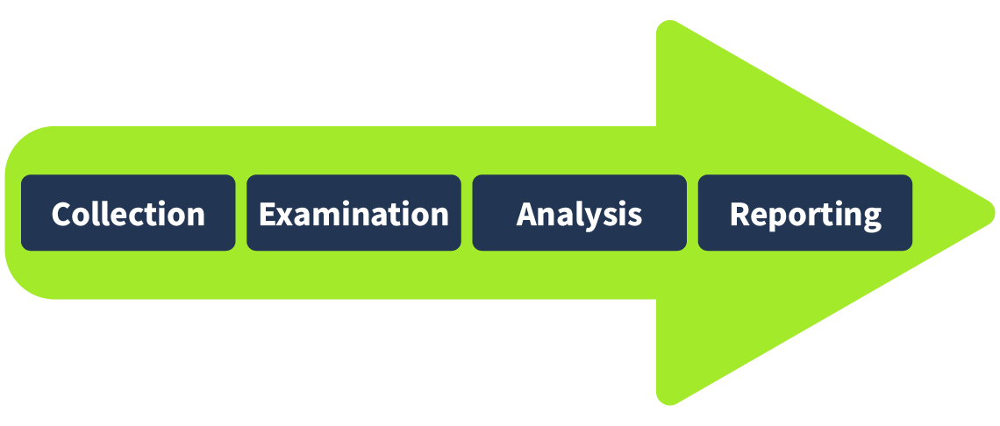
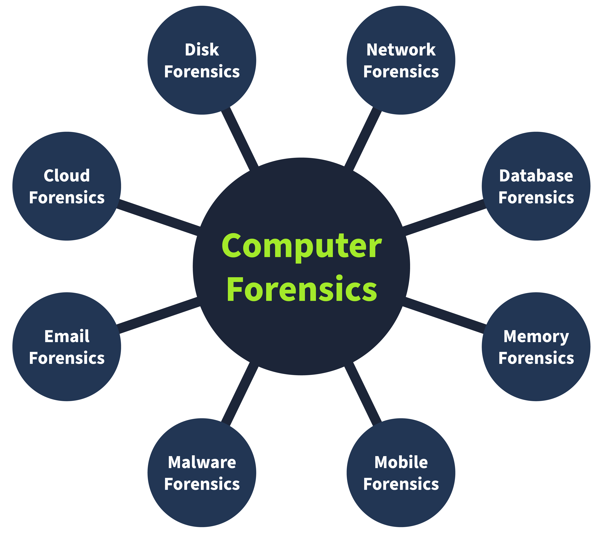
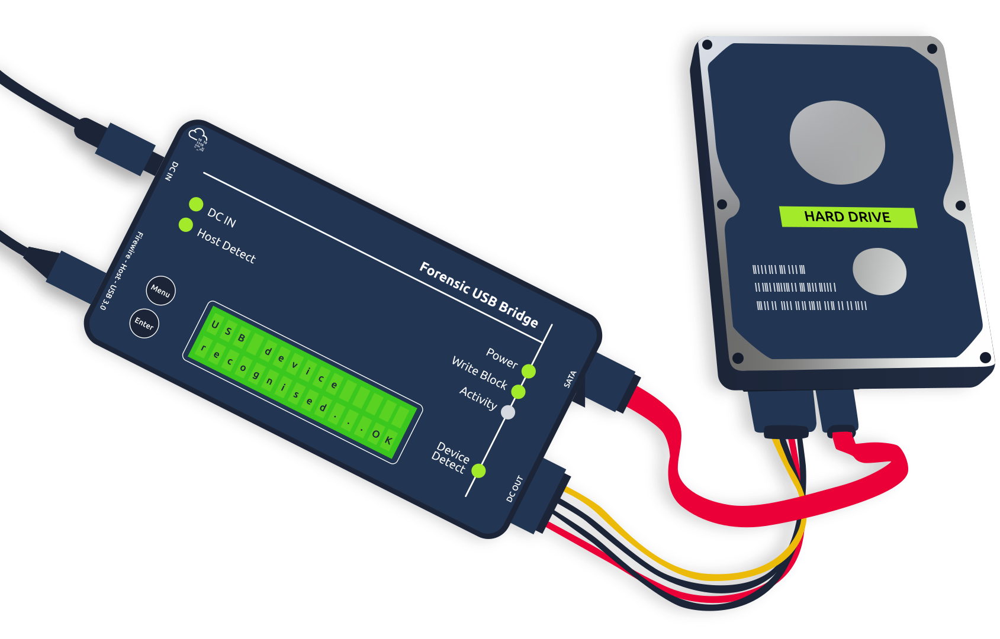

# Digital forensics

## Digital Forensics Methodology

<figure><figcaption></figcaption></figure>

1. **Collection:** The first phase of digital forensics is data collection. Identifying all the devices from which the data can be collected is essential. Usually, an investigator can find personal computers, laptops, digital cameras, USBs, etc., on the crime scene. It is also necessary to ensure the original data is not tampered with while collecting the evidence and to maintain a proper document containing the collected items’ details. We will also be discussing the evidence-acquisition procedures in the upcoming tasks.
2. **Examination:** The collected data may overwhelm investigators due to its size. This data usually needs to be filtered, and the data of interest needs to be extracted. For example, as an investigator, you collected all the media files from a digital camera on the crime scene. You may only require some of the media as you are concerned with the media recorded on a specific date and time. So, in the examination phase, you would filter the media files of the required time and move them to the next phase. Similarly, you may only need the data of a specific user from a system containing numerous user accounts. The examination phase helps you filter this particular data for analysis.
3. **Analysis:** This is a critical phase. The investigators now have to analyze the data by correlating it with multiple pieces of evidence to draw conclusions. The analysis depends upon the case scenario and available data. The analysis aims to extract the activities relevant to the case chronologically.
4. **Reporting:** In the last phase of digital forensics, a detailed report is prepared. This report contains the investigation’s methodology and detailed findings from the collected evidence. It may also contain recommendations. This report is presented to law enforcement and executive management. It is important to include executive summaries as part of the report, considering the level of understanding of all the receiving parties.

<figure><figcaption></figcaption></figure>

* **Computer forensics:** The most common type of digital forensics is computer forensics, which concerns investigating computers, the devices most commonly used in crimes.
* **Mobile forensics:** Mobile forensics involves investigating mobile devices and extracting evidence such as call records, text messages, GPS locations, and more.
* **Network forensics:** This area of forensics covers investigation beyond individual devices. It includes the whole network. The majority of the evidence found in networks is the network traffic logs.
* **Database forensics:** Many critical data is stored in dedicated databases. Database forensics investigates any intrusion into these databases that results in data modification or exfiltration.
* **Cloud forensics:** Cloud forensics is the type of forensics that involves investigating data stored on cloud infrastructure. This type of forensics sometimes gets tricky for the investigators as there is little evidence on cloud infrastructures.
* **Email forensics:** Email, the most common communication method between professionals, has become an important part of digital forensics. Emails are investigated to determine whether they are part of phishing or fraudulent campaigns.

## Evidence Acquisition

#### Chain of Custody

Imagine that a team of investigators collects all the evidence from the crime scene, and some of the evidence goes missing after a few days, or there is any change in the evidence. No individual can be held accountable in this scenario because there is no proper process for documenting the evidence owners. This problem can be solved by maintaining a chain of custody document. A chain of custody is a formal document containing all the details of the evidence. Some of the key details are listed below:

* Description of the evidence (name, type).
* Name of individuals who collected the evidence.
* Date and time of evidence collection.
* Storage location of each piece of evidence.
* Access times and the individual record who accessed the evidence.

#### Use of Write Blockers

<figure><figcaption></figcaption></figure>
