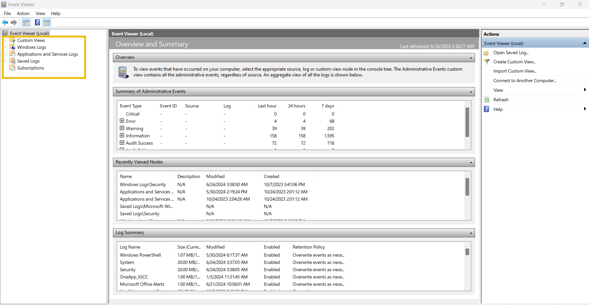

# Logs

## Use Cases of Logs

| Use Case                             | Description                                                                                                                                                                                          |
| ------------------------------------ | ---------------------------------------------------------------------------------------------------------------------------------------------------------------------------------------------------- |
| Security Events Monitoring           | Logs help us detect anomalous behavior when real-time monitoring is used.                                                                                                                            |
| Incident Investigation and Forensics | Logs are the traces of every kind of activity. It offers detailed information on what happened during the incident. The security team utilizes the logs to perform root cause analysis of incidents. |
| Troubleshooting                      | As the logs also record the errors in systems or applications, they can be used to diagnose issues and helpful in fixing them.                                                                       |
| Performance Monitoring               | Logs can also provide valuable insights into the performance of applications.                                                                                                                        |
| Auditing and Compliance              | Logs play a major role in Auditing and Compliance, making it easier with its capability to establish a trail of different kinds of activities.                                                       |

## Types of Logs

| Log Type         | Usage                                                                                                                                                                                            | Example                                                                                                                                                 |
| ---------------- | ------------------------------------------------------------------------------------------------------------------------------------------------------------------------------------------------ | ------------------------------------------------------------------------------------------------------------------------------------------------------- |
| System Logs      | The system logs can be helpful in troubleshooting running issues in the OS. These logs provide information on various operating system activities.                                               | 
- System Startup and shutdown events - Driver Loading events - System Error events - Hardware events
                                    |
| Security Logs    | The security logs help detect and investigate incidents. These logs provide information on the security-related activities in the system.                                                        | 
-Authentication events - Authorization events - Security Policy changes events - User Account changes events - Abnormal Activity events
 |
| Application Logs | The application logs contain specific events related to the application. Any interactive or non-interactive activity happening inside the application will be logged here.                       | 
- User Interaction events - Application Changes events - Application Update events - Application Error events
                           |
| Audit Logs       | The Audit logs provide detailed information on the system changes and user events. These logs are helpful for compliance requirements and can play a vital role in security monitoring as well.  | 
- Data Access events - System Change events - User Activity events - Policy Enforcement events
                                          |
| Network Logs     | Network logs provide information on the network’s outgoing and incoming traffic. They play crucial roles in troubleshooting network issues and can also be handy during incident investigations. | 
- Incoming Network Traffic events - Outgoing Network Traffic events - Network Connection Logs - Network Firewall Logs
                      |
| Access Logs      | The Access logs provide detailed information about the access to different resources. These resources can be of different types, providing us with information on their access.                  | 
- Webserver Access Logs - Database Access Logs - Application Access Logs - API Access Logs
                                                 |

## Windows Event Logs Analysis

Like other operating systems, Windows OS also logs many of the activities that take place. These are stored in segregated log files, each with a specific log category. Some of the crucial types of logs stored in a Windows Operating System are:

* **Application:** There are many applications running on the operating system. Any information related to those applications is logged into this file. This information includes errors, warnings, compatibility issues, etc.
* **System:** The operating system itself has different running operations. Any information related to these operations is logged in the System log file. This information includes driver issues, hardware issues, system startup and shutdown information, services information, etc.
* **Security:** This is the most important log file in Windows OS in terms of security. It logs all security-related activities, including user authentication, changes in user accounts, security policy changes, etc.

<figure><figcaption></figcaption></figure>

Here is a table of some important Event IDs in Windows Operating System.

| Event ID | Description                                        |
| -------- | -------------------------------------------------- |
| 4624     | A user account successfully logged in              |
| 4625     | A user account failed to login                     |
| 4634     | A user account successfully logged off             |
| 4720     | A user account was created                         |
| 4724     | An attempt was made to reset an account’s password |
| 4722     | A user account was enabled                         |
| 4725     | A user account was disabled                        |
| 4726     | A user account was deleted                         |
