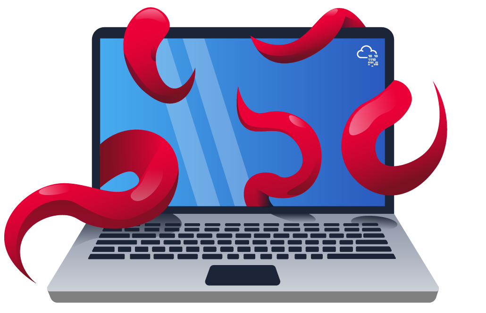
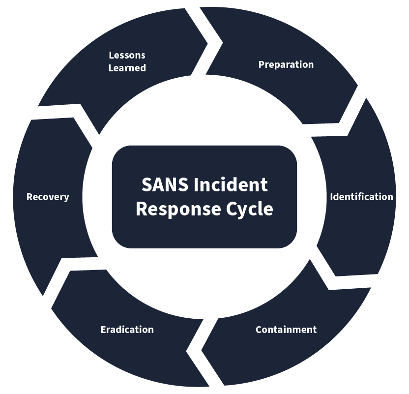
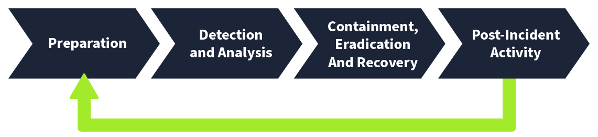
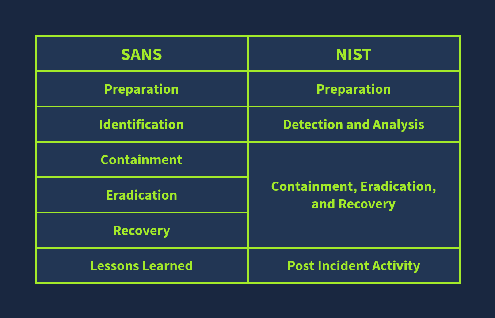

# Incident Response

## Types of Incidents

* **Malware Infections**: Malware is a malicious program that can damage a system, network, or application. The majority of incidents are associated with malware infections.  There are different types of malware, each with a unique potential to cause damage. Malware infections are mostly caused by files that can be text, documents, executables, etc.

<figure><figcaption></figcaption></figure>

* **Security Breaches:** Security Breaches arise when an unauthorized person gets access to confidential data (something we don’t want them to see or have).  Security Breaches are of the utmost importance as many businesses rely on their confidential data, which must only be accessible to authorized personnel.

<figure><figcaption></figcaption></figure>

* **Data Leaks:** Data leaks are incidents in which confidential information of an individual or an organization is exposed to unauthorized entities. Many attackers use data leaks for reputational damage to their victims or use this technique to threaten their victims and get what they need from them. Unlike Security Breaches, data leaks can also be unintentionally caused by human errors or misconfigurations.

<figure><figcaption></figcaption></figure>

* **Insider Attacks:** Incidents from within an organization are known as insider attacks. Think about a disgruntled employee infecting the whole network through a USB on his last day. This is an example of an insider attack. Someone within your organization intentionally initiating an attack comes under this category. These attacks can be hazardous, as an insider always has greater access to resources than an outsider.

<figure><figcaption></figcaption></figure>

* **Denial Of Service Attacks:** Availability is one of the three pillars of cyber security. Defensive security solutions and people constantly find ways to protect information; they ensure that the data is available to the people simultaneously. This is because there is no point in protecting something that is unavailable to us. Denial of Service attacks, or DoS attacks, are incidents where the attacker floods a system/network/application with false requests, eventually making it unavailable to legitimate users. This happens due to the exhaustion of resources available to entertain the requests.

<figure><figcaption></figcaption></figure>

***

## Incident Response Process

| Phase           | Explanation                                                                                                                                                                                                                                                                                      | Example                                                                                                                                                                                                        |
| --------------- | ------------------------------------------------------------------------------------------------------------------------------------------------------------------------------------------------------------------------------------------------------------------------------------------------ | -------------------------------------------------------------------------------------------------------------------------------------------------------------------------------------------------------------- |
| Preparation     | This is the first phase. The preparation phase includes building the necessary resources to handle an incident. These resources include developing incident response teams, having a proper incident response plan in place, and deploying necessary security solutions to combat the incidents. | Conducting awareness training for employees on phishing emails. Phishing emails are fraudulent emails sent by malicious attackers that can trick you into performing actions that can lead you to an incident. |
| Identification  | The identification phase refers to looking for any abnormal behavior that may indicate an incident. This involves using various security solutions and techniques to monitor abnormal events.                                                                                                    | The security team notices a huge amount of data being sent out from one of the hosts. Upon analysis, it was found to be compromised after a malicious file was downloaded from a phishing email attachment.    |
| Containment     | Once an incident has been identified, the next step should be to contain it. This means minimizing the impact of the attack. This is usually done by isolating the victim machine, disabling the compromised user accounts, etc.                                                                 | The Security team isolates the host from the network to minimize the impact and not allow the attacker to jump to other systems, leveraging the compromised host.                                              |
| Eradication     | This phase, as its name suggests, involves removing the threat from the attacked environment. The threat may be of any kind. The eradication phase will ensure the subject environment is clean, and now we can move to the recovery phase.                                                      | A deep malware scan was executed on the system to remove the malicious software from the host.                                                                                                                 |
| Recovery        | The recovery phase is very important in this chain. It involves recovering the affected systems from backup or rebuilding them. The recovered systems are then tested and are ready to use.                                                                                                      | The compromised host was re-configured, and the exfiltrated data was restored from the backup.                                                                                                                 |
| Lessons Learned | This is also an important part of the incident response lifecycle. Gaps in the detection and analysis of the incident are identified and documented, helping to improve the overall process in future incidents.                                                                                 | Conducting a post-incident review meeting to analyze the incident's root cause and improve the security to prevent future attacks.                                                                             |

**SANS**

<figure><figcaption></figcaption></figure>

**NIST**

<figure><figcaption></figcaption></figure>

**Comperasion**

<figure><figcaption></figcaption></figure>

## Playbooks

Following is an example of a **Playbook** for an incident: Phishing Email

1. Notify all the stakeholders of the phishing email incident
2. Determine if the email was malicious by conducting header and body analysis of the email
3. Look for any attachments with the email and analyze them
4. Determine if anybody opened the attachments
5. Isolate the infected systems from the network
6. Block the email sender

## Becoming a First Responder

**Preservation of Evidence**

1\. Registers and Cache

Registers and cache are extremely volatile and constantly changing as the host executes different applications. In a matter of split seconds, this data can change. While we would never be fast enough to capture this evidence at the exact moment of becoming aware of the incident, we should do it as soon as possible. This evidence can be vital for malware analysis to understand what the malware performed on the host. In most incidents, we would not capture this information, as it is simply too volatile. 

2\. Routing Table, ARP Cache, Process Table, Kernel Statistics and Memory

While the incident might have been raised on a single host, we must be aware that more hosts might have been infected. We also want to have a better understanding of not just this host in question, but also if the host communicated to any other hosts in the network. Therefore, we need to capture information such as the routing and ARP tables. Routes and ARP entries have a specific time-to-live, meaning if we are unable to capture this data in time, we might not have the full picture of what network communication took place at the time the incident occurred. These can be captured from the host itself. 

Regarding the actual suspected host, we want to better understand what applications were running and what they were doing at the time of the incident. Therefore, we have to capture information about the processes that were executing at the time of the incident.

Lastly, just having the program name does not tell us exactly what it is or what it is doing. If we want to truly understand what the program is, we will have to collect it from memory. This means that we will need to capture evidence from the Random Access Memory (RAM). However, the information located here can be lost if there is a brownout or if the power is turned off. Malware has become incredibly advanced and can stage its different payloads, meaning even if we have a sample of the malware to execute in the sandbox, we cannot truly understand what it was doing on the host without analysing it directly in the memory.

3\. Temporary File Systems

It is common for applications to create and use temporary files on hosts. For example, on a web server, active sessions are usually stored in temporary files. While these files are often preserved longer on the host, we do not want to take any chances in losing these files that may be important for the investigation.

4\. Disk

The next step is to make sure that we take a snapshot of the host's drive. While this evidence portion may not be as volatile as the others, it can play an important part in legal proceedings and should, therefore, be prioritised. Preserving this evidence means that we also have the ability to perform the local logs on the device itself, which can help analysts determine if the threat actor attempted to hide their tracks by comparing this to remotely stored logs.

5\. Remote Logging and Monitoring

As discussed in the Logging for Accountability and Monitoring room, all hosts should forward their logs to a secure remote location. However, even these remote locations do not have an infinite log retention policy. Since, at this stage, we are unsure how far back the incident goes, we want to make sure that we preserve these remote logs as far back as possible while the investigation is still ongoing.

6\. Physical Configuration and Network Topology

The physical configuration of the host and network topology at the time of the incident is usually not volatile at all. However, this evidence can usually assist us in our investigation. Understanding and preserving evidence, such as which subnet the host was connected to, will be important when we try to understand the scope of the incident and can point us in the direction of other hosts that should be scrutinised and investigated.

7\. Archival Media

Last on the list is backups. While this information will usually not be volatile, it can be used as evidence to help us determine how far back the incident went when comparing artefacts on the current disk to that found on backups. However, as these backups are usually not going anywhere, we have a bit more breathing room to focus on other, more volatile sources first.

**The Other Two Big DON'Ts**

We have already talked about the first big don't, which is to not turn off the device; however, there are two other big don'ts according to the IETF:

* Don't trust the programs on the system. This means that you should not use the actual software on the host to perform your evidence collection. The simple reason for this is that the threat actor may have altered these programs and that by using these programs, you are tainting the evidence that you are trying to capture.
* Don't run programs that modify the access times of files. When a file was accessed is evidence itself. If you perform a simple Copy + Paste, you will taint this evidence. This is why special software or hardware is used when evidence is captured to ensure that the evidence is captured as is and not tainted.

Even if it happened inadvertently, it is incredibly easy to destroy or taint evidence, which means it cannot be used in legal proceedings moving forward.

