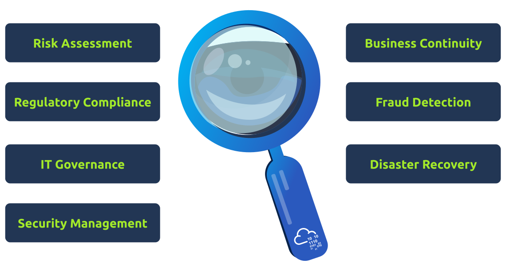

# Auditing and Monitoring

### Audit Objectives

By conducting an information systems audit, auditors can assess various aspects of an organisation’s IT infrastructure, processes, and controls. Some primary objectives of an information systems audit include the following:

* **Assess the effectiveness of internal controls:** This process can help mitigate the risk of fraud, errors, and other disruptions to the organisation’s operations.
* **Identify and assess risks:** This process can help the organisation develop and implement appropriate controls to mitigate risks to the organisation’s information systems.
* **Assess the efficiency and effectiveness of information systems:** This process can help the organisation improve the performance of its information systems and make better decisions about future investments in information technology.
* **Ensure compliance with laws and regulations:** This process can help protect the organisation from fines, penalties, and other legal sanctions.

<figure><figcaption></figcaption></figure>

More generally, information systems audits can be used for a broader set of targets, depending on the industry and regulations. In more formal terms, information systems audit serves the following objectives:

* **Risk assessment:** Identify potential risks and vulnerabilities that may affect information assets’ confidentiality, integrity, and availability and evaluate risk mitigation strategies in place.
* **Regulatory compliance:** Ensure that an organisation’s information systems adhere to relevant laws, regulations, and industry standards to avoid legal violations and safeguard the organisation’s reputation.
* **IT governance:** Evaluate the effectiveness of IT governance practices, including decision-making processes, resource allocation, and performance management within the organisation.
* **Security management:** Assess the effectiveness of an organisation’s information security policy, processes, and controls in protecting information assets from unauthorised access, use, modification, and disclosure.
* **Operational and performance evaluation:** Assess the controls and processes for key IT activities such as system design, development, implementation, and ongoing maintenance, ensuring that the organisation’s systems and resources are utilised efficiently and that desired goals and outcomes are achieved.
* **Data management and quality:** Evaluate the processes and controls for data storage, retention, backup, and recovery to ensure that critical data is accurate, complete, reliable, and available when needed.
* **Business continuity and disaster recovery:** Assess the adequacy of an organisation’s strategies for maintaining critical IT services and capabilities during various business disruptions, including assessing backup and contingency plans to ensure timely recovery.
* **Fraud detection and prevention:** Identify fraudulent activities or misuse of resources by examining user activity, authorisation, and the overall control environment.

By identifying potential vulnerabilities, weaknesses, or irregularities, IT auditors help prevent unauthorised access, data breaches, system failures, and legal violations, strengthening information security and ensuring the integrity, confidentiality, and availability of critical IT resources and information assets.

## Audit Types

One way to classify audits is based on who is performing the audit:

* **Internal audits:** These are performed by an organisation’s personnel or staff members assigned to the internal audit function.
* **External audits:** External audits are conducted by independent auditors not employed by the organisation being audited. These auditors are typically from external accounting or auditing firms, and the primary purpose is to provide an impartial and objective review.

### Popular Audit Frameworks

* **COSO:** The Committee of Sponsoring Organizations of the Treadway Commission (COSO) is a private-sector initiative that develops frameworks for enterprise risk management, internal control, and fraud deterrence. COSO’s [Internal Control-Integrated Framework](https://www.coso.org/sitepages/internal-control.aspx) is one of the most widely used frameworks for auditing internal controls. It is typically used in various industries, including financial services, healthcare, and government.
* **COBIT:** The [Control Objectives for Information and Related Technology](https://www.isaca.org/resources/cobit) (COBIT) is a framework for the governance and management of information and technology (IT). It provides a comprehensive set of control objectives that can be used to assess the effectiveness of an organisation’s IT governance and management practices. It is typically used in various industries, including financial services, healthcare, and government.
* **ISAE 3402:** [ISAE3402](https://isae3402.com/ISAE3402_overview.html) is an international standard that provides guidance on the assurance of controls over financial reporting. Auditors use it to assure of the effectiveness of an organisation’s internal controls over financial reporting. It is typically used in various industries, including financial services, healthcare, and government.
* **ISO 27001:** [ISO 27001](https://www.iso.org/standard/27001) is an international standard for information security management. It provides a set of best practices for information security management. It is typically used in various industries, including financial services, healthcare, and government.
* **ITIL**: ITIL stands for Information Technology Infrastructure Library. It is a framework of best practices for IT Service Management (ITSM). ITIL is used in auditing to establish a systematic approach for assessing an organisation’s management and governance of IT services. By providing standard practices and criteria, ITIL helps organisations identify areas where their ITSM practices can be improved and to provide recommendations for how to make those improvements.
* **PCI DSS:** The [Payment Card Industry Data Security Standard](https://www.pcisecuritystandards.org/document_library/?document=pci_dss) (PCI DSS) is a set of security requirements for organisations that accept payment cards. It is designed to protect cardholder data from unauthorised access, use, disclosure, alteration, or destruction. It is typically used in industries that accept payment cards, such as retail, hospitality, and healthcare.
* **SOX:** The Sarbanes-Oxley Act of 2002 (SOX) is a federal law that establishes auditing and financial reporting requirements for public companies. It is designed to protect investors by improving the accuracy and reliability of financial reporting. It is typically used in public companies.

| Framework | Description                                                                                                       | Industries                | Notes                                                                                          |
| --------- | ----------------------------------------------------------------------------------------------------------------- | ------------------------- | ---------------------------------------------------------------------------------------------- |
| COSO      | Internal control framework that helps organisations design, implement, and monitor their internal controls.       | All industries            | COSO is a comprehensive framework that covers all aspects of internal control.                 |
| COBIT     | IT governance framework that helps organisations align their IT with their business goals.                        | All industries            | COBIT is a flexible framework that can be adapted to the needs of any organisation.            |
| ISAE 3402 | Assurance standard that provides assurance on the controls of a service organisation.                             | All industries            | ISAE 3402 is a relatively new standard gaining popularity in the financial services industry.  |
| ISO 27001 | Information security management system (ISMS) standard that helps organisations protect their information assets. | All industries            | ISO 27001 is the world’s most widely adopted ISMS standard.                                    |
| ITIL      | IT service management (ITSM) framework that helps organisations deliver high-quality IT services.                 | All industries            | ITIL is a well-established framework that organisations of all sizes use.                      |
| PCI DSS   | Payment Card Industry Data Security Standard that helps organisations protect cardholder data.                    | Financial services        | PCI DSS is a mandatory standard for organisations that process credit and debit card payments. |
| SOX       | Sarbanes-Oxley Act that sets requirements for internal controls over financial reporting.                         | Publicly traded companies | SOX is a complex law that has a significant impact on public companies.                        |

### Audit Process

The process typically consists of the following primary stages:

* **Planning:** The auditor determines the audit’s scope, objectives, and timelines. This stage involves understanding the organisation’s IT environment – including infrastructure, systems, applications, security measures, and data management practices – and identifying potential risks and controls to be evaluated.
* **Information gathering:** The auditor collects relevant data, background information, and documentation to thoroughly understand the organisation’s IT processes and systems. This process typically involves interviewing key personnel, reviewing resource documentation, analysing procedures and policies, and examining the control environment.
* **Risk assessment and control evaluation:** The auditor identifies and assesses the risks and vulnerabilities within the organisation’s IT infrastructure, processes, and systems based on the information gathered. This process includes evaluating the effectiveness of internal controls, security measures, and compliance with applicable policies, regulations, and industry standards.
* **Testing:** The auditor performs detailed tests on selected systems, applications, specific processes or control procedures to validate their effectiveness, accuracy, and compliance. Testing methods may include data analysis, vulnerability scanning, penetration testing, controls testing, or sampling, depending on the audit objectives and the audited systems.
* **Analysis and findings:** The auditor analyses the testing and evaluation results, identifies deviations, irregularities, or vulnerabilities, and evaluates the implications. Auditors determine if systems are configured securely, IT processes are effective and compliant, or risks are adequately mitigated.
* **Reporting:** After the analysis, the auditor documents the findings and conclusions, makes recommendations for improvement where necessary, and prepares a formal audit report. This report is then shared with the management, the audit committee, or other stakeholders as required, helping them understand the organisation’s risk exposure, compliance, and effectiveness of IT processes and controls.
* **Follow-up:** In some cases, a follow-up may be performed to evaluate if the recommended improvements and corrective actions have been implemented and ensure their effectiveness in addressing the identified issues.

### Audit Areas

The following is a list of some areas that we might consider inspecting when performing an information systems audit:

* **Information Systems Hardware:** Inspect the hardware configuration and performance to ensure it meets the organisation’s needs.
* **OS:** Check the operating system configuration and security to ensure it is secure and compliant with organisational policies.
* **File Systems:** Check the file system permissions and access control to ensure that sensitive data is protected.
* **Database Management Systems:** Audit the database configuration and security to ensure it is secure and compliant with organisational policies.
* **Network Infrastructure:** Inspect the network configuration and security to ensure it is secure and compliant with organisational policies.
* **Network Operating Controls:** Audit the network operating controls to ensure that they effectively prevent unauthorised access to the network.
* **IT Operations:** Examine the IT operations to ensure they effectively deliver high-quality IT services.
* **Lights-Out Operations:** Check the lights-out operations to ensure they effectively manage IT infrastructure without the need for human intervention.
* **Problem Management Operations:** Audit the problem management operations to ensure that they effectively resolve IT problems in a timely manner.
* **Monitoring Operations:** Validate the monitoring operations to ensure they effectively detect and respond to IT incidents.
* **Procurement:** Check the procurement process to ensure that IT hardware and software are secure and compliant.
* **Business Continuity Planning:** Inspect the business continuity plan to ensure that it effectively ensures the continuity of critical IT services during a disaster.
* **Disaster Recovery Planning:** Examine the disaster recovery plan to ensure it effectively recovers critical IT services during a disaster.

## Audit Scenario

Let’s say that we are auditing a company using COBIT. We might go through a series of steps that resemble the following:

#### Step 1: Planning

* **Define the scope of the audit:** We start by defining the scope of the audit and identifying the relevant COBIT domains that apply to the organisation’s IT governance practices.
* **Identify the relevant COBIT controls:** Next, we identify the appropriate COBIT controls that are in place to mitigate the risks identified in the scope of the audit.
* **Develop an audit plan:** We will need to develop an audit plan that outlines the steps that will be taken to gather evidence and assess the organisation’s compliance with the relevant COBIT controls.

**Note:** The COBIT 2019 framework defines 40 control objectives, which are grouped into five domains:

* **Plan and Organise (PO):** 13 control objectives
* **Acquire and Implement (AI):** 9 control objectives
* **Deliver and Support (DS):** 11 control objectives
* **Monitor and Evaluate (ME):** 7 control objectives
* **Resilience (RES):** 1 control objective

The details of the COBIT controls are beyond the scope of this room. However, for this exercise, we need to know that the COBIT controls provide a framework for ensuring that IT activities are aligned with the organisation’s strategic goals and objectives.

#### Step 2: Execution

* **Gather evidence:** We start this stage by gathering evidence of the organisation’s compliance with the relevant COBIT controls. This evidence may include documentation, interviews, and observations.
* **Assess the evidence:** Next, we assess the evidence to determine whether the organisation complies with the relevant COBIT controls.

#### Step 3: Assessment

* **Identify gaps in compliance:** First, we must identify gaps in the organisation’s compliance with the relevant COBIT controls.
* **Make recommendations for improvement:** Next, we can make recommendations for improvement to the organisation’s IT governance practices.

#### Step 4: Reporting

* **Prepare the audit report:** We begin by preparing an audit report summarising the audit findings and making recommendations for improvement.
* **Communicate the audit report:** Once the report is ready, we must communicate it to the organisation’s management and stakeholders.

#### Step 5: Follow-up

* **Monitor the implementation of recommendations:** Ideally speaking, we will be able to monitor the implementation of the recommendations made in the audit report to ensure that the organisation is taking steps to improve its IT governance practices.

The steps above show an example of an information systems audit using the COBIT framework. The exact steps involved in an audit will vary depending on the organisation’s needs and requirements. However, the general steps outlined above apply to most information systems audits.
