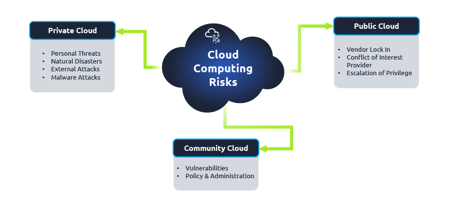
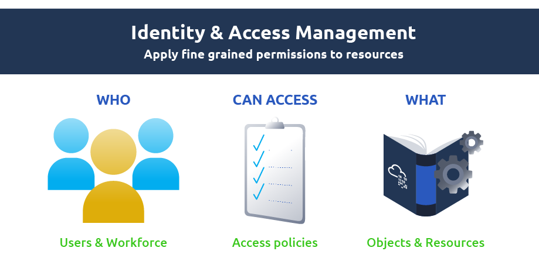

# Cloud Security

## Architectural Concepts of Cloud

<figure><figcaption></figcaption></figure>

## Cloud Security Concepts

<figure><figcaption></figcaption></figure>

## Cloud Security Risks Concerning Deployment Models

<figure><figcaption></figcaption></figure>

## Security Through Access Management

<figure><figcaption></figcaption></figure>

## Security Through Policies

* Identity-based Policies: Attached to identities and grant permissions.
* Resource-based Policies: These are implemented on resources (data & services) and define who is authorised to access that resource.
* Session-based Policies: These temporary policies allow access to specific resources for a particular time.

