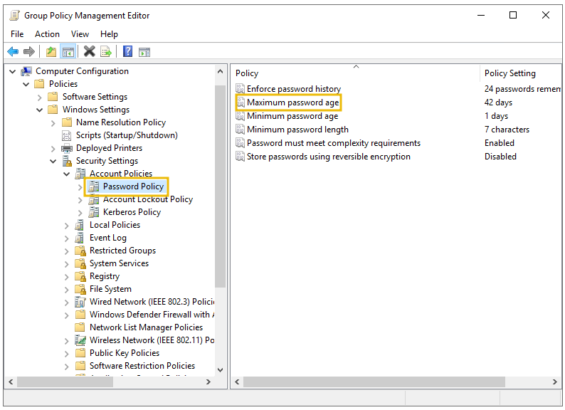
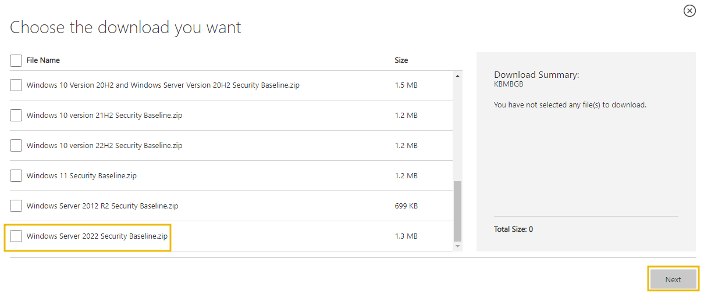
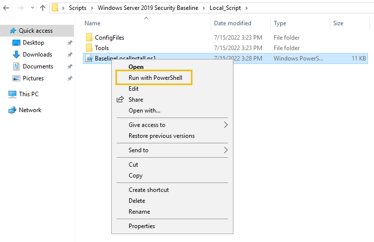

# Active Directory Hardening

<figure><figcaption></figcaption></figure>

## Securing Authentication Methods

**LAN Manager Hash**&#x20;

The user account password for Windows isn't stored in clear text; instead, it stores passwords with two types of hash representation. When the password for any user account is changed or set with fewer than 15 characters, both LM hash (LAN Manager hash) and NT hash (Windows NT hash) are generated by Windows and can be stored in AD. The LM hash is relatively weaker than the NT and is prone to a fast brute-force attack. The best recommendation is to prevent Windows from storing the password's LM hash. You can access it through the following:

<figure><figcaption></figcaption></figure>

**SMB Signing**\
SMB stands for Server Message Block. Generally, Microsoft-based networks utilise this protocol for file and print communication. Moreover, it allows secure transmission over the network. Configuring SMB signing through group policy is crucial to detect Man in the Middle (MiTM) attacks that may result in modification of SMB traffic in transit. SMB signing ensures the integrity of data for both client and server. All supported Windows versions have an SMB packet signing option.

<figure><figcaption></figcaption></figure>

**LDAP Signing**

Light Weight Directory Access Protocol (LDAP) enables locating and authenticating resources on the network. Hackers may introduce replay or MiTM attacks to launch custom LDAP requests. Therefore, LDAP signing is a Simple Authentication and Security Layer (SASL) property that only accepts signed LDAP requests and ignores other requests (plain-text or non-SSL). We can enable LDAP signing through the following:

<figure><figcaption></figcaption></figure>

**Password Rotation**

Active Directory password security is critical to address because of security breaches and password reuse. It becomes challenging for any organisation to reset account passwords or update them everywhere, so they prefer not to do it. This scenario could have a few alternate approaches, and each method has pros and cons.&#x20;

* **First Technique:** Creating a script to update passwords automatically in the Scheduled Task with the help of PowerShell. This method does not require any additional overhead and removes all the manual efforts for password rotation, but it requires you to write and maintain your script – which could be challenging.&#x20;
* **Second Technique:** Add a Multi-Factor Authentication (MFA) solution to AD and choose not to change the password often. It adds a security layer, and you will not need to change your password often. You can read more about implementing MFA [here](https://docs.microsoft.com/en-us/azure/active-directory/authentication/howto-mfa-getstarted).
* **Third Technique:** Microsoft provides a solution for services account password rotation through Group Managed Services Accounts (gMSAs), which changes passwords after every 30 days. You can learn more about it [here](https://docs.microsoft.com/en-us/azure/active-directory/fundamentals/service-accounts-group-managed).

Password Policies\
Attackers use various corporate password-compromise techniques, including brute force, dictionary, password spraying, credential attacks etc. All organisations must have a strict password policy to defend against all such attacks. Password policies mean different rules for creating passwords, including length, complexity, and changing frequency. For viewing and configuring the password policy, you can use the following:

`Group Policy Management Editor > Computer Configuration > Policies > Windows Settings > Security Settings > Account Policies > Password Policy`

<figure><figcaption></figcaption></figure>

Understanding Password Policy Settings

* **Enforce password history**: Prevent at least 10 to 15 old passwords from being set as new ones.&#x20;
* **Minimum password length**: The minimum password length should be set between 10 to 14.
* **Complexity requirements**: Must not contain the name of the user account and ensure the password has uppercase letters, lowercase letters, digits, or special characters.

## Protecting Against Known Attacks

**Kerberoasting**\
[Kerberoasting ](https://tryhackme.com/room/attackingkerberos)is a common and successful post-exploitation technique for attackers to get privileged access to AD. The attacker exploits Kerberos Ticket Granting Service (TGS) to request an encrypted password, and then the attacker cracks it offline through various brute force techniques. These attacks are difficult to detect as the request is made through an approved user, and no unusual traffic pattern is generated during this process. You can prevent the attack by ensuring an additional layer of authentication through MFA or by frequent and periodic Kerberos Key Distribution Centre (KDC) service account password reset. You can learn more about the attack [here](https://microsoft.com/security/blog/2020/08/27/stopping-active-directory-attacks-and-other-post-exploitation-behavior-with-amsi-and-machine-learning/).

**Weak and Easy-to-Guess Passwords**&#x20;

The easiest target for intruders to breach security is the weak and easy-to-guess old passwords. The best recommendation is to use strong passwords and avoid already known ones. A strong password consists of a combination of uppercase and lowercase letters, numbers, and special characters. You can learn more about password strength [here](https://docs.microsoft.com/en-us/azure/active-directory/authentication/concept-password-ban-bad-combined-policy). There are many tools available that can help you perform Password Auditing in AD. You can see a report generated through a free tool on `Desktop > Password-Report.png.`

**Brute Forcing Remote Desktop Protocol**

The intruders or attackers use scanning tools to brute force the weak credentials. Once the brute force is successful, they quickly access the compromised systems and try to do privilege escalation along with a persistent foothold in the target's computer. The best recommendation is to never expose RDP without additional security controls to the public internet. Continuous audits for scanning attacks or brute-force attempts are also an important step.

\
**Publically Accessible Share**

During AD configuration, some share folders are publicly accessible or left unauthenticated, providing an initial foothold for attackers for lateral movement. You can use the `Get-SmbOpenFile` cmdlet in PowerShell to look for any undesired share on the network and configure access accordingly.

## Implementing Least Privilege Model

<figure><figcaption></figcaption></figure>

**Creating the Right Type of Accounts**\
Implementing the least privilege model requires setting up the different account types for diverse purposes. It includes the following account types:

* User accounts: You must promote using regular user accounts for most people in the network, who are necessary to perform their regular duties.
* Privilege accounts: These are the accounts with elevated privileges and are further classified as first and second privilege accounts.&#x20;
* Shared accounts: These accounts are shared amongst a group of people, as the visitors with bare minimum privileges, to give limited access for a specific time. These accounts are not recommended and must be utilised in limited scenarios.&#x20;

**Role-Based Access Control on Hosts**

**Tiered Access Model**

The Active Directory Tiered Access Model (TAM) comprises plenty of technical controls that reduce the privilege escalation risks. It consists of a logical structure that separates Active Directory's assets by creating boundaries for security purposes. The primary goal is the protection of Active Directory's top-valued identities (Tier 0). At the same time, domain members and other users can perform routine tasks, such as email checking, surfing the internet, and using apps and other services (Tier 1, 2). It comprises three tiers, Tier 0, 1, and 2, which are as follows:&#x20;

* Tier 0: Top level and includes all the admin accounts, Domain Controller, and groups.
* Tier 1: Domain member applications and servers.&#x20;
* Tier 2: End-user devices like HR and sales staff (non-IT personnel).

<figure><figcaption></figcaption></figure>

**Auditing Accounts**

Accounts audit is a crucial task mainly carried out by setting up the correct account, assigning privileges, and applying restrictions. Three audit types related to accounts must be done periodically: usage, privilege, and change audits.&#x20;

* Usage audits allow monitoring each account's specific tasks and validating their access rights.&#x20;
* A privilege audit allows you to check if every account in the system has the least privilege.
* Change audits allow you to look for any improper changes to account permissions, passwords, or settings. Any unacceptable change to these may lead to a data breach.

## Microsoft Security Compliance Toolkit

Microsoft Security Compliance Toolkit (MSCT) is an official toolkit provided by Microsoft to implement and manage local and domain-level policies. You don't have to worry about complex policy syntaxes and scripts, as Microsoft will provide pre-developed security baselines per the end user environment. You can download MSCT from the official Microsoft website[ link.](https://www.microsoft.com/en-us/download/details.aspx?id=55319)&#x20;

<figure><figcaption></figcaption></figure>

<figure><figcaption></figcaption></figure>
