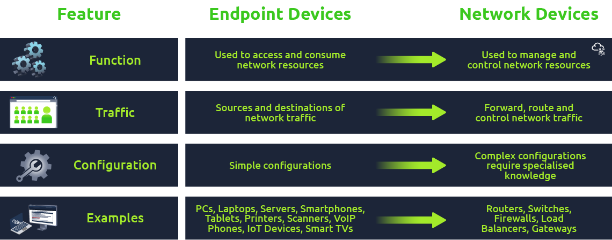

# Network Device Hardening

## Common Threat and Attack Vectors

**Difference between Network Devices and Endpoint Devices**\
Before proceeding with our actual topic, it is imperative to understand the difference between network devices and endpoint devices. Endpoint devices refer to any device that can generate or consume data on a network, such as Laptops, Desktops, Smartphones, Tablets, Printers, Servers, and IoT Devices. They are typically located at the edge of a network and interact directly with users. The figure below shows the difference between endpoint and network devices based on their functionality, traffic, and configuration.

<figure><figcaption></figcaption></figure>

**Common Threats and Attack Vectors of Network Devices**

| 
Threat 
                      | 
Description 
                                                                                                                                                                             | 
Attack Vector 
                                                                                                                                                                                                                                                               |
| -------------------------------------- | -------------------------------------------------------------------------------------------------------------------------------------------------------------------------------------------------- | -------------------------------------------------------------------------------------------------------------------------------------------------------------------------------------------------------------------------------------------------------------------------------------- |
| 
Unauthorised access 
         | 
Gain unauthorised control of a network device, and then the complete network. 
                                                                                                           | <ul><li>Password attacks (brute force, dictionary &#x26; hybrid)</li><li>Exploit known vulnerabilities, e.g. RCE</li><li>Social Engineering/Phishing attack to trick network administrators into disclosing sensitive information such as usernames and passwords of devices</li></ul> |
| 
Denial of Service (DoS) 
     | 
Disruption of critical devices and services to make them unavailable to genuine users. 
                                                                                                  | <ul><li>Flooding devices with fake requests</li><li>Exploiting vulnerabilities in logical or resource handling</li><li>Manipulating network packets</li></ul>                                                                                                                          |
| 
Man-in-the-Middle Attacks 
   | 
Intercept the network requests between two parties by masquerading as each other to steal sensitive information or alter/manipulate the requests. 
                                       | <ul><li>ARP spoofing</li><li>DNS spoofing</li><li>Rogue access points</li></ul>                                                                                                                                                                                                        |
| 
Privilege escalation 
        | 
Gaining higher-level privileges or rights to perform restricted actions, e.g. accessing sensitive information or executing malicious code. 
                                              | <ul><li>Weak passwords or use of the same passwords for user and admin accounts</li><li>Exploiting vulnerabilities</li><li>Misconfigurations</li></ul>                                                                                                                                 |
| 
Bandwidth theft/ hotlinking 
 | 
Linking a bandwidth-intensive resource (image or video) from an external website to its original website, without permission. This can cause increased traffic to the original website. 
 | <ul><li>Scraping large volumes of data </li><li>DoS attacks </li><li>Malware attacks</li></ul>                                                                                                                                                                                   |

## Common Hardening Techniques

* Updating & Patching: Ensuring the latest version of the Operating System and underlying applications of all devices and systems and installing regular security patches is the core hardening measure. Outdated OS and applications contain vulnerabilities that attackers can exploit.
* Disabling unnecessary services & ports: Turn off all unnecessary services and block all ports (physical and virtual) that are not needed for system functionality. This will reduce the attack surface by minimising the number of entry points an attacker can exploit.
* Principle of Least Privilege (POLP): Restrict users and processes to only the minimum necessary permissions required to perform their functions.
* Logs Monitoring: Implement a log monitoring system to monitor for unusual activity or security events.
* Backup regularly: Take routine backups of systems and configurations as they can help recover from a security incident or system failure.
* Enforcing Strong Passwords: Change default login passwords and use strong passwords that are at least ten characters long with a combination of small letters, capital letters, special characters, and numbers. These types of passwords protect against dictionary and brute-force attacks.
* Multi-Factor Authentication (MFA): MFA is an additional security layer requiring two or more types of identification before accessing the account or system. The two factors are generally something we know (like passwords) and something we have (like biometrics).
* Disable bluetooth or wifi wirless broadcast if it is not neccesry , disable ping

**Importance of Secure Protocols**

Secure protocols play a critical role in network device hardening by protecting against unauthorised access and data breaches. They ensure that sensitive data transmitted between devices is encrypted and cannot be intercepted by malicious actors. Moreover, secure protocols also help prevent man-in-the-middle attacks and other network-based exploits. Using secure protocols, network administrators can ensure that only authorised personnel can access sensitive information and perform system administration tasks. Necessary security protocols include HTTPS, SSH, SSL/TLS, and IPsec. You can learn more about secure network protocols in [this ](http://tryhackme.com/jr/networksecurityprotocols)room.

\
**Removal/Blocking of Insecure Protocols**

&#x20;In addition to using secure protocols, removing and blocking access to those insecure protocols is equally essential, which will decrease an attacker's attack surface. Most important are the protocols that transmit data in clear text without encrypting them, like FTP, HTTP, Telnet, SMTP, and more. Moreover, there are inherently secure protocols (e.g. LDAP, RDP, SIPS); however, they can allow attackers to exploit the network if configured incorrectly.\
\
**Implementation of Monitoring and Logging Controls**

Logging in network devices is essential for detecting and investigating security incidents, identifying performance issues, and complying with regulatory requirements. It provides a record of events and activities on the device, which can be used for troubleshooting, forensic analysis, and auditing purposes. The following techniques are generally used for logging:

* **Syslog:** A protocol to standardise the transfer of log messages, with the purpose of storing and analysing log messages to a central server.
* **SNMP:** Traps a notification sent by a network device to a management system when a predefined event occurs.
* **NetFlow:** A protocol used to collect and analyse network traffic data for monitoring and security analysis.
* **Packet Captures:** Capturing network traffic and storing it for analysis using a tool like Wireshark.

## Important Tools for Network Monitoring

| 
Tool 
                                                                                                                                               | 
Usage Dscription 
                                                                                                                                                                                             |
| ------------------------------------------------------------------------------------------------------------------------------------------------------------- | ----------------------------------------------------------------------------------------------------------------------------------------------------------------------------------------------------------------------- |
| 
<a href="https://assets.nagios.com/downloads/nagioscore/docs/nagioscore/4/en/quickstart.html">Nagios</a> 
                                           | 
 A popular open-source software for monitoring systems, networks, and infrastructure. It provides real-time monitoring and alerting for various services and applications.
                                    |
| 
<a href="https://documentation.solarwinds.com/en/success_center/npm/content/npm_installation_guide.htm">SolarWinds Network Performance Monitor</a> 
 | 
A comprehensive network monitoring tool that provides real-time visibility into network performance and availability. It includes network mapping, automated network discovery, and customisable dashboards. 
 |
| [PRTG](https://www.paessler.com/manuals/prtg/installation)                                                                                                    | 
An all-in-one network monitoring tool that provides comprehensive performance and availability monitoring. It includes real-time traffic analysis, custom dashboards, and customisable alerts. 
               |
| [Zabbix](https://www.zabbix.com/download)                                                                                                                     | A powerful open-source network monitoring tool that provides real-time network performance and availability monitoring. It includes features such as customisable dashboards, network mapping, and alerting.            |

