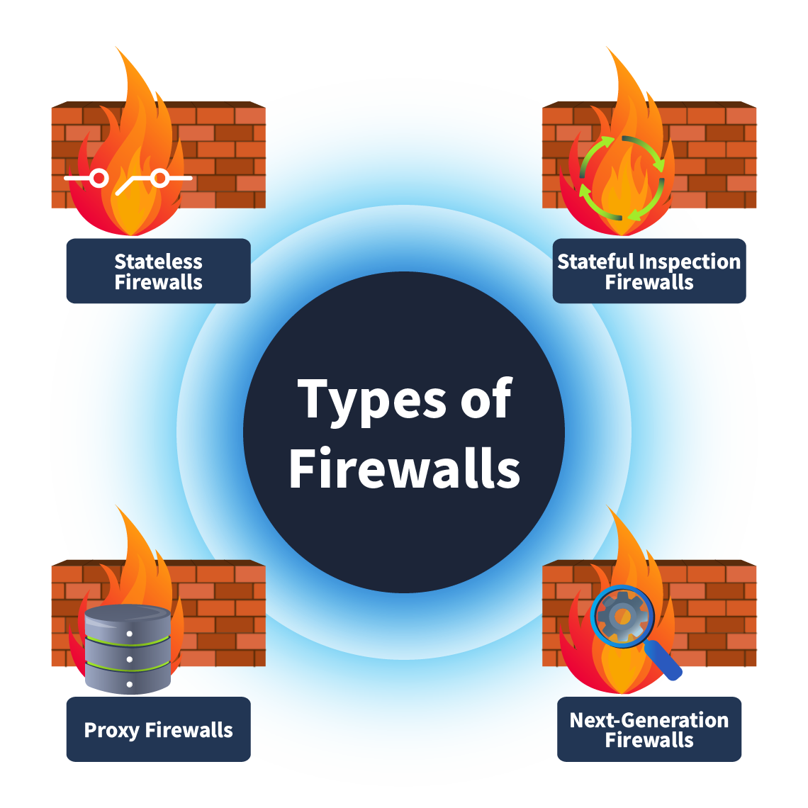
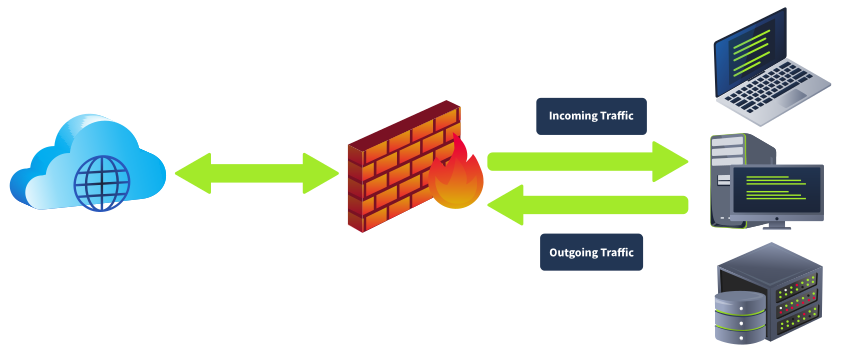

# Firewalls

<figure><figcaption></figcaption></figure>

**1. Stateless Firewall (Old)**

* Operates at **Layer 3 & 4** (network & transport).
* Filters packets only by **predefined rules**, without tracking connection states.
* **Fast performance** but **less secure**, as each packet is treated independently.
* Cannot enforce policies based on previous traffic history.

**2. Stateful Firewall**

* Operates at **Layer 3 & 4**.
* Tracks **connection states** using a **state table**.
* Allows/denies future packets based on the status of existing connections.
* Provides **better security** than stateless firewalls.

**3. Proxy Firewall (Application-Level Gateway)**

* Operates at **Layer 7** (application).
* Acts as an **intermediary** between users and the internet.
* **Inspects packet contents**, hides internal IP addresses, and enforces **content filtering policies**.
* Provides **anonymity** and application-level security.

**4. Next-Generation Firewall (NGFW)**

* Operates from **Layer 3 to Layer 7**.
* Provides **deep packet inspection**, intrusion prevention, and heuristic analysis.
* Can **decrypt SSL/TLS traffic** for inspection.
* Uses **threat intelligence feeds** to detect and block malicious activity in real time.
* Combines traditional firewall functions with **advanced security features**.

| **Firewalls**                         | **Characteristics**                                                                                                                                                                                      |
| ------------------------------------- | -------------------------------------------------------------------------------------------------------------------------------------------------------------------------------------------------------- |
| **Stateless Firewalls**               | 
- Basic filtering 

- No track of previous connections 

- Efficient for high-speed networks
                                                                                            |
| **Stateful Firewalls (Old)**          | 
- Recognize traffic by patterns 

- Complex rules can be applied 

- Monitor the network connections
                                                                                    |
| **Proxy Firewalls**                   | 
- Inspect the data inside packets 

- Provide content filtering options 

- Provide application control 

- Decrypt and inspect SSL/TLS data packets
                               |
| **Next-Generation Firewalls (NGFWs)** | 
- Provide advanced threat protection 

- Include an intrusion prevention system (IPS) 

- Identify anomalies with heuristic analysis 

 - Decrypt and inspect SSL/TLS data packets
 |
| **WAF (Web Application Firewall)**    | Protects web applications by filtering, monitoring, and blocking malicious HTTP/S traffic (e.g., SQL injection, XSS).                                                                                    |


Firewalls can be physical or software like Host Based Firewall or Web Based Firewalls


The basic components of a firewall’s rule are described below:

* **Source address:** The machine’s IP address that would originate the traffic.
* **Destination address:** The machine’s IP address that would receive the data.
* **Port:** The port number for the traffic.
* **Protocol:** The protocol that would be used during the communication.
* **Action:** This defines the action that would be taken upon identifying any traffic of this particular nature.
* **Direction:** This field defines the rule’s applicability to incoming or outgoing traffic.

<figure><figcaption></figcaption></figure>

**Inbound Rules**

Rules are categorized as inbound rules when they are meant to be applied to incoming traffic only. For example, you might allow incoming HTTP traffic (port 80) on your web server.

**Outbound Rules**

These rules are made for outgoing traffic only. For example, blocking all outgoing SMTP traffic (port 25) from all the devices except the mail server.

**Forward Rules**

Forwarding rules are created to forward specific traffic inside the network. For example, a forwarding rule can be created to forward the incoming HTTP (port 80) traffic to the web server located in your network.


