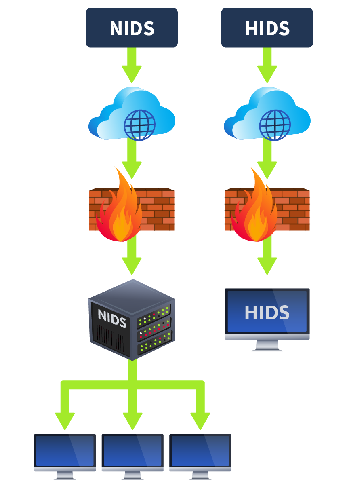
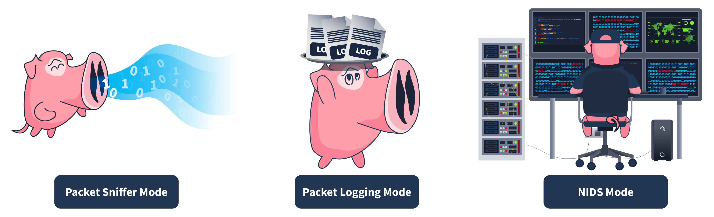
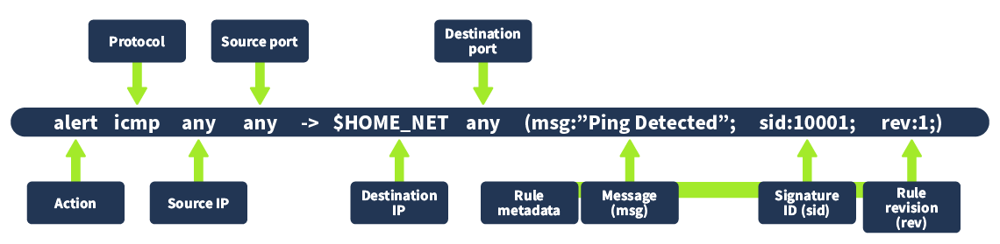

# IDS

<figure><figcaption></figcaption></figure>

### Deployment Modes

IDS can be deployed in the following ways:

* **Host Intrusion Detection System (HIDS):** Host-based IDS solutions are installed individually on the hosts and are responsible for only detecting potential security threats associated with that particular host. They provide detailed visibility of the host’s activities. However, host intrusion detection systems can be challenging to manage in large networks as they are resource-intensive and require management on each host.
* **Network Intrusion Detection System (NIDS):** Network-based IDS solutions are crucial in detecting potentially malicious activities within the whole network, regardless of any specific hosts. They monitor the network traffic of all the hosts involved to detect suspicious activities. It provides a centralized view of all the detections inside the whole network.

### Detection Modes

* **Signature-Based IDS:** Many attacks occur every day. Each attack has its unique pattern, which is known as a signature. These signatures are preserved by the IDS in their databases so that if the same attack happens in the future, it gets detected by its signature and reported to the security administrators for action. The stronger the signature database of the IDS is, the more efficiently it would detect known threats. However, the signature-based IDS is unable to detect zero-day attacks. Zero-day attacks have no prior signatures (patterns) and are not saved inside the IDS databases. Therefore, the signature-based IDS can only detect the attacks that happened previously, and its signatures (patterns) are saved inside the database. In the upcoming tasks, we will explore a signature-based IDS named Snort.
* **Anomaly-Based IDS:** This type of IDS first learns the normal behavior (baseline) of the network or system and performs detections if there is any deviation from the normal behavior. Anomaly-based IDS can also detect zero-day attacks because they don’t rely on the available signatures for the detections but detect abnormalities inside the network or system by comparing the current state with the normal behavior (baseline). However, this type of IDS may generate a lot of false positives (marking benign activities as malicious) because the nature of most legitimate programs matches the malicious ones. Anomaly-based IDS would mark them malicious and believe anything behaving unusually is malicious. We can also reduce the false positives generated by anomaly-based IDS by fine-tuning it (manually defining the normal behavior in the IDS).
* **Hybrid IDS:** A hybrid IDS combines the detection methods of signature-based IDS and anomaly-based IDS to leverage the strengths of each approach. Some known threats may already have some signatures in the IDS database; in this case, the hybrid IDS would use the detection technique of the signature-based IDS. If it encounters a new threat, it can leverage the detection method of anomaly-based IDS.

## Snort

Snort, developed in 1998, is one of the most widely used open-source IDS solutions. It uses both signature-based and anomaly-based detection to identify threats, with attack patterns defined in its rule files. Snort comes with built-in rule sets that can detect many types of malicious traffic. However, you can also create custom rules to detect specific traffic not covered by the defaults, or disable rules that are not relevant to your network. In the next task, we will explore these built-in rules and create custom ones for targeted detection.

<figure><figcaption></figcaption></figure>

| **Mode**                                           | **Description**                                                                                                                                                                   | **Use Case**                                                                                                                               |
| -------------------------------------------------- | --------------------------------------------------------------------------------------------------------------------------------------------------------------------------------- | ------------------------------------------------------------------------------------------------------------------------------------------ |
| **Packet Sniffer Mode**                            | Reads and displays network packets without analysis. Useful for monitoring and troubleshooting rather than IDS detection. Traffic can be shown on the console or saved to a file. | The network team observes performance issues and needs detailed insights into traffic. They use Snort’s packet sniffer mode for diagnosis. |
| **Packet Logging Mode**                            | Logs network traffic as PCAP files for later analysis, including detections. Helps in forensic investigations and root cause analysis of attacks.                                 | The security team investigates a past network attack and uses Snort’s packet logging mode to review traffic logs.                          |
| **Network Intrusion Detection System (NIDS) Mode** | Monitors network traffic in real-time, applying rule files to detect attack patterns. Generates alerts when threats are detected.                                                 | The security team proactively monitors for threats using Snort’s NIDS mode.                                                                |

### Rules

Snort **rules** are the core instructions that tell Snort **what to look for in network traffic** and **what action to take when a match is found**.

They act like signatures and detection logic for suspicious or malicious behavior.

#### Key Points about Snort Rules:

* **Structure** → A Snort rule has **two parts**:
  1. **Rule Header** → Defines action (alert, log, drop, etc.), protocol (TCP, UDP, ICMP, IP), source/destination IPs and ports, and traffic direction.
  2. **Rule Options** → Defines what to look for inside the packet (e.g., content, payload, flags) and provides details for alerts.
* **Rule Actions** → Common ones include:
  * `alert` → Generate an alert and log the packet.
  * `log` → Log the packet without alerting.
  * `pass` → Ignore the packet.
  * `drop/reject` (inline mode) → Block malicious traffic.
* **Detection Logic** → Rules can match on specific content (like “GET /admin”), protocol behavior, ports, or anomalies.
* **Customizable** → Admins can write custom rules for threats unique to their environment, or disable irrelevant ones.

<figure><figcaption></figcaption></figure>
