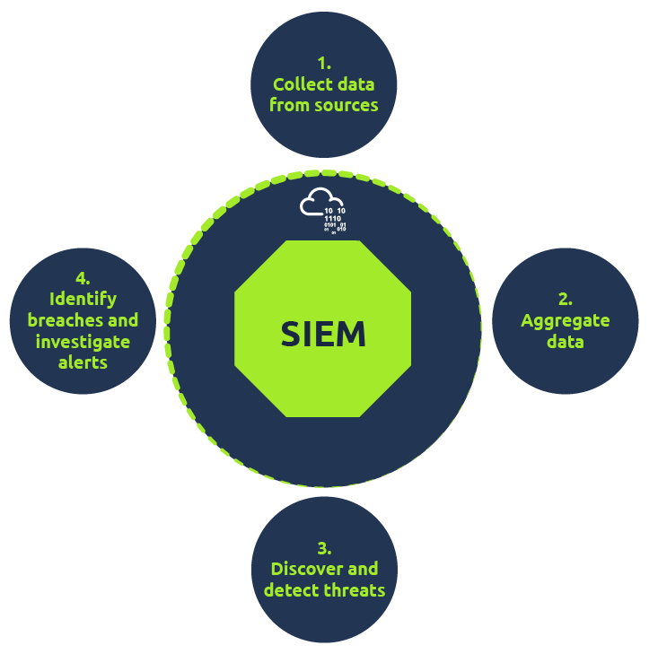

# SIEM

## Importance of SIEM

#### **SIEM (Security Information and Event Management)**

* Collects and correlates data from multiple sources to **detect threats**.
* Raises **alerts** when threats or thresholds are detected, enabling analysts to respond.
* Provides **visibility** into network and host activities.
* Plays a key role in **timely threat detection and protection** in cybersecurity.

***

#### **Key Capabilities of SIEM**

* Correlates events from different log sources.
* Monitors both **host-centric** and **network-centric** activities.
* Supports analysts in **investigation and response** to threats.
* Enables **threat hunting** beyond pre-defined rules.

***

#### **SOC Analyst Responsibilities Using SIEM**

* Monitoring and investigating security events.
* Identifying and reducing **false positives**.
* Tuning rules to reduce noise.
* Reporting for compliance.
* Identifying and covering **network visibility blind spots**.

***

## Log Types

1\) Host-Centric Log Sources

These are log sources that capture events that occurred within or related to the host. Some log sources that generate host-centric logs are Windows Event logs, Sysmon, Osquery, etc. Some examples of host-centric logs are:

* A user accessing a file
* A user attempting to authenticate.
* A process Execution Activity
* A process adding/editing/deleting a registry key or value.
* Powershell execution

2\) Network-Centric Log Sources

Network-related logs are generated when the hosts communicate with each other or access the internet to visit a website. Some network-based protocols are SSH, VPN, HTTP/s, FTP, etc. Examples of such events are:

* SSH connection
* A file being accessed via FTP
* Web traffic
* A user accessing company's resources through VPN.
* Network file sharing Activity

<figure><figcaption></figcaption></figure>

* Real-time log Ingestion
* Alerting against abnormal activities
* 24/7 Monitoring and visibility
* Protection against the latest threats through early detection
* Data Insights and visualization
* Ability to investigate past incidents.

## Linux Workstation

Linux OS stores all the related logs, such as events, errors, warnings, etc. Which are then ingested into SIEM for continuous monitoring. Some of the common locations where Linux store logs are:

* /var/log/httpd : Contains HTTP Request  / Response and error logs.
* /var/log/cron   : Events related to cron jobs are stored in this location.
* /var/log/auth.log and /var/log/secure : Stores authentication related logs.
* /var/log/kern : This file stores kernel related events.

## Windows Machine

Windows records every event that can be viewed through the Event Viewer utility. It assigns a unique ID to each type of log activity, making it easy for the analyst to examine and keep track of. To view events in a Windows environment, type `Event Viewer` in the search bar, and it takes you to the tool where different logs are stored and can be viewed, as shown below. These logs from all windows endpoints are forwarded to the SIEM solution for monitoring and better visibility.

<figure><figcaption></figcaption></figure>

## Dashboard

Dashboards are the most important components of any SIEM. SIEM presents the data for analysis after being normalized and ingested. The summary of these analyses is presented in the form of actionable insights with the help of multiple dashboards. Each SIEM solution comes with some default dashboards and provides an option for custom Dashboard creation. Some of the information that can be found in a dashboard are:

* Alert Highlights
* System Notification
* Health Alert
* List of Failed Login Attempts
* Events Ingested Count
* Rules triggered
* Top Domains Visited

An example of a Default dashboard in Qradar SIEM is shown below:

<figure><figcaption></figcaption></figure>

## !!! Correlation Rules !!!

Correlation rules play an important role in the timely detection of threats allowing analysts to take action on time. Correlation rules are pretty much logical expressions set to be triggered. A few examples of correlation rules are:

* If a User gets 5 failed Login Attempts in 10 seconds - Raise an alert for `Multiple Failed Login Attempts`
* If login is successful after multiple failed login attempts - Raise an alert for `Successful Login After multiple Login Attempts`
* A rule is set to alert every time a user plugs in a USB (Useful if USB is restricted as per the company policy)
* If outbound traffic is > 25 MB - Raise an alert to potential Data exfiltration Attempt (Usually, it depends on the company policy)

Use-Case 1:

Adversaries tend to remove the logs during the post-exploitation phase to remove their tracks. A unique Event ID 104 is logged every time a user tries to remove or clear event logs. To create a rule based on this activity, we can set the condition as follows:

Rule: If the Log source is WinEventLog AND EventID is 104 - Trigger an alert `Event Log Cleared`

Use-Case 2: Adversaries use commands like whoami after the exploitation/privilege escalation phase. The following Fields will be helpful to include in the rule.

* Log source: Identify the log source capturing the event logs
* Event ID: which Event ID is associated with Process Execution activity? In this case, event id 4688 will be helpful.
* NewProcessName: which process name will be helpful to include in the rule?

Rule: If Log Source is WinEventLog AND EventCode is 4688, and NewProcessName contains whoami, then Trigger an ALERT `WHOAMI command Execution DETECTED`

In the previous task, the importance of field-value pairs was discussed. Correlation rules keep an eye on the values of certain fields to get triggered. That is the reason why it is important to have normalized logs ingested.

## Alert Investigation

When monitoring SIEM, analysts spend most of their time on dashboards as it displays various key details about the network in a very summarized way. Once an alert is triggered, the events/flows associated with the alert are examined, and the rule is checked to see which conditions are met. Based on the investigation, the analyst determines if it's a True or False positive. Some of the actions that are performed after the analysis are:

* Alert is False Alarm. It may require tuning the rule to avoid similar False positives from occurring again.
* Alert is True Positive. Perform further investigation.
* Contact the asset owner to inquire about the activity.
* Suspicious activity is confirmed. Isolate the infected host.
* Block the suspicious IP.
