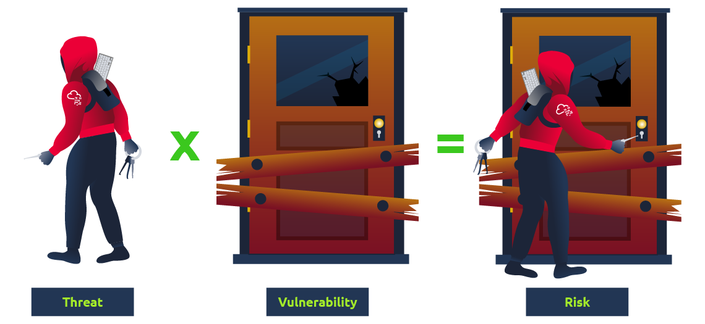

# Threat Modelling

## Threat, Vulnerability and Risk

| Type          | Definition                                                                                                                                                                                                                                          |
| ------------- | --------------------------------------------------------------------------------------------------------------------------------------------------------------------------------------------------------------------------------------------------- |
| Threat        | Refers to any potential occurrence, event, or actor that may exploit vulnerabilities to compromise information confidentiality, integrity, or availability. It may come in various forms, such as cyber attacks, human error, or natural disasters. |
| Vulnerability | A weakness or flaw in a system, application, or process that may be exploited by a threat to cause harm. It may arise from software bugs, misconfiguration, or design flaws.                                                                        |
| Risk          | The possibility of being compromised because of a threat taking advantage of a vulnerability. A way to think about how likely an attack might be successful and how much damage it could cause.                                                     |
|               |                                                                                                                                                                                                                                                     |

<figure><figcaption></figcaption></figure>

## High-Level Process of Threat Modelling

1.  Defining the scope

    Identify the specific systems, applications, and networks in the threat modelling exercise.
2.  Asset Identification

    Develop diagrams of the organisation's architecture and its dependencies. It is also essential to identify the importance of each asset based on the information it handles,  such as customer data, intellectual property, and financial information.
3.  Identify Threats

    Identify potential threats that may impact the identified assets, such as cyber attacks, physical attacks, social engineering, and insider threats.
4.  Analyse Vulnerabilities and Prioritise Risks&#x20;

    Analyse the vulnerabilities based on the potential impact of identified threats in conjunction with assessing the existing security controls. Given the list of vulnerabilities, risks should be prioritised based on their likelihood and impact.
5.  Develop and Implement Countermeasures

    Design and implement security controls to address the identified risks, such as implementing access controls, applying system updates, and performing regular vulnerability assessments.
6.  Monitor and Evaluate

    Continuously test and monitor the effectiveness of the implemented countermeasures and evaluate the success of the threat modelling exercise. An example of a simple measurement of success is tracking the identified risks that have been effectively mitigated or eliminated.

## Attack Trees

<figure><figcaption></figcaption></figure>

## MITRE ATT\&CK Framework


[red-teaming.md](../../red-teamimg-ethical-hacking/red-teaming.md)


## DREAD Framework

The DREAD framework is a risk assessment model developed by Microsoft to evaluate and prioritise security threats and vulnerabilities.

| DREAD           | Definition                                                                                                                                                                                                                                  |
| --------------- | ------------------------------------------------------------------------------------------------------------------------------------------------------------------------------------------------------------------------------------------- |
| Damage          | The potential harm that could result from the successful exploitation of a vulnerability. This includes data loss, system downtime, or reputational damage.                                                                                 |
| Reproducibility | The ease with which an attacker can successfully recreate the exploitation of a vulnerability. A higher reproducibility score suggests that the vulnerability is straightforward to abuse, posing a greater risk.                           |
| Exploitability  | The difficulty level involved in exploiting the vulnerability considering factors such as technical skills required, availability of tools or exploits, and the amount of time it would take to exploit the vulnerability successfully.     |
| Affected Users  | The number or portion of users impacted once the vulnerability has been exploited.                                                                                                                                                          |
| Discoverability | The ease with which an attacker can find and identify the vulnerability considering whether it is publicly known or how difficult it is to discover based on the exposure of the assets (publicly reachable or in a regulated environment). |

<figure><figcaption></figcaption></figure>

* **Damage** - How bad would an attack be?
* **Reproducibility** - How easy is it to reproduce the attack?
* **Exploitability** - How much work is it to launch the attack?
* **Affected Users** - How many people will be impacted?
* D**iscoverability** - How easy is it to discover the vulnerability?

**DREAD Framework Guidelines**

1. Establish a standardised set of guidelines and definitions for each DREAD category that provides a consistent understanding of how to rate vulnerabilities. This can be supported by providing examples and scenarios to illustrate how scores should be assigned under various circumstances.
2. Encourage collaboration and discussion among multiple teams. Constructive feedback from different members aids in justifying the assigned scores, which can lead to a more accurate assessment.
3. Use the DREAD framework with other risk-assessment methodologies and regularly review and update the chosen methods and techniques to ensure they remain relevant and aligned with the organisation's needs.

| **DREAD Score** | **2.5**                                                                                    | **5**                                                 | **7.5**                                                          | **10**                                                            |
| --------------- | ------------------------------------------------------------------------------------------ | ----------------------------------------------------- | ---------------------------------------------------------------- | ----------------------------------------------------------------- |
| Damage          | Minimal infrastructure information disclosure                                              | Minimal information disclosure related to client data | Limited PII leak                                                 | Complete data leak                                                |
| Reproducibility | Multiple attack vectors requiring technical expertise                                      | Minor customisation for public exploits needed        | Little prerequisite technical skills needed to run the exploit   | Users with public exploits can successfully reproduce the exploit |
| Exploitability  | Almost no public exploits are available and need customisation of scripts                  | Complicated exploit scripts available in the wild     | Minimal technical skills are required to execute public exploits | Reliable Metasploit module exists                                 |
| Affected Users  | 
Almost none to a small subset 
                                                   | Around 10% of users                                   | More than half of the user base                                  | All users                                                         |
| Discoverability | The significant effort needed to discover the vulnerability chains for the exploit to work | Requires a manual way of verifying the vulnerability  | Public scanning scripts not embedded in scanning tools exist     | Almost all known scanning tools can find the vulnerability        |

Given this guideline, we can assess some known vulnerabilities in the application. Below is an example of scoring provided for each vulnerability.

1. Unauthenticated Remote Code Execution (Score: 8)
   * Damage (D): 10
   * Reproducibility (R): 7.5
   * Exploitability (E): 10
   * Affected Users (A): 10
   * Discoverability (D): 2.5
2. Insecure Direct Object References (IDOR) in User Profiles (Score: 6.5)
   * Damage (D): 2.5
   * Reproducibility (R): 7.5&#x20;
   * Exploitability (E): 7.5
   * Affected Users (A): 10&#x20;
   * Discoverability (D): 5
3. Server Misconfiguration Leading to Information Disclosure (Score: 5)
   * Damage (D): 0
   * Reproducibility (R): 10
   * Exploitability (E): 10
   * Affected Users (A): 0
   * Discoverability (D): 5

## **STRIDE Framework**

The STRIDE framework is a threat modelling methodology also developed by Microsoft, which helps identify and categorise potential security threats in software development and system design. The acronym STRIDE is based on six categories of threats, namely:

As you can see, the table above also provides what component of the CIA triad is violated. The STRIDE framework is built upon this foundational information security concept.

<figure><figcaption></figcaption></figure>

| Category               | Definition                                                                                         | Policy Violated |
| ---------------------- | -------------------------------------------------------------------------------------------------- | --------------- |
| Spoofing               | Unauthorised access or impersonation of a user or system.                                          | Authentication  |
| Tampering              | Unauthorised modification or manipulation of data or code.                                         | Integrity       |
| Repudiation            | Ability to deny having acted, typically due to insufficient auditing or logging.                   | Non-repudiation |
| Information Disclosure | Unauthorised access to sensitive information, such as personal or financial data.                  | Confidentiality |
| Denial of Service      | Disruption of the system's availability, preventing legitimate users from accessing it.            | Availability    |
| Elevation of Privilege | Unauthorised elevation of access privileges, allowing threat actors to perform unintended actions. | Authorisation   |

**Threat Modelling With STRIDE**

1.  **System Decomposition**

    Break down all accounted systems into components, such as applications, networks, and data flows. Understand the architecture, trust boundaries, and potential attack surfaces.
2.  **Apply STRIDE Categories**

    For each component, analyse its exposure to the six STRIDE threat categories. Identify potential threats and vulnerabilities related to each category.
3.  **Threat Assessment**

    Evaluate the impact and likelihood of each identified threat. Consider the potential consequences and the ease of exploitation and prioritise threats based on their overall risk level.
4.  **Develop Countermeasures**&#x20;

    Design and implement security controls to address the identified threats tailored to each STRIDE category. For example, to enhance email security and mitigate spoofing threats, implement DMARC, DKIM, and SPF, which are email authentication and validation mechanisms that help prevent email spoofing, phishing, and spamming.
5.  **Validation and Verification**

    Test the effectiveness of the implemented countermeasures to ensure they effectively mitigate the identified threats. If possible, conduct penetration testing, code reviews, or security audits.
6.  C**ontinuous Improvement**

    Regularly review and update the threat model as the system evolves and new threats emerge. Monitor the effective countermeasures and update them as needed.

| Scenario                                                                                                                                              | Spoofing     | Tampering    | Repudiation  | Information Disclosure | Denial of Service | Elevation of Privilege |
| ----------------------------------------------------------------------------------------------------------------------------------------------------- | ------------ | ------------ | ------------ | ---------------------- | ----------------- | ---------------------- |
| Sending a spoofed email, wherein the mail gateway lacks email security and logging configuration.                                                     | 
✔ 
 | 
 
  | 
✔ 
 | 
 
            | 
 
       | 
 
            |
| 
Flooding a web server with many requests that lack load-balancing capabilities. 
                                                            | 
 
  | 
 
  | 
 
  | 
 
            | 
✔ 
      | 
 
            |
| Abusing an SQL injection vulnerability.                                                                                                               | 
 
  | 
✔ 
 | 
 
  | 
✔ 
           | 
 
       | 
 
            |
| Accessing public cloud storage (such as AWS S3 bucket or Azure blob) that handles customer data.                                                      | 
 
  | 
 
  | 
 
  | 
✔ 
           | 
 
       | 
 
            |
| Exploiting a local privilege escalation vulnerability due to the lack of system updates and modifying system configuration for a persistent backdoor. | 
 
  | 
✔ 
 | 
 
  | 
 
            | 
 
       | ✔                      |

## PASTA Framework

PASTA, or Process for Attack Simulation and Threat Analysis, is a structured, risk-centric threat modelling framework designed to help organisations identify and evaluate security threats and vulnerabilities within their systems, applications, or infrastructure. PASTA provides a systematic, seven-step process that enables security teams to understand potential attack scenarios better, assess the likelihood and impact of threats, and prioritise remediation efforts accordingly.

<figure><figcaption></figcaption></figure>

1.  **Define the Objectives**

    Establish the scope of the threat modelling exercise by identifying the systems, applications, or networks being analysed and the specific security objectives and compliance requirements to be met.
2.  **Define the Technical Scope**

    Create an inventory of assets, such as hardware, software, and data, and develop a clear understanding of the system's architecture, dependencies, and data flows.
3.  **Decompose the Application**

    Break down the system into its components, identifying entry points, trust boundaries, and potential attack surfaces. This step also includes mapping out data flows and understanding user roles and privileges within the system.
4.  **Analyse the Threats**&#x20;

    Identify potential threats to the system by considering various threat sources, such as external attackers, insider threats, and accidental exposures. This step often involves leveraging industry-standard threat classification frameworks or attack libraries.
5.  **Vulnerabilities and Weaknesses Analysis**

    Analyse the system for existing vulnerabilities, such as misconfigurations, software bugs, or unpatched systems, that an attacker could exploit to achieve their objectives. Vulnerability assessment tools and techniques, such as static and dynamic code analysis or penetration testing, can be employed during this step.
6.  **Analyse the Attacks**

    Simulate potential attack scenarios and evaluate the likelihood and impact of each threat. This step helps determine the risk level associated with each identified threat, allowing security teams to prioritise the most significant risks.
7.  **Risk and Impact Analysis**

    Develop and implement appropriate security controls and countermeasures to address the identified risks, such as updating software, applying patches, or implementing access controls. The chosen countermeasures should be aligned with the organisation's risk tolerance and security objectives.
