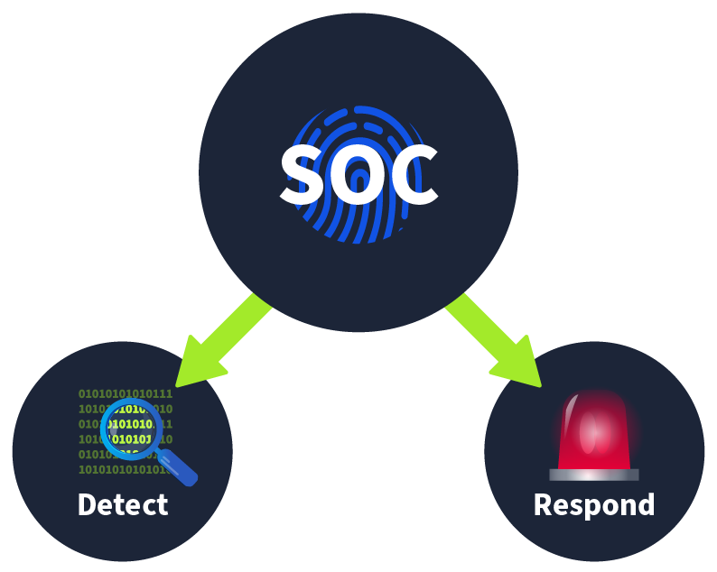
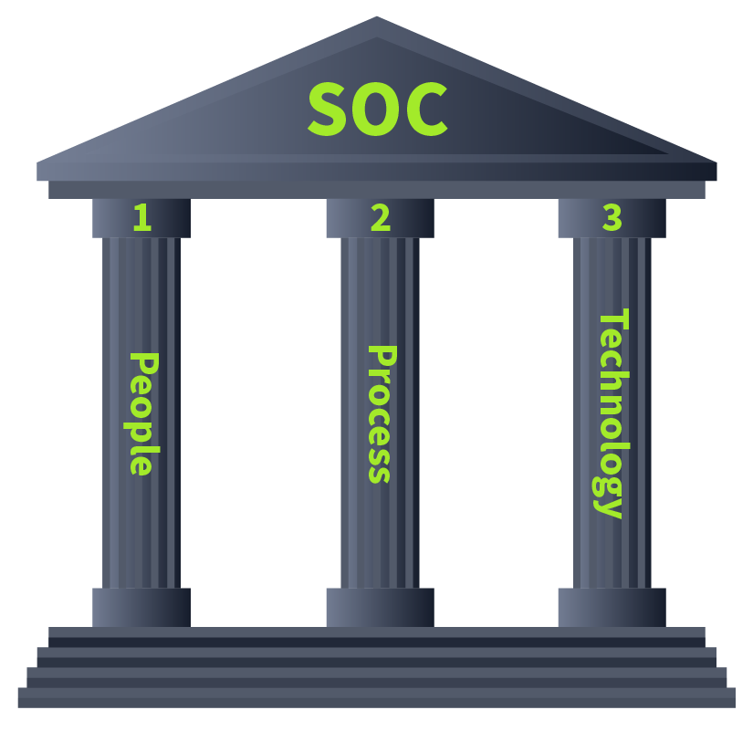
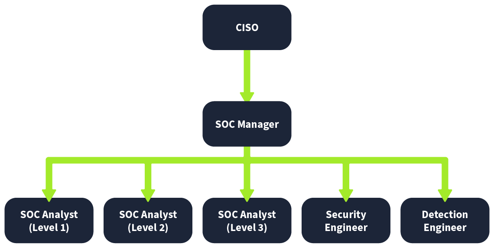
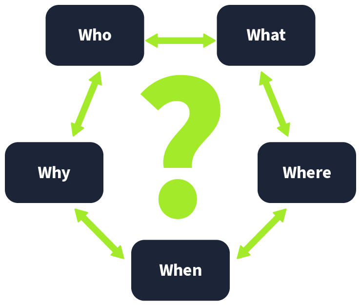

# SOC Analyst

## SOC Goal

<figure><figcaption></figcaption></figure>

### **Detection**

* **Detect vulnerabilities**: A vulnerability is a weakness that an attacker can exploit to carry out things beyond their permission level. A vulnerability might be discovered in any device’s software (operating system and programs), such as a server or computer. For instance, the SOC might discover a set of MS Windows computers that must be patched against a specific published vulnerability. Strictly speaking, vulnerabilities are not necessarily the SOC’s responsibility; however, unfixed vulnerabilities affect the security level of the entire company.
* **Detect unauthorized activity**: Consider the case where an attacker discovered the username and password of one of the employees and used them to log in to the company system. It is crucial to detect this kind of unauthorized activity quickly before it causes any damage. Many clues, such as geographic location, can help us detect this.
* **Detect policy violations**: A security policy is a set of rules and procedures created to help protect a company against security threats and ensure compliance. What is considered a violation would vary from company to company; examples include downloading pirated media files and sending confidential company files insecurely.
* **Detect intrusions**: Intrusions refer to unauthorized access to systems and networks. One scenario would be an attacker successfully exploiting our web application. Another would be a user visiting a malicious site and getting their computer infected.

### **Response**

* **Support with the incident response**: Once an incident is detected, certain steps are taken to respond to it. This response includes minimizing its impact and performing the root cause analysis of the incident. The SOC team also helps the incident response team carry out these steps.

<figure><figcaption></figcaption></figure>

## Jobs In SOC

<figure><figcaption></figcaption></figure>

* **SOC Analyst (Level 1):** Anything detected by the security solution would pass through these analysts first. These are the first responders to any detection. SOC Level 1 Analysts perform basic alert triage to determine if a specific detection is harmful. They also report these detections through proper channels.
* **SOC Analyst (Level 2):** While Level 1 does the first-level analysis, some detections may require deeper investigation. Level 2 Analysts help them dive deeper into the investigations and correlate the data from multiple data sources to perform a proper analysis.
* **SOC Analyst (Level 3):** Level 3 Analysts are experienced professionals who proactively look for any threat indicators and support in the incident response activities. The critical severity detection reported by Level 1 and Level 2 Analysts are often security incidents that need detailed responses, including containment, eradication, and recovery. This is where Level 3 analysts’ experience comes in handy.
* **Security Engineer:** All analysts work on security solutions. These solutions need deployment and configuration. Security Engineers deploy and configure these security solutions to ensure their smooth operation.
* **Detection Engineer:** Security rules are the logic built behind security solutions to detect harmful activities. Level 2 and 3 Analysts often create these rules, while the SOC team can sometimes also utilize the detection engineer role independently for this responsibility.
* **SOC Manager:** The SOC Manager manages the processes the SOC team follows and provides support. The SOC Manager also remains in contact with the organization’s CISO (Chief Information Security Officer) to provide him with updates on the SOC team’s current security posture and efforts.

### Alert Triage

<figure><figcaption></figcaption></figure>
