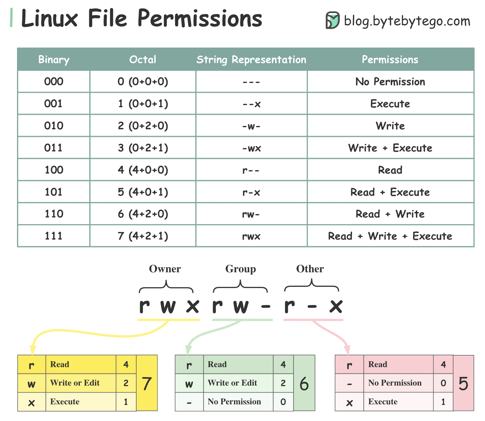

# File permissions

<figure><figcaption></figcaption></figure>


**Zero uid on linux is always the Root user**


## chmod

```bash
chmod u+x script.sh   # Add execute to user
chmod go-w file.txt   # Remove write from group and others
chmod a+r file.txt    # Add read to everyone
chmod u=rwx file.txt  # Set user to rwx exactly
```

| Symbol | Meaning           |
| ------ | ----------------- |
| `u`    | user (owner)      |
| `g`    | group             |
| `o`    | others            |
| `a`    | all (u+g+o)       |
| `+`    | add permission    |
| `-`    | remove permission |
| `=`    | set exactly       |

```bash
chmod 755 script.sh
```

* **7** → user = rwx
* **5** → group = r-x
* **5** → others = r-x

## chown

The `chown` command in Unix/Linux is used to **change the ownership** of files and directories.

### Basic Syntax

```bash
chown [OPTIONS] USER[:GROUP] FILE...
```

### Common Options

| Option                               | Description                                                                                                       |
| ------------------------------------ | ----------------------------------------------------------------------------------------------------------------- |
| `-R`, `--recursive`                  | Apply changes to all files and directories recursively.Recursively change ownership.                              |
| `-v`, `--verbose`                    | Show a message for each file that is changed.Verbose output, shows what changes are made.                         |
| `-f`, `--silent`, `--quiet`          | Suppress most error messages.                                                                                     |
| `--dereference`                      | Affect the target of symbolic links (default behavior).Use ownership of `RFILE` as the reference for other files. |
| `-h`, `--no-dereference`             | Affect the symbolic link itself, not the file it points to.                                                       |
| `--from=CURRENT_OWNER:CURRENT_GROUP` | Only change ownership if current owner/group matches.                                                             |
| `--reference=RFILE`                  | Change ownership to match that of the reference file.                                                             |
