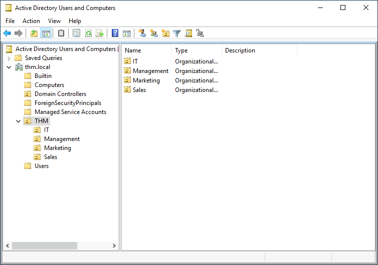

# Active Directory

<figure><figcaption></figcaption></figure>

The core of any Windows Domain is the Active Directory Domain Service (AD DS). This service acts as a catalogue that holds the information of all of the "objects" that exist on your network. Amongst the many objects supported by AD, we have users, groups, machines, printers, shares and many others. Let's look at some of them:

_Users_

Users are one of the most common object types in Active Directory. Users are one of the objects known as **security principals**, meaning that they can be authenticated by the domain and can be assigned privileges over **resources** like files or printers. You could say that a security principal is an object that can act upon resources in the network.

Users can be used to represent two types of entities:

* **People:** users will generally represent persons in your organisation that need to access the network, like employees.
* **Services:** you can also define users to be used by services like IIS or MSSQL. Every single service requires a user to run, but service users are different from regular users as they will only have the privileges needed to run their specific service.

_Machines_

Machines are another type of object within Active Directory; for every computer that joins the Active Directory domain, a machine object will be created. Machines are also considered "security principals" and are assigned an account just as any regular user. This account has somewhat limited rights within the domain itself.

The machine accounts themselves are local administrators on the assigned computer, they are generally not supposed to be accessed by anyone except the computer itself, but as with any other account, if you have the password, you can use it to log in.

**Note:** Machine Account passwords are automatically rotated out and are generally comprised of 120 random characters.

## Identifying machine

accounts is relatively easy. They follow a specific naming scheme. The machine account name is the computer's name followed by a dollar sign. For example, a machine named `DC01` will have a machine account called `DC01$`.

| Security Group     | Description                                                                                                                                               |
| ------------------ | --------------------------------------------------------------------------------------------------------------------------------------------------------- |
| Domain Admins      | Users of this group have administrative privileges over the entire domain. By default, they can administer any computer on the domain, including the DCs. |
| Server Operators   | Users in this group can administer Domain Controllers. They cannot change any administrative group memberships.                                           |
| Backup Operators   | Users in this group are allowed to access any file, ignoring their permissions. They are used to perform backups of data on computers.                    |
| Account Operators  | Users in this group can create or modify other accounts in the domain.                                                                                    |
| Domain Users       | Includes all existing user accounts in the domain.                                                                                                        |
| Domain Computers   | Includes all existing computers in the domain.                                                                                                            |
| Domain Controllers | Includes all existing DCs on the domain.                                                                                                                  |

This will open up a window where you can see the hierarchy of users, computers and groups that exist in the domain. These objects are organised in **Organizational Units (OUs)** which are container objects that allow you to classify users and machines. OUs are mainly used to define sets of users with similar policing requirements. The people in the Sales department of your organisation are likely to have a different set of policies applied than the people in IT, for example. Keep in mind that a user can only be a part of a single OU at a time.

Checking our machine, we can see that there is already an OU called `THM` with four child OUs for the IT, Management, Marketing and Sales departments. It is very typical to see the OUs mimic the business' structure, as it allows for efficiently deploying baseline policies that apply to entire departments. Remember that while this would be the expected model most of the time, you can define OUs arbitrarily. Feel free to right-click the `THM` OU and create a new OU under it called `Students` just for the fun of it.

<figure><figcaption></figcaption></figure>

## Windows Defaults

You probably noticed already that there are other default containers apart from the THM OU. These containers are created by Windows automatically and contain the following:

* **Builtin:** Contains default groups available to any Windows host.
* **Computers:** Any machine joining the network will be put here by default. You can move them if needed.
* **Domain Controllers:** Default OU that contains the DCs in your network.
* **Users:** Default users and groups that apply to a domain-wide context.
* **Managed Service Accounts:** Holds accounts used by services in your Windows domain.

## Security Groups vs OUs

You are probably wondering why we have both groups and OUs. While both are used to classify users and computers, their purposes are entirely different:

* OUs are handy for applying policies to users and computers, which include specific configurations that pertain to sets of users depending on their particular role in the enterprise. Remember, a user can only be a member of a single OU at a time, as it wouldn't make sense to try to apply two different sets of policies to a single user.
* Security Groups, on the other hand, are used to grant permissions over resources. For example, you will use groups if you want to allow some users to access a shared folder or network printer. A user can be a part of many groups, which is needed to grant access to multiple resources.

_**The process of granting privileges to a user over some OU or other AD Object is called…**_

_**Answer:** delegation_

_**What is the name of the network share used to distribute GPOs to domain machines?**_

_**Answer:** SYSVOL_

<figure><figcaption></figcaption></figure>

<figure><figcaption></figcaption></figure>

<figure><figcaption></figcaption></figure>

To access domain from uk to usa branch we use **Trust relationships,**  **Two-way trust relationships**
