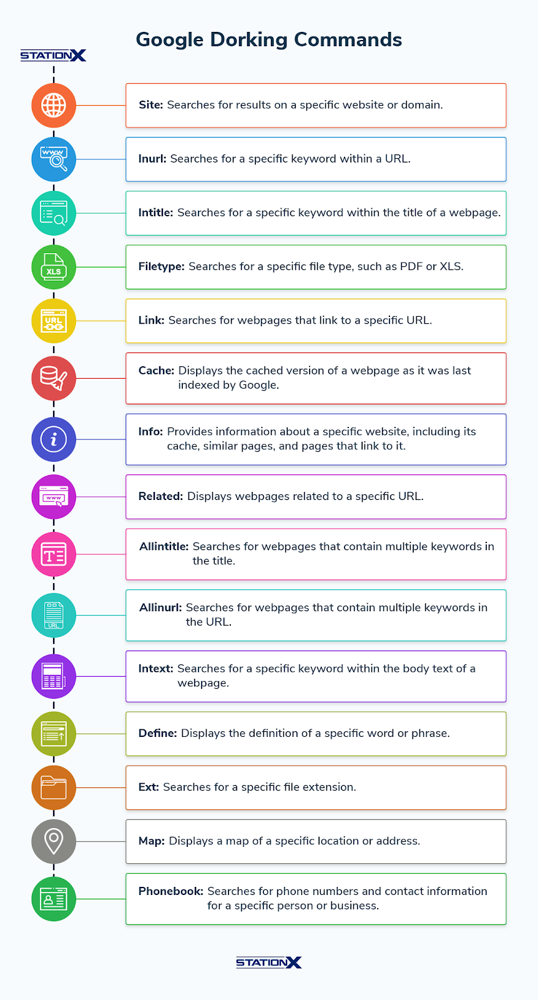

# Google Dorking



Basic Commands

#### **Basic Search Operators:**

* **Search a Specific Website (Domain Search)**\
  `site:example.com`
* **Search for Specific File Types**
  * Find PDFs:\
    `filetype:pdf site:example.com`
  * Find Word Docs:\
    `filetype:doc site:example.com`
* **Search for Specific Keywords in Titles**\
  `intitle:"admin login"`
* **Search for Specific Keywords in URLs**\
  `inurl:"login"`
* **Search for Specific Keywords in the Body of the Page**\
  `intext:"confidential"`

#### **Advanced Google Dorks:**

* **Search for Specific Phrases in Title and Body**\
  `allintitle:"confidential files"`
* **Search for Specific Words or Phrases in URL and Body**\
  `allinurl:"admin" intext:"password"`
* **Search for Multiple Words in Title or Body**\
  `intitle:"login" intitle:"admin"`
* **Search for Login Pages**\
  `inurl:"login" "username" "password"`
* **Search for Vulnerabilities or Exposed Directories**\
  `inurl:"phpinfo.php"` `intitle:"Index of /admin"`
* **Search for Exposed Admin or Configuration Files**\
  `inurl:"admin" filetype:log` `inurl:"config" filetype:bak`
* **Search for Camera or IoT Devices**\
  `intitle:"webcamXP" inurl:"admin"` `intitle:"Security Camera" inurl:"live"`

#### **Combining Operators:**

* **Combine Multiple Operators for Advanced Searches**\
  `site:example.com filetype:pdf "confidential" intitle:"report"`
* **Search for Exposed Databases or Admin Portals**\
  `inurl:"admin" intitle:"login"`

<figure><figcaption></figcaption></figure>
