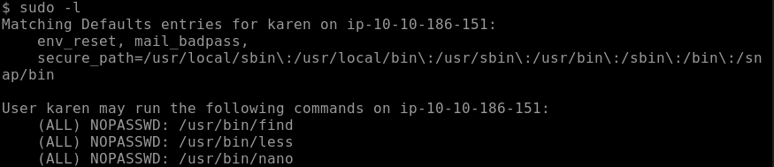

# Information Gathering

**1. Passive Information Gathering**

* Done **without directly interacting** with the target.
* Goal: Avoid detection.
* Sources:
  * WHOIS records
  * DNS records
  * Social media
  * Job postings
  * Public websites
  * Google hacking (dorking)

**2. Active Information Gathering**

* Involves **direct interaction** with the target.
* Riskier because it can **trigger alerts** or logs.
* Tools/Techniques:
  * Ping, traceroute
  * Port scanning (e.g., Nmap)
  * Banner grabbing
  * OS fingerprinting

#### What is **Footprinting**?

**Footprinting** is a **specific part of Information Gathering** where the goal is to **collect detailed information about a specific target** — like a company, website, or server — **before launching an attack**.

Think of footprinting as **drawing a blueprint** of the target's digital presence.

<figure><figcaption></figcaption></figure>
