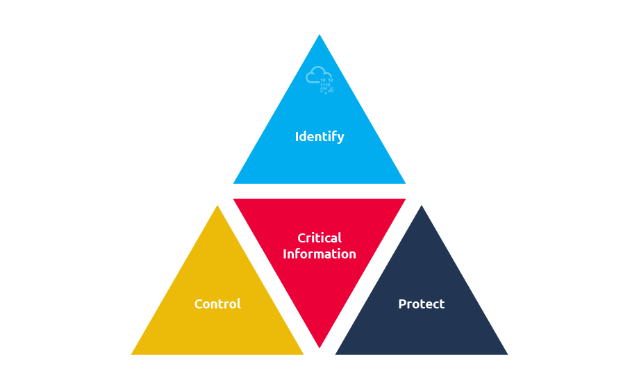
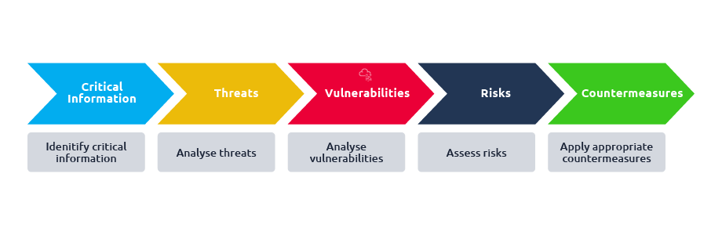
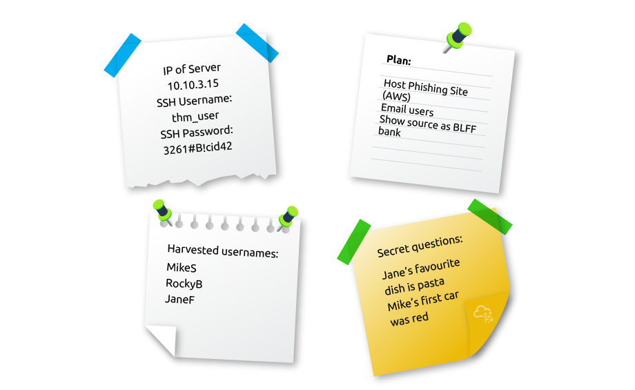
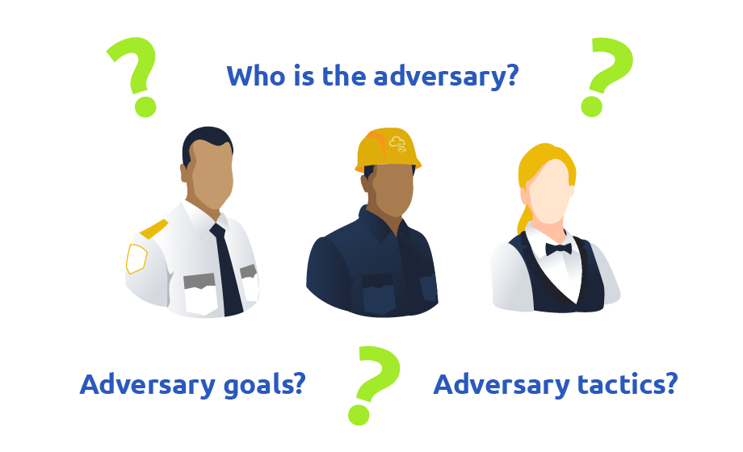

# OPSEC

Operations Security (OPSEC) is a term coined by the United States military. In the field of cybersecurity, let’s start with the definition provided by [NIST](https://csrc.nist.gov/glossary/term/opsec):

<figure><figcaption></figcaption></figure>

The OPSEC process has five steps:

1. Identify critical information
2. Analyse threats
3. Analyse vulnerabilities
4. Assess risks
5. Apply appropriate countermeasures

<figure><figcaption></figcaption></figure>

If the adversary discovers that you are scanning their network with Nmap (the blue team in our case), they should easily be able to discover the IP address used. For instance, if you use this same IP address to host a phishing site, it won’t be very difficult for the blue team to connect the two events and attribute them to the same actor.

OPSEC is not a solution or a set of rules; OPSEC is a five-step process to deny adversaries from gaining access to any critical information (defined in Task 2). We will dive into each step and see how we can improve OPSEC as part of our red team operations.

<figure><figcaption></figcaption></figure>

To identify critical information, the red team must think like an adversary and ask what the blue team would need to stop the mission. Critical information isn’t always sensitive, but anything that could jeopardize operations if exposed. Examples include:

* **Client information** (e.g., employee names, roles, infrastructure). Sharing must follow the **Principle of Least Privilege (PoLP)**.
* **Red team details** (identities, activities, plans, capabilities, limitations).
* **Tactics, Techniques, and Procedures (TTPs)** used in simulations.
* **Tools and environments** (OS, cloud providers, C2 frameworks). For example, if defenders know you use Pentoo, they can monitor related logs.
* **Public IP addresses**—exposure allows defenders to block or trace attacks.
* **Domain names**—if discovered, defenders can block or sinkhole them.
* **Hosted phishing sites** or other infrastructure used for emulation.

## &#x20;Threat Analysis

After we identify critical information, we need to analyse threats. _Threat analysis refers to identifying potential adversaries and their intentions and capabilities_. Adapted from the US Department of Defense [(DoD) Operations Security (OPSEC) Program Manual](https://www.esd.whs.mil/Portals/54/Documents/DD/issuances/dodm/520502m.pdf), threat analysis aims to answer the following questions:

1. Who is the adversary?
2. What are the adversary’s goals?
3. What tactics, techniques, and procedures does the adversary use?
4. What critical information has the adversary obtained, if any?

<figure><figcaption></figcaption></figure>

Here are some practical ways to reduce exposing your red team tactics and minimize OPSEC risks:

1. **Separate Tools and Tasks**
   * Don’t run multiple high-profile attack tools (e.g., Metasploit + Hydra) on the same machine if it could be observed.
   * Use dedicated systems for different phases of the attack.
2. **Use Air-Gapped or Isolated Environments**
   * Keep your tools and attacks in isolated virtual machines or networks that defenders can’t easily see.
3. **Limit Logging and Traces**
   * Avoid leaving logs, screenshots, or temporary files that could reveal your activity.
   * Mask or clean up evidence where safe and permitted.
4. **Minimize Network Exposure**
   * Use VPNs, proxies, or NATed IPs to hide the source of scans or attacks.
   * Don’t expose unnecessary ports or services that reveal your tools.
5. **Follow the Principle of Least Privilege (PoLP)**
   * Only run tools with the minimum required privileges to avoid leaving unnecessary footprints.
6. **Rotate Tools and Techniques**
   * Don’t rely on a single known tool or method; variation makes it harder for defenders to recognize patterns.
7. **Plan for Deception**
   * Sometimes leaving false traces or decoy activity can distract defenders from your real tactics.

If you want, I can make a **super short OPSEC checklist** for red teams that’s easy to remember. Do you want me to do that?

## &#x20;Summary

In this room, we have covered how the OPSEC process can be applied to red team operations. OPSEC process has five elements:

1. Identify critical information: “Critical information includes, but is not limited to, red team’s intentions, capabilities, activities and limitations.”
2. Analyse threats: Threat analysis refers to identifying potential adversaries and their intentions and capabilities.
3. Analyse vulnerabilities: An OPSEC vulnerability exists when an adversary can obtain critical information, analyse the findings, and act in a way that would affect your plans.
4. Assess risks: “Risk assessment requires learning the possibility of an event taking place along with the expected cost of that event.”
5. Apply appropriate countermeasures: Countermeasures are designed to prevent an adversary from detecting critical information, provide an alternative interpretation of critical information or indicators (deception), or deny the adversary’s collection system.

OPSEC is a process that can be applied outside the military. This room covered how it is applied to red team operations; furthermore, it is not difficult to apply it to other fields, such as marketing or industry. This process will help prevent the adversary from putting the pieces together, thus preventing them from taking timely action.
