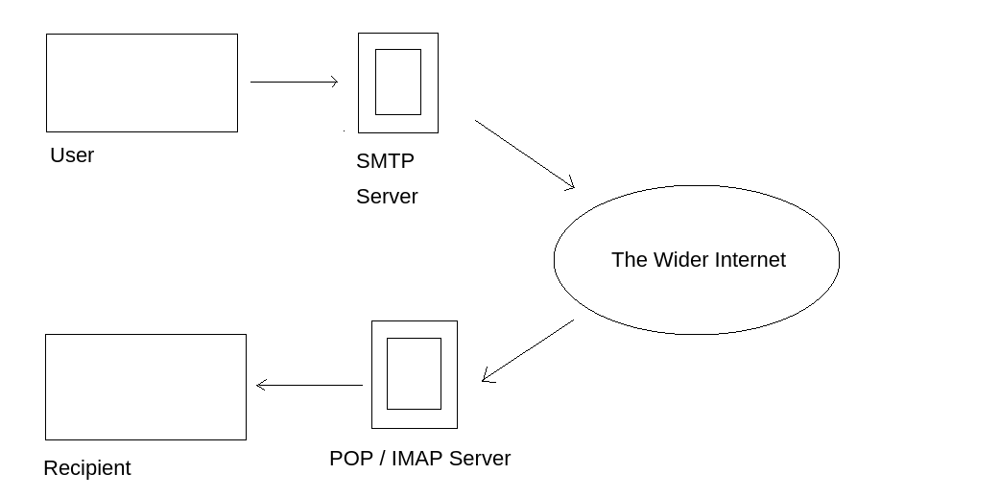

# SMTP/25 Enumeration

SMTP (Simple Mail Transfer Protocol) uses several ports, but port 587 is the standard and recommended port for email submission, while port 25 is commonly used for server-to-server communication. Port 465 is a legacy port for SMTPS (SMTP over SSL/TLS) and should only be used if required

<figure><figcaption></figcaption></figure>

1\. The mail user agent, which is either your email client or an external program. connects to the SMTP server of your domain, e.g. smtp.google.com. This initiates the SMTP handshake. This connection works over the SMTP port- which is usually 25. Once these connections have been made and validated, the SMTP session starts.

2\. The process of sending mail can now begin. The client first submits the sender, and recipient's email address- the body of the email and any attachments, to the server.

3\. The SMTP server then checks whether the domain name of the recipient and the sender is the same.

4\. The SMTP server of the sender will make a connection to the recipient's SMTP server before relaying the email. If the recipient's server can't be accessed, or is not available- the Email gets put into an SMTP queue.

5\. Then, the recipient's SMTP server will verify the incoming email. It does this by checking if the domain and user name have been recognised. The server will then forward the email to the POP or IMAP server, as shown in the diagram above.

6\. The E-Mail will then show up in the recipient's inbox.

## Enumeration

if we found users and ssh is open we can bruteforce

<figure><figcaption></figcaption></figure>

## Mail Transfer Agent (MTA)

A Mail Transfer Agent (MTA) is a software program that sends and receives electronic mail (email) between mail servers. It acts like a digital postman, responsible for routing, transferring, and delivering emails to their correct destination using the [Simple Mail Transfer Protocol](https://www.google.com/search?client=firefox-b-d\&q=Simple+Mail+Transfer+Protocol\&mstk=AUtExfAC8n1ltWg4JF0-1T7RPBYMVFOJvDzN5FoMUC1giF7SSiemMI4JfsmtRYDZezoejmXrPAPHevbtGxYrBbgpWIwcB3fbzy88mEaz95VuTPyPpnJIWIG_dmK3hGWYjfb4_F_STu0Paz8HxilJFp7KfxFkYdrNEURaV9AGhZfxQc5oavtX6Fn9qvsKl1z42M5jj8Qee5294Rj9s73h0XrSbl1n3w\&csui=3\&ved=2ahUKEwje8uL7qK6QAxWpBNsEHRNREKkQgK4QegQIARAE) (SMTP)

## Exploitetion

User hydra to bruteforce
