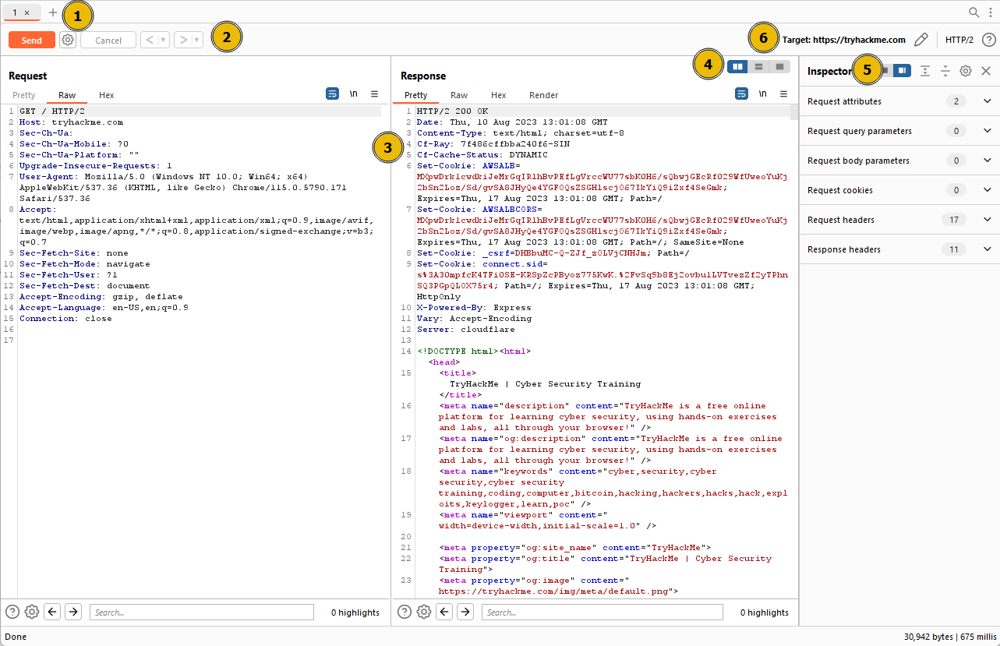
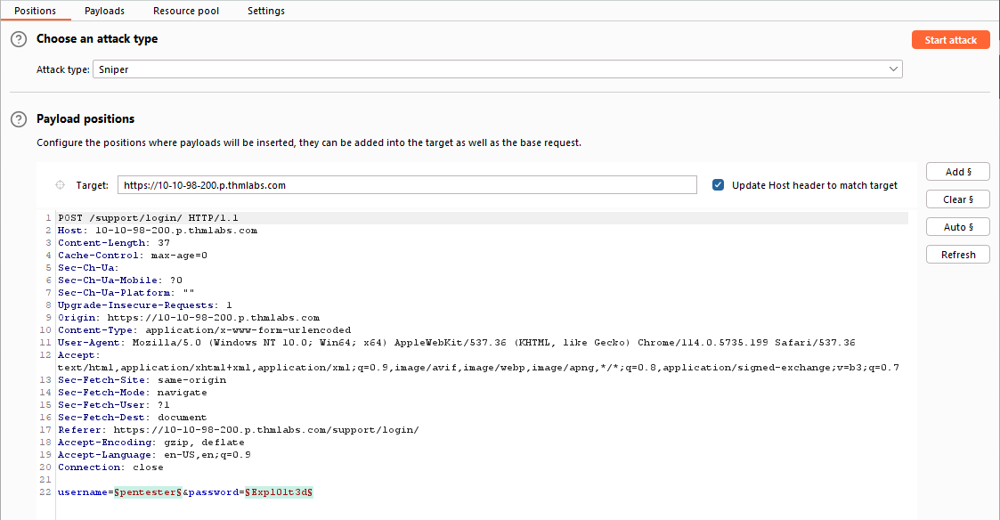
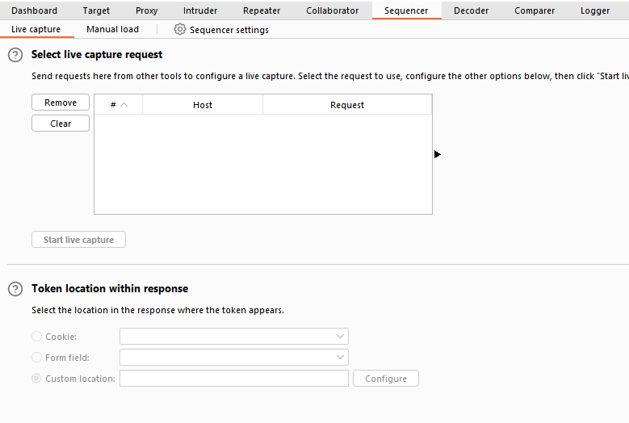
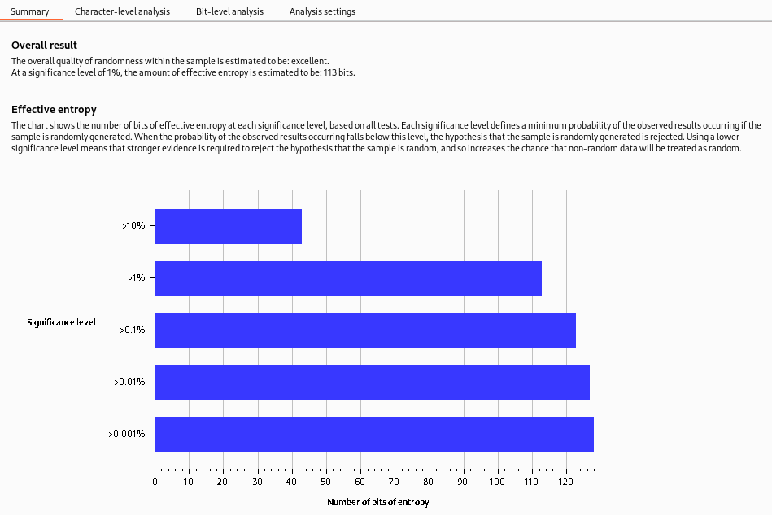

# Tools

## Wayback Machine



## **Wappalyzer**

<figure><figcaption></figcaption></figure>

## Caido

## Burp suite

### Repeater

<figure><figcaption></figcaption></figure>

### Intruder

Intruder is Burp Suite's built-in fuzzing tool that allows for automated request modification and repetitive testing with variations in input values. By using a captured request (often from the Proxy module), Intruder can send multiple requests with slightly altered values based on user-defined configurations. It serves various purposes, such as brute-forcing login forms by substituting username and password fields with values from a wordlist or performing fuzzing attacks using wordlists to test subdirectories, endpoints, or virtual hosts. Intruder's functionality is comparable to command-line tools like Wfuzz or ffuf.

* **Positions**: This tab allows us to select an attack type (which we will cover in a future task) and configure where we want to insert our payloads in the request template.
* **Payloads**: Here we can select values to insert into the positions defined in the Positions tab. We have various payload options, such as loading items from a wordlist. The way these payloads are inserted into the template depends on the attack type chosen in the Positions tab. The Payloads tab also enables us to modify Intruder's behavior regarding payloads, such as defining pre-processing rules for each payload (e.g., adding a prefix or suffix, performing match and replace, or skipping payloads based on a defined regex).
* **Resource Pool**: This tab is not particularly useful in the Burp Community Edition. It allows for resource allocation among various automated tasks in Burp Professional. Without access to these automated tasks, this tab is of limited importance.

<figure><figcaption></figcaption></figure>

On the right-hand side of the interface, we find the following buttons: `Add §`, `Clear §`, and `Auto §`:

* The `Add §` button allows us to define new positions manually by highlighting them within the request editor and then clicking the button.
* The `Clear §` button removes all defined positions, providing a blank canvas where we can define our own positions.
* The `Auto §` button automatically attempts to identify the most likely positions based on the request. This feature is helpful if we previously cleared the default positions and want them back.

### Attack Types

## Sequencer

Sequencer allows us to evaluate the entropy, or randomness, of "tokens". Tokens are strings used to identify something and should ideally be generated in a cryptographically secure manner. These tokens could be session cookies or **C**ross-**S**ite **R**equest **F**orgery (CSRF) tokens used to protect form submissions. If these tokens aren't generated securely, then, in theory, we could predict upcoming token values. The implications could be substantial, for instance, if the token in question is used for password resets.

<figure><figcaption></figcaption></figure>

We have two main ways to perform token analysis with Sequencer:

* **Live Capture**: This is the more common method and is the default sub-tab for Sequencer. Live capture lets us pass a request that will generate a token to Sequencer for analysis. For instance, we might want to pass a POST request to a login endpoint to Sequencer, knowing that the server will respond with a cookie. With the request passed in, we can instruct Sequencer to start a live capture. It will then automatically make the same request thousands of times, storing the generated token samples for analysis. After collecting enough samples, we stop the Sequencer and allow it to analyze the captured tokens.
* **Manual Load**: This allows us to load a list of pre-generated token samples directly into Sequencer for analysis. Using Manual Load means we don't need to make thousands of requests to our target, which can be noisy and resource-intensive. However, it does require that we have a large list of pre-generated tokens.


**Entropy:** The measure of randomness of data in a file is known as entropy. Entropy is very useful in identifying compressed and packed malware. Packed or compressed files usually have a high entropy.


<figure><figcaption></figcaption></figure>

* **Overall result**: This gives a broad assessment of the security of the token generation mechanism. In this case, the level of entropy indicates that the tokens are likely securely generated.
* **Effective entropy**: This measures the randomness of the tokens. The effective entropy of 117 bits is relatively high, indicating that the tokens are sufficiently random and, therefore, secure against prediction or brute force attacks.
* **Reliability**: The significance level of 1% implies that there is 99% confidence in the accuracy of the results. This level of confidence is quite high, providing assurance in the accuracy of the effective entropy estimation.
* **Sample**: This provides details about the token samples analyzed during the entropy testing process, including the number of tokens and their characteristics.
