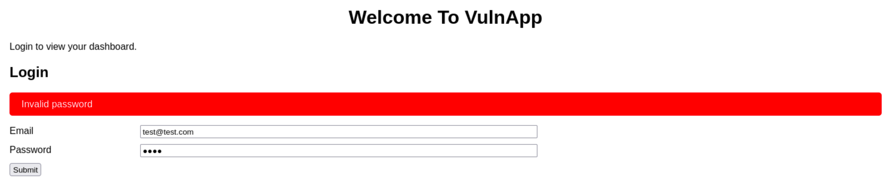
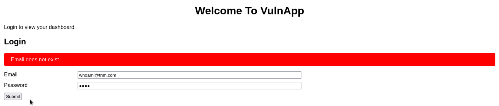

# Authentication Enumeration

**Identifying Valid Usernames**

Knowing a valid username lets an attacker focus just on the password. You can figure out usernames in different ways, like observing how the application responds during login or password resets. For example, error messages that specify "this account doesn't exist" or "incorrect password" can hint at valid usernames, making an attacker's job easier.

**Password Policies**

The guidelines when creating passwords can provide valuable insights into the complexity of the passwords used in an application. By understanding these policies, an attacker can gauge the potential complexity of the passwords and tailor their strategy accordingly. For example, the below PHP code uses regex to require a password that includes symbols, numbers, and uppercase letters

**Registration Pages**

Web applications typically make the user registration process straightforward and informative by immediately indicating whether an email or username is available. While this feedback is designed to enhance user experience, it can inadvertently serve a dual purpose. If a registration attempt results in a message stating that a username or email is already taken, the application is unwittingly confirming its existence to anyone trying to register. Attackers exploit this feature by testing potential usernames or emails, thus compiling a list of active users without needing direct access to the underlying database.

**Password Reset Features**

Password reset mechanisms are designed to help users regain access to their accounts by entering their details to receive reset instructions. However, the differences in the application's response can unintentionally reveal sensitive information. For example, variations in an application's feedback about whether a username exists can help attackers verify user identities. By analyzing these responses, attackers can refine their lists of valid usernames, substantially improving the effectiveness of subsequent attacks.

**Verbose Errors**

Verbose error messages during login attempts or other interactive processes can reveal too much. When these messages differentiate between "username not found" and "incorrect password," they're intended to help users understand their login issues. However, they also provide attackers with definitive clues about valid usernames, which can be exploited for more targeted attacks.

**Data Breach Information**

Data from previous security breaches is a goldmine for attackers as it allows them to test whether compromised usernames and passwords are reused across different platforms. If an attacker finds a match, it suggests not only that the username is reused but also potential password recycling, especially if the platform has been breached before. This technique demonstrates how the effects of a single data breach can ripple through multiple platforms, exploiting the connections between various online identities.

## Verbose Errors

Verbose errors can turn into a goldmine of information, providing insights such as:

* **Internal Paths**: Like a map leading to hidden treasure, these reveal the file paths and directory structures of the application server which might contain configuration files or secret keys that aren't visible to a normal user.
* **Database Details**: Offering a sneak peek into the database, these errors might spill secrets like table names and column details.
* **User Information**: Sometimes, these errors can even hint at usernames or other personal data, providing clues that are crucial for further investigation.

## Inducing Verbose Errors

Attackers induce verbose errors as a way to force the application to reveal its secrets. Below are some common techniques used to provoke these errors:

1. **Invalid Login Attempts**: This is like knocking on every door to see which one will open. By intentionally entering incorrect usernames or passwords, attackers can trigger error messages that help distinguish between valid and invalid usernames. For example, entering a username that doesn’t exist might trigger a different error message than entering one that does, revealing which usernames are active.
2. **SQL Injection**: This technique involves slipping malicious SQL commands into entry fields, hoping the system will stumble and reveal information about its database structure. For example, placing a single quote ( `'`) in a login field might cause the database to throw an error, inadvertently exposing details about its schema.
3. **File Inclusion/Path Traversal**: By manipulating file paths, attackers can attempt to access restricted files, coaxing the system into errors that reveal internal paths. For example, using directory traversal sequences like `../../` could lead to errors that disclose restricted file paths.
4. **Form Manipulation**: Tweaking form fields or parameters can trick the application into displaying errors that disclose backend logic or sensitive user information. For example, altering hidden form fields to trigger validation errors might reveal insights into the expected data format or structure.
5. **Application Fuzzing**: Sending unexpected inputs to various parts of the application to see how it reacts can help identify weak points. For example, tools like Burp Suite Intruder are used to automate the process, bombarding the application with varied payloads to see which ones provoke informative errors.

## Enumeration in Authentication Forms

<figure><figcaption></figcaption></figure>

<figure><figcaption></figcaption></figure>

**Automation Example**

Below is a Python script that will check for valid emails in the target web app

```python
import requests
import sys

def check_email(email):
    url = 'http://enum.thm/labs/verbose_login/functions.php'  # Location of the login function
    headers = {
        'Host': 'enum.thm',
        'User-Agent': 'Mozilla/5.0 (X11; Linux aarch64; rv:102.0) Gecko/20100101 Firefox/102.0',
        'Accept': 'application/json, text/javascript, */*; q=0.01',
        'Accept-Language': 'en-US,en;q=0.5',
        'Accept-Encoding': 'gzip, deflate',
        'Content-Type': 'application/x-www-form-urlencoded; charset=UTF-8',
        'X-Requested-With': 'XMLHttpRequest',
        'Origin': 'http://enum.thm',
        'Connection': 'close',
        'Referer': 'http://enum.thm/labs/verbose_login/',
    }
    data = {
        'username': email,
        'password': 'password',  # Use a random password as we are only checking the email
        'function': 'login'
    }

    response = requests.post(url, headers=headers, data=data)
    return response.json()

def enumerate_emails(email_file):
    valid_emails = []
    invalid_error = "Email does not exist"  # Error message for invalid emails

    with open(email_file, 'r') as file:
        emails = file.readlines()

    for email in emails:
        email = email.strip()  # Remove any leading/trailing whitespace
        if email:
            response_json = check_email(email)
            if response_json['status'] == 'error' and invalid_error in response_json['message']:
                print(f"[INVALID] {email}")
            else:
                print(f"[VALID] {email}")
                valid_emails.append(email)

    return valid_emails

if __name__ == "__main__":
    if len(sys.argv) != 2:
        print("Usage: python3 script.py <email_list_file>")
        sys.exit(1)

    email_file = sys.argv[1]

    valid_emails = enumerate_emails(email_file)

    print("\nValid emails found:")
    for valid_email in valid_emails:
        print(valid_email)

```

