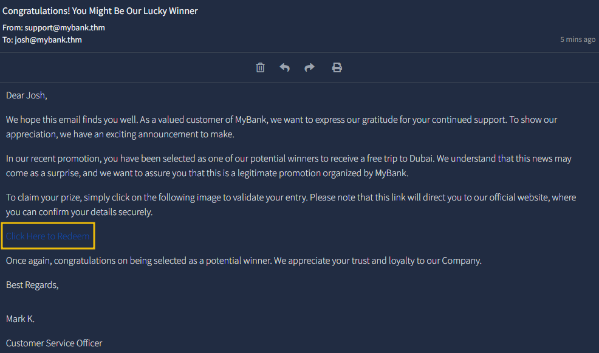

# CSRF



## Effects of CSRF

Understanding CSRF's impact is crucial for keeping online activities secure. Although CSRF attacks don't directly expose user data, they can still cause harm by changing passwords and email addresses or making financial transactions. The risks associated with CSRF include:

* **Unauthorised Access:** Attackers can access and control a user's actions, putting them at risk of losing money, damaging their reputation, and facing legal consequences.
* **Exploiting Trust:** CSRF exploits the trust websites put in their users, undermining the sense of security in online browsing.
* **Stealthy Exploitation:** CSRF works quietly, using standard browser behaviour without needing advanced malware. Users might be unaware of the attack, making them susceptible to repeated exploitation.


Can happen anywere even password change,delete account , change email.Besicly we send the same rqeust for example post to update  email but becuase there is not csrf token anyone can send  reqeust if it has the cookie/token or make  ink when someone press it the request it sends.

Also if there is csrf token we can try removing it and see if work and that mean the webserver is not validating correct the csrf token

Also trying to change to get from post maywork



A CSRF attack works **only if the victim is logged in** to the target site.



We can bypass csrf if token is not generated secure and we can predict the token





## Types of CSRF Attack

<figure><figcaption></figcaption></figure>

**Flash-based CSRF**

The term "Flash-based CSRF" describes the technique of conducting a CSRF attack by taking advantage of flaws in Adobe Flash Player components. Internet applications with features like interactive content, video streaming, and intricate animations have been made possible with Flash. But over time, security flaws in Flash, particularly those that can be used to launch CSRF attacks, have become a major source of worry. As HTML5 technology advanced and security flaws multiplied, official support for Adobe Flash Player ceased on [December 31, 2020](https://www.adobe.com/products/flashplayer/end-of-life.html).

Even though Flash is no longer supported, a talk about Flash-based cross-site request forgery threats is instructive, particularly for legacy systems that still rely on antiquated technologies. A malicious Flash file (.swf) posted on the attacker's website would typically send unauthorised requests to other websites to carry out Flash-based CSRF attacks.

**Email Attack**

<figure><figcaption></figcaption></figure>

```
<a href="http://mybank.thm:8080/dashboard.php?to_account=GB82MYBANK5698&amount=1000" target="_blank">Click Here to Redeem</a>
```

## Double Submit Cookie Bypass

<figure><figcaption></figcaption></figure>

How it works

* **Token Generation:** When a user logs in or initiates a session, the server generates a unique CSRF token. This token is sent to the user's browser both as a cookie (CSRF-Token cookie) and embedded in hidden form fields of web forms where actions are performed (like money transfers).
* **User Action:** Suppose the user wants to transfer money. They fill out the transfer form on the website, which includes the hidden CSRF token.
* **Form Submission:** Upon submitting the form, two versions of the CSRF token are sent to the server: one in the cookie and the other as part of the form data.
* **Server Validation:** The server then checks if the CSRF token in the cookie matches the one sent in the form data. If they match, the request is considered legitimate and processed; if not, the request is rejected.

**Possible Vulnerable Scenarios**

* S**ession Cookie Hijacking (Man in the Middle Attack):** If the CSRF token is not appropriately isolated and safeguarded from the session, an attacker may also be able to access it by other means (such as malware, network spying, etc.).
* **Subverting the Same-Origin Policy (Attacker Controlled Subdomain):** An attacker can set up a situation where the browser's same-origin policy is broken. Browser vulnerabilities or deceiving the user into sending a request through an attacker-controlled subdomain with permission to set cookies for its parent domain could be used.
* **Exploiting XSS Vulnerabilities:** An attacker may be able to obtain the CSRF token from the cookie or the page itself if the web application is susceptible to Cross-Site Scripting (XSS). By creating fraudulent requests with the double-submitted cookie CSRF token, the attacker can get around the defence once they have the CSRF token.
* **Predicting or Interfering with Token Generation:** An attacker may be able to guess or modify the CSRF token if the tokens are not generated securely and are predictable or if they can tamper with the token generation process.
* **Subdomain Cookie Injection:** Injecting cookies into a user's browser from a related subdomain is another potentially sophisticated technique that might be used. This could fool the server's CSRF protection system by appearing authentic to the main domain.

## Defence Mechanisms

**Pentesters**

* **CSRF Testing:** Actively test applications for CSRF vulnerabilities by attempting to execute unauthorised actions through manipulated requests and assess the effectiveness of implemented protections.&#x20;
* **Boundary Validation**: Evaluate the application's validation mechanisms, ensuring that user inputs are appropriately validated and anti-CSRF tokens are present and correctly verified to prevent request forgery.
* **Security Headers Analysis:** Assess the presence and effectiveness of security headers, such as CORS and Referer, to enhance the overall security and prevent various attack vectors, including CSRF.
* **Session Management Testing:** Examine the application's session management mechanisms, ensuring that session tokens are securely generated, transmitted, and validated to prevent unauthorised access and actions.
* **CSRF Exploitation Scenarios:** Explore various CSRF exploitation scenarios, such as embedding malicious requests in image tags or exploiting trusted endpoints, to identify potential weaknesses in the application's defences and improve security measures.

**Secure Coders**

* **Anti-CSRF Tokens:** Integrate anti-CSRF tokens into each form or request to ensure that only requests with valid and unpredictable tokens are accepted, thwarting CSRF attacks.&#x20;
* **SameSite Cookie Attribute:** Set the SameSite attribute on cookies to 'Strict' or 'Lax' to control when cookies are sent with cross-site requests, minimising the risk of CSRF by restricting cookie behaviour.
* **Referrer Policy:** Implement a strict referrer policy, limiting the information disclosed in the referer header and ensuring that requests come from trusted sources, thereby preventing unauthorised cross-site requests.
* **Content Security Policy (CSP)**: Utilise CSP to define and enforce a policy that specifies the trusted sources of content, mitigating the risk of injecting malicious scripts into web pages.
* **Double-Submit Cookie Pattern:** Implement a secure double-submit cookie pattern, where an anti-CSRF token is stored both in a cookie and as a request parameter. The server then compares both values to authenticate requests.
* **Implement CAPTCHAS:** Secure developers can incorporate CAPTCHA challenges as an additional layer of defense against CSRF attacks especially in user authentication, form submissions, and account creation processes.

## Cookies

Different Types of SameSite Cookies

* **Lax**: Lax SameSite cookies are like a friendly neighbour. They provide a moderate level of protection by allowing cookies to be sent in top-level navigations and safe HTTP methods like GET, HEAD, and OPTIONS. This means that cookies will not be sent with cross-origin POST requests, helping to mitigate certain types of CSRF attacks. However, cookies are still included in GET requests initiated by external websites, which may pose a security risk if sensitive information is stored in cookies.
* **Strict:** Strict SameSite cookies act as vigilant guards. They offer the highest level of protection by restricting cookies to be sent only in a first-party context. This means that cookies are only sent with requests originating from the same site that set the cookie, effectively preventing cross-site request forgery attacks. By enforcing strict isolation between different origins, strict SameSite cookies significantly enhance the security of web applications, especially in scenarios where sensitive user data is involved.
* **None**: None SameSite cookies behave like carefree globetrotters. They are sent with both first-party and cross-site requests, making them convenient for scenarios where cookies need to be accessible across different origins. However, to prevent potential security risks associated with cross-site requests, None SameSite cookies require the Secure attribute if the request is made over HTTPS. This ensures that cookies are only transmitted over secure connections, reducing the likelihood of interception or tampering by malicious actors during transit.

#### **1. SameSite=Strict**

* Highest security.
* Cookies sent _only_ for requests from the same origin.
* Blocks _all_ cross‑site requests.
* Excellent protection against CSRF.

#### **2. SameSite=Lax**

* Medium security.
* Cookies sent in:
  * **Top‑level navigations (GET)**
  * Safe methods such as **GET, HEAD, OPTIONS**
* Cookies **NOT** sent in cross‑site **POST** requests.
* Still vulnerable when:
  * An attacker uses a **GET request** (e.g., clicking a link).

#### **3. SameSite=None**

* Cookies sent with **all requests**, cross‑site included.
* Must also include **Secure** attribute.
* Used for third‑party content (iframes, APIs).
