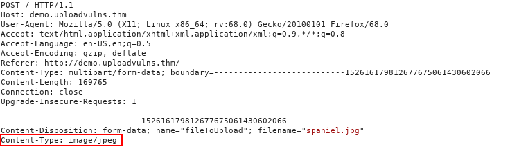

# File Upload


Windows servers identify file types from .php example, Linux server idenitfy file types from magic numbers


## Methodology

1. **Recon:** Examine the site for upload points. Use tools (Wappalyzer, Burp) and headers (`Server`, `X-Powered-By`) to identify technologies.
2. **Client-side check:** Review source or JS for filters — these are easy to bypass.
3. **Test upload:** Send a harmless file. Locate where it’s stored or displayed (direct folder, embedded page). Use tools like **Gobuster** (`-x php,txt,html`) to find renamed or hidden files.
4. **Server-side filter analysis:**
   * Upload invalid extensions → detect blacklist vs whitelist.
   * Change **magic number** → reveals content-type filtering.
   * Modify **MIME type** → tests header-based filtering.
   * Vary **file size** → finds upload limits.
5. **Observation:** Use responses and error messages to understand protections.
6. **Goal:** Map the upload process, identify filters, and understand how files are validated and stored — all essential for secure testing.

***

## Overwriting Existing Files

<figure><figcaption></figcaption></figure>

<figure><figcaption></figcaption></figure>

<figure><figcaption></figcaption></figure>

And our attack was successful! We managed to overwrite the original `images/spaniel.jpg` with our own copy.

## RCE

Uploading WebShells and gaining access revshell , c2 webshell that u run commands from browser. Run files from search bar also  path traversal if we cant find the file directory

## Filtering Types

### _Extension Validation:_

They either _blacklist_ extensions (i.e. have a list of extensions which are **not** allowed) or they _whitelist_ extensions (i.e. have a list of extensions which **are** allowed, and reject everything else).

### _File Type Filtering:_

Similar to Extension validation, but more intensive, file type filtering looks, once again, to verify that the contents of a file are acceptable to upload. We'll be looking at two types of file type validation:

_**MIME validation:**_ MIME (**M**ultipurpose **I**nternet **M**ail **E**xtension) types are used as an identifier for files -- originally when transfered as attachments over email, but now also when files are being transferred over HTTP(S). The MIME type for a file upload is attached in the header of the request, and looks something like this:

<figure><figcaption></figcaption></figure>

_**Magic Number validation:**_ Magic numbers are the more accurate way of determining the contents of a file; although, they are by no means impossible to fake. The "magic number" of a file is a string of bytes at the very beginning of the file content which identify the content. For example, a PNG file would have these bytes at the very top of the file:


Unlike Windows, Unix systems use magic numbers for identifying files; however, when dealing with file uploads, it is possible to check the magic number of the uploaded file to ensure that it is safe to accept. This is by no means a guaranteed solution, but it's more effective than checking the extension of a file.


### _File Size Filtering:_

File length filters are used to prevent huge files from being uploaded to the server via an upload form (as this can potentially starve the server of resources). In most cases this will not cause us any issues when we upload shells; however, it's worth bearing in mind that if an upload form only expects a very small file to be uploaded, there may be a length filter in place to ensure that the file length requirement is adhered to. As an example, our fully fledged PHP reverse shell from the previous task is 5.4Kb big -- relatively tiny, but if the form expects a maximum of 2Kb then we would need to find an alternative shell to upload.

### _File Name Filtering:_

As touched upon previously, files uploaded to a server should be unique. Usually this would mean adding a random aspect to the file name, however, an alternative strategy would be to check if a file with the same name already exists on the server, and give the user an error if so. Additionally, file names should be sanitised on upload to ensure that they don't contain any "bad characters", which could potentially cause problems on the file system when uploaded (e.g. null bytes or forward slashes on Linux, as well as control characters such as `;` and potentially unicode characters). What this means for us is that, on a well administered system, our uploaded files are unlikely to have the same name we gave them before uploading, so be aware that you may have to go hunting for your shell in the event that you manage to bypass the content filtering.

## Bypassing Client-Side Filtering

1. _Turn off Javascript in your browser_ -- this will work provided the site doesn't require Javascript in order to provide basic functionality. If turning off Javascript completely will prevent the site from working at all then one of the other methods would be more desirable; otherwise, this can be an effective way of completely bypassing the client-side filter.
2. _Intercept and modify the incoming page._ Using Burpsuite, we can intercept the incoming web page and strip out the Javascript filter before it has a chance to run. The process for this will be covered below.
3. _Intercept and modify the file upload_. Where the previous method works _before_ the webpage is loaded, this method allows the web page to load as normal, but intercepts the file upload after it's already passed (and been accepted by the filter). Again, we will cover the process for using this method in the course of the task.
4. _Send the file directly to the upload point._ Why use the webpage with the filter, when you can send the file directly using a tool like `curl`? Posting the data directly to the page which contains the code for handling the file upload is another effective method for completely bypassing a client side filter. We will not be covering this method in any real depth in this tutorial, however, the syntax for such a command would look something like this: `curl -X POST -F "submit:<value>" -F "<file-parameter>:@<path-to-file>" <site>`. To use this method you would first aim to intercept a successful upload (using Burpsuite or the browser console) to see the parameters being used in the upload, which can then be slotted into the above command.

<figure><figcaption></figcaption></figure>

In this instance we can see that the filter is using a _whitelist_ to exclude any MIME type that isn't `image/jpeg`.


<figure><figcaption></figcaption></figure>



## Bypassing Server-Side Filtering: File Extensions


Windows servers identify file types from .php example, Linux server idenitfy file types from magic numbers


For the first part of this task we'll take a look at a website that's using a blacklist for file extensions as a server side filter. There are a variety of different ways that this could be coded, and the bypass we use is dependent on that. In the real world we wouldn't be able to see the code for this, but for this example, it will be included here:

```php

<?php
    //Get the extension
    $extension = pathinfo($_FILES["fileToUpload"]["name"])["extension"];
    //Check the extension against the blacklist -- .php and .phtml
    switch($extension){
        case "php":
        case "phtml":
        case NULL:
            $uploadFail = True;
            break;
        default:
            $uploadFail = False;
    }
?>
```

In this instance, the code is looking for the last period (`.`) in the file name and uses that to confirm the extension, so that is what we'll be trying to bypass here. Other ways the code could be working include: searching for the first period in the file name, or splitting the file name at each period and checking to see if any blacklisted extensions show up. We'll cover this latter case later on, but in the meantime, let's focus on the code we've got here.

We can see that the code is filtering out the `.php` and `.phtml` extensions, so if we want to upload a PHP script we're going to have to find another extension. The [wikipedia page](https://en.wikipedia.org/wiki/PHP) for PHP gives us a few common extensions that we can try; however, there are actually a variety of other more rarely used extensions available that webservers may nonetheless still recognise. These include: `.php3`, `.php4`, `.php5`, `.php7`, `.phps`, `.php-s`, `.pht` and `.phar`. Many of these bypass the filter (which only blocks`.php` and `.phtml`), but it appears that the server is configured not to recognise them as PHP files, as in the below example:


In the previous example we saw that the code was using the `pathinfo()` PHP function to get the last few characters after the `.`, but what happens if it filters the input slightly differently?

Let's try uploading a file called `shell.jpg.php`. We already know that JPEG files are accepted, so what if the filter is just checking to see if the `.jpg` file extension is somewhere within the input?

Pseudocode for this kind of filter may look something like this:

`ACCEPT FILE FROM THE USER -- SAVE FILENAME IN VARIABLE userInput`\
`IF STRING ".jpg" IS IN VARIABLE userInput:`\
&#x20;   `SAVE THE FILE`\
`ELSE:`\
&#x20;   `RETURN ERROR MESSAGE`

## Bypassing Server-Side Filtering: Magic Numbers


Windows servers identify file types from .php example, Linux server idenitfy file types from magic numbers


As mentioned previously, magic numbers are used as a more accurate identifier of files. The magic number of a file is a string of hex digits, and is always the very first thing in a file. Knowing this, it's possible to use magic numbers to validate file uploads, simply by reading those first few bytes and comparing them against either a whitelist or a blacklist. Bear in mind that this technique can be very effective against a PHP based webserver; however, it can sometimes fail against other types of webserver .



Linux `file` command to check the file type of our shell:

<figure><figcaption></figcaption></figure>

As expected, the command tells us that the filetype is PHP. Keep this in mind as we proceed with the explanation.

<figure><figcaption></figcaption></figure>

Save the file and exit. Next we're going to reopen the file in `hexeditor` (which comes by default on Kali), or any other tool which allows you to see and edit the shell as hex. In hexeditor the file looks like this:

<figure><figcaption></figcaption></figure>

Note the four bytes in the red box: they are all `41`, which is the hex code for a capital "A" -- exactly what we added at the top of the file previously.

Change this to the magic number we found earlier for JPEG files: `FF D8 FF DB`

<figure><figcaption></figcaption></figure>

Now if we save and exit the file (Ctrl + x), we can use `file` once again, and see that we have successfully spoofed the filetype of our shell:
