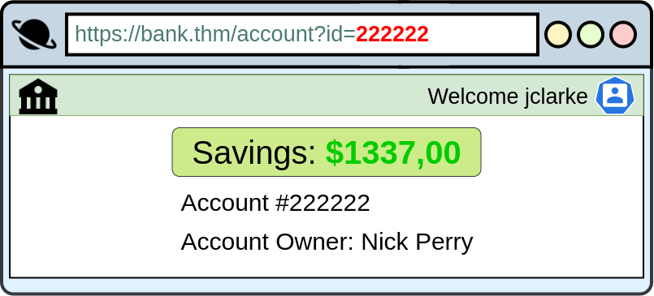

# IDOR

It’s a type of **access control vulnerability** where an application exposes internal implementation details (like file names, database IDs, or keys) and fails to properly enforce authorization checks.

👉 In simple terms:\
An attacker can directly manipulate an identifier (like a user ID or file ID) in the URL, request body, or API call to access or modify data they shouldn’t have access to.

## Example 1

A web app shows a user’s invoice:

```url
https://example.com/invoice?id=123
```

If the app only checks that the ID exists but **not** that it belongs to the logged-in user, an attacker could change it:

```
https://example.com/invoice?id=124
```

and now see another user’s invoice.

## Example 2

For example, let's say we're logging into our bank account, and after correctly authenticating ourselves, we get taken to a URL like this `https://bank.thm/account?id=111111`. On that page, we can see all our important bank details, and a user would do whatever they need to do and move along their way, thinking nothing is wrong.

<figure><figcaption></figcaption></figure>

There is, however, a potentially huge problem here, anyone may be able to change the `id` parameter to something else like `222222`, and if the site is incorrectly configured, then he would have access to someone else's bank information.

<figure><figcaption></figcaption></figure>

### **Encoded IDs**

<figure><figcaption></figcaption></figure>

sometimes we need to encoded again to work the change we made!!!

### **Hashed IDs**

Hashed IDs are a little bit more complicated to deal with than encoded ones, but they may follow a predictable pattern, such as being the hashed version of the integer value. For example, the Id number 123 would become 202cb962ac59075b964b07152d234b70 if md5 hashing were in use.

### **Unpredictable IDs**

If the Id cannot be detected using the above methods, an excellent method of IDOR detection is to create two accounts and swap the Id numbers between them. If you can view the other users' content using their Id number while still being logged in with a different account (or not logged in at all), you've found a valid IDOR vulnerability.

What is the minimum number of accounts you need to create to check for IDORs between accounts?

```bash
1
```

### **Where are they located?**

The vulnerable endpoint you're targeting may not always be something you see in the address bar. It could be content your browser loads in via an AJAX request or something that you find referenced in a JavaScript file.&#x20;

Sometimes endpoints could have an unreferenced parameter that may have been of some use during development and got pushed to production. For example, you may notice a call to **/user/details** displaying your user information (authenticated through your session). But through an attack known as parameter mining, you discover a parameter called user\_id that you can use to display other users' information, for example, **/user/details?user\_id=123**.
