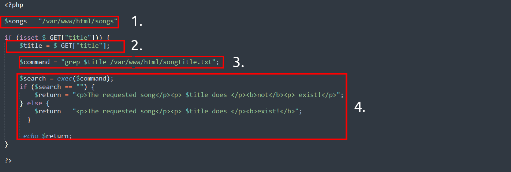
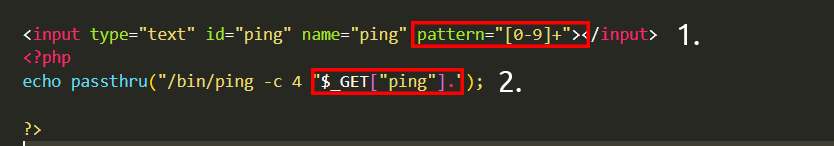
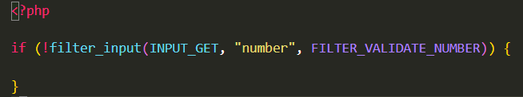
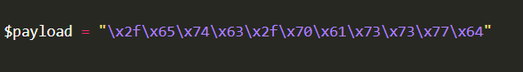

# Command injection

The main defence for preventing injection attacks is ensuring that user-controlled input is not interpreted as queries or commands. There are different ways of doing this:

* Using an allow list: when input is sent to the server, this input is compared to a list of safe inputs or characters. If the input is marked as safe, then it is processed. Otherwise, it is rejected, and the application throws an error.
* Stripping input: If the input contains dangerous characters, these are removed before processing.

## Basic Command Injection

The simplest way is by inserting a command separator to chain additional commands. These are typical in Unix-based systems, but Windows has its own variations.

**Semicolon (`;`)**: Executes commands sequentially.

```bash
127.0.0.1; ls
```

**Semicolon (`;`)**: Executes commands sequentially.

```bash
127.0.0.1 && id
```

**Double pipe (`||`)**: Executes the second command only if the first one fails.

```bash
127.0.0.1 || id
```

**Pipe (`|`)**: Sends the output of one command as the input to the next.

```bash
127.0.0.1 | ls
```

## Bypassing Input Filters

**Base64 Encoding**: Some filters might not check for base64-encoded payloads.

```bash
echo "LS0gY2F0IC9ldGMvYXBwYWdlX2ZpbGU=" | base64 -d
```

**URL Encoding**: Certain characters might be URL-encoded (`%3B` for `;`, `%26` for `&`, `%7C` for `|`).

```bash
127.0.0.1%3B id
```

**Double URL Encoding**: Encode characters multiple times to bypass filters that decode only once.

```bash
127.0.0.1%253B id
```

**Hexadecimal Encoding**: Some filters don't properly decode hexadecimal characters.

```bash
127.0.0.1%3B id
```



## Discovering Command Injection

<figure><figcaption></figcaption></figure>

```php
<?php
    if (isset($_GET["mooing"])) {
        $mooing = $_GET["mooing"];
        $cow = 'default';

        if(isset($_GET["cow"]))
            $cow = $_GET["cow"];
        
        passthru("perl /usr/bin/cowsay -f $cow $mooing");
    }
?>
```

<figure><figcaption></figcaption></figure>

1\. The application stores MP3 files in a directory contained on the operating system.

2\. The user inputs the song title they wish to search for. The application stores this input into the `$title` variable.

3\. The data within this `$title` variable is passed to the command `grep` to search a text file named _songtitle.txt_ for the entry of whatever the user wishes to search for.

4\. The output of this search of _songtitle.txt_ will determine whether the application informs the user that the song exists or not.

Now, this sort of information would typically be stored in a database; however, this is just an example of where an application takes input from a user to interact with the application’s operating system.

An attacker could abuse this application by injecting their own commands for the application to execute. Rather than using `grep` to search for an entry in `songtitle.txt`, they could ask the application to read data from a more sensitive file.

## Exploiting Command Injection

Command Injection can be detected in mostly one of two ways:

1. Blind command injection
2. Verbose command injection

I have defined these two methods in the table below, where the two sections underneath will explain these in greater detail.

| Method  | Description                                                                                                                                                                                                                                                                   |
| ------- | ----------------------------------------------------------------------------------------------------------------------------------------------------------------------------------------------------------------------------------------------------------------------------- |
| Blind   | This type of injection is where there is no direct output from the application when testing payloads. You will have to investigate the behaviours of the application to determine whether or not your payload was successful.                                                 |
| Verbose | This type of injection is where there is direct feedback from the application once you have tested a payload. For example, running the `whoami` command to see what user the application is running under. The web application will output the username on the page directly. |

Useful payloads

I have compiled some valuable payloads for both Linux & Windows into the tables below.

Linux

| Payload | Description                                                                                                                                                                                                          |
| ------- | -------------------------------------------------------------------------------------------------------------------------------------------------------------------------------------------------------------------- |
| whoami  | See what user the application is running under.                                                                                                                                                                      |
| ls      | List the contents of the current directory. You may be able to find files such as configuration files, environment files (tokens and application keys), and many more valuable things.                               |
| ping    | This command will invoke the application to hang. This will be useful in testing an application for blind command injection.                                                                                         |
| sleep   | This is another useful payload in testing an application for blind command injection, where the machine does not have `ping` installed.                                                                              |
| nc      | Netcat can be used to spawn a reverse shell onto the vulnerable application. You can use this foothold to navigate around the target machine for other services, files, or potential means of escalating privileges. |

Windows

| Payload | Description                                                                                                                                                                            |
| ------- | -------------------------------------------------------------------------------------------------------------------------------------------------------------------------------------- |
| whoami  | See what user the application is running under.                                                                                                                                        |
| dir     | List the contents of the current directory. You may be able to find files such as configuration files, environment files (tokens and application keys), and many more valuable things. |
| ping    | This command will invoke the application to hang. This will be useful in testing an application for blind command injection.                                                           |
| timeout | This command will also invoke the application to hang. It is also useful for testing an application for blind command injection if the `ping` command is not installed.                |

## Remediating Command Injection

Vulnerable Functions

In PHP, many functions interact with the operating system to execute commands via shell; these include:

* Exec
* Passthru
* System

<figure><figcaption></figcaption></figure>

1. The application will only accept a specific pattern of characters (the digits  0-9)
2. The application will then only proceed to execute this data which is all numerical.

**Input sanitisation**

Sanitising any input from a user that an application uses is a great way to prevent command injection. This is a process of specifying the formats or types of data that a user can submit. For example, an input field that only accepts numerical data or removes any special characters such as `>` ,  `&` and `/`.

In the snippet below, the `filter_input` [PHP function](https://www.php.net/manual/en/function.filter-input.php) is used to check whether or not any data submitted via an input form is a number or not. If it is not a number, it must be invalid input.

<figure><figcaption></figcaption></figure>

**Bypassing Filters**

Applications will employ numerous techniques in filtering and sanitising data that is taken from a  user's input. These filters will restrict you to specific payloads; however, we can abuse the logic behind an application to bypass these filters. For example, **an application may strip out quotation marks**; we can instead use the hexadecimal value of this to achieve the same result.

When executed, although the data given will be in a different format than what is expected, it can still be interpreted and will have the same result.

<figure><figcaption></figcaption></figure>
