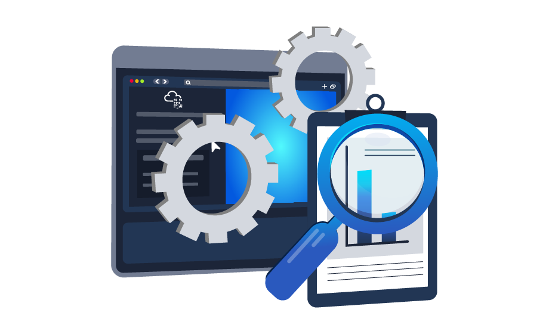

# IDS/IPS evasion

Evading a signature-based IDS/IPS requires that you manipulate your traffic so that it does not match any IDS/IPS signatures. Here are four general approaches you might consider to evade IDS/IPS systems.

1. Evasion via Protocol Manipulation
2. Evasion via Payload Manipulation
3. Evasion via Route Manipulation
4. Evasion via Tactical Denial of Service (DoS)

<figure><figcaption></figcaption></figure>

## Types

Consequently, the detection engine of an IDS can be:

1. **Signature-based:** A signature-based IDS requires full knowledge of malicious (or unwanted) traffic. In other words, we need to explicitly feed the signature-based detection engine the characteristics of malicious traffic. Teaching the IDS about malicious traffic can be achieved using explicit rules to match against.
2. **Anomaly-based**: This requires the IDS to have knowledge of what regular traffic looks like. In other words, we need to “teach” the IDS what normal is so that it can recognize what is **not** normal. Teaching the IDS about normal traffic, i.e., baseline traffic can be achieved using machine learning or manual rules.

🔍 What “Signature-Based” Means

A **signature** is a predefined pattern that represents a known threat. This could be:

* A specific byte sequence in network traffic
* A known malicious payload
* A command used in an attack
* A sequence of actions (e.g., a TCP scan pattern)

## IDS/IPS Rule triggering

### Syntax

Each IDS/IPS has a certain syntax to write its rules. For example, Snort uses the following format for its rules: `Rule Header (Rule Options)`, where **Rule Header** constitutes:

1. Action: Examples of action include `alert`, `log`, `pass`, `drop`, and `reject`.
2. Protocol: `TCP`, `UDP`, `ICMP`, or `IP`.
3. Source IP/Source Port: `!10.10.0.0/16 any` refers to everything not in the class B subnet `10.10.0.0/16`.
4. Direction of Flow: `->` indicates left (source) to right (destination), while `<>` indicates bi-directional traffic.
5. Destination IP/Destination Port: `10.10.0.0/16 any` to refer to class B subnet `10.10.0.0/16`.

Below is an example rule to `drop` all ICMP traffic passing through Snort IPS:

```
drop icmp any any -> any any (msg: "ICMP Ping Scan"; dsize:0; sid:1000020; rev: 1;
```

### Hypothetical case

<figure><figcaption></figcaption></figure>

Let’s consider the following “naive” approach. We want to create a Snort rule that detects the term `ncat` in the payload of the traffic exchanged with our webserver to learn how people exploit this vulnerability.

```
alert tcp any any <> any 80 (msg: "Netcat Exploitation"; content:"ncat"; sid: 1000030; rev:1;)
```

The rule above inspects the content of the packets exchanged with port 80 for the string `ncat`. Alternatively, you can choose to write the content that Snort will scan for in hexadecimal format. `ncat` in ASCII is written as `6e 63 61 74` in hexadecimal and it is encapsulated as a string by 2 pipe characters `|`.

```
alert tcp any any <> any 80 (msg: "Netcat Exploitation"; content:"|6e 63 61 74|"; sid: 1000031; rev:1;)
```

We can further refine it if we expect to see it in HTTP POST requests. Note that `flow:established` tells the Snort engine to look at streams started by a TCP 3-way handshake (established connections).

```
alert tcp any any <> any 80 (msg: "Netcat Exploitation"; flow:established,to_server; content:"POST"; nocase; http_method; content:"ncat"; nocase; sid:1000032; rev:1;)
```

## Evasion via Protocol Manipulation

Evasion via protocol manipulation includes:

* Relying on a different protocol
* Manipulating (Source) TCP/UDP port
* Using session splicing (IP packet fragmentation)
* Sending invalid packets

<figure><figcaption></figcaption></figure>

#### Rely on a Different Protocol

The IDS/IPS system might be configured to block certain protocols and allow others. For instance, you might consider using UDP instead of TCP or rely on HTTP instead of DNS to deliver an attack or exfiltrate data. You can use the knowledge you have gathered about the target and the applications necessary for the target organization to design your attack. For instance, if web browsing is allowed, it usually means that protected hosts can connect to ports 80 and 443 unless a local proxy is used. In one case, the client relied on Google services for their business, so the attacker used Google web hosting to conceal his malicious site. Unfortunately, it is not a one-size-fits-all; moreover, some trial and error might be necessary as long as you don’t create too much noise.

<figure><figcaption></figcaption></figure>

Consider the case where you are using [Ncat](https://nmap.org/ncat). Ncat, by default, uses a TCP connection; however, you can get it to use UDP using the option `-u`.

* To listen using TCP, just issue `ncat -lvnp PORT_NUM` where port number is the port you want to listen to.
* to connect to an Ncat instance listening on a TCP port, you can issue `ncat TARGET_IP PORT_NUM`

Note that:

* `-l` tells `ncat` to listen for incoming connections
* `-v` gets more verbose output as `ncat` binds to a source port and receives a connection
* `-n` avoids resolving hostnames
* `-p` specifies the port number that `ncat` will listen on

As already mentioned, using `-u` will move all communications over UDP.

* To listen using UDP, just issue `ncat -ulvnp PORT_NUM` where port number is the port you want to listen to. Note that unless you add `-u`, `ncat` will use TCP by default.
* To connect to an Ncat instance listening on a UDP port, you can issue `nc -u TARGET_IP PORT_NUM`

Consider the following two examples:

* Running `ncat -lvnp 25` on the attacker system and connecting to it will give the impression that it is a usual TCP connection with an SMTP server, unless the IDS/IPS provides deep packet inspection (DPI).
* Executing `ncat -ulvnp 162` on the attacker machine and connecting to it will give the illusion that it is a regular UDP communication with an SNMP server unless the IDS/IPS supports DPI.

### Manipulate (Source) TCP/UDP Port

Generally speaking, the TCP and UDP source and destination ports are inspected even by the most basic security solutions. Without deep packet inspection, the port numbers are the primary indicator of the service used. In other words, network traffic involving TCP port 22 would be interpreted as SSH traffic unless the security solution can analyze the data carried by the TCP segments.

Depending on the target security solution, you can make your port scanning traffic resemble web browsing or DNS queries. If you are using Nmap, you can add the option `-g PORT_NUMBER` (or `--source-port PORT_NUMBER`) to make Nmap send all its traffic from a specific source port number.

While scanning a target, use `nmap -sS -Pn -g 80 -F 10.112.159.193` to make the port scanning traffic appear to be exchanged with an HTTP server at first glance.

If you are interested in scanning UDP ports, you can use `nmap -sU -Pn -g 53 -F 10.112.159.193` to make the traffic appear to be exchanged with a DNS server.

<figure><figcaption></figcaption></figure>

### Use Session Splicing (IP Packet Fragmentation)

Another approach possible in IPv4 is IP packet fragmentation, i.e., session splicing. The assumption is that if you break the packet(s) related to an attack into smaller packets, you will avoid matching the IDS signatures. If the IDS is looking for a particular stream of bytes to detect the malicious payload, divide your payload among multiple packets. Unless the IDS reassembles the packets, the rule won’t be triggered.

Nmap offers a few options to fragment packets. You can add:

* `-f` to set the data in the IP packet to 8 bytes.
* `-ff` to limit the data in the IP packet to 16 bytes at most.
* `--mtu SIZE` to provide a custom size for data carried within the IP packet. The size should be a multiple of 8.

suppose you want to force all your packets to be fragmented into specific sizes. In that case, you should consider using a program such as [Fragroute(opens in new tab)](https://www.monkey.org/~dugsong/fragroute/). `fragroute` can be set to read a set of rules from a given configuration file and applies them to incoming packets. For simple IP packet fragmentation, it would be enough to use a configuration file with `ip_frag SIZE` to fragment the IP data according to the provided size. The size should be a multiple of 8.

For example, you can create a configuration file `fragroute.conf` with one line, `ip_frag 16`, to fragment packets where IP data fragments don’t exceed 16 bytes. Then you would run the command `fragroute -f fragroute.conf HOST`. The host is the destination to which we would send the fragmented packets it.

### Sending Invalid Packets

Generally speaking, the response of systems to valid packets tends to be predictable. However, it can be unclear how systems would respond to invalid packets. For instance, an IDS/IPS might process an invalid packet, while the target system might ignore it. The exact behavior would require some experimentation or inside knowledge.

Nmap makes it possible to create invalid packets in a variety of ways. In particular, two common options would be to scan the target using packets that have:

* Invalid TCP/UDP checksum
* Invalid TCP flags

Nmap lets you send packets with a wrong TCP/UDP checksum using the option `--badsum`. An incorrect checksum indicates that the original packet has been altered somewhere across its path from the sending program.

Nmap also lets you send packets with custom TCP flags, including invalid ones. The option `--scanflags` lets you choose which flags you want to set.

* `URG` for Urgent
* `ACK` for Acknowledge
* `PSH` for Push
* `RST` for Reset
* `SYN` for Synchronize
* `FIN` for Finish

For instance, if you want to set the flags Synchronize, Reset, and Finish simultaneously, you can use `--scanflags SYNRSTFIN`, although this combination might not be beneficial for your purposes.

If you want to craft your packets with custom fields, whether valid or invalid, you might want to consider a tool such as `hping3`. We will list a few example options to give you an idea of packet crafting using `hping3`.

* `-t` or `--ttl` to set the Time to Live in the IP header
* `-b` or `--badsum` to send packets with a bad UDP/TCP checksum
* `-S`, `-A`, `-P`, `-U`, `-F`, `-R` to set the TCP SYN, ACK, PUSH, URG, FIN, and RST flags, respectively

There is a myriad of other options. Depending on your needs, you might want to check the `hping3` manual page for the complete list.

## Evasion via payload manipulation

<figure><figcaption></figcaption></figure>


## Evasion via tactical DoS

<figure><figcaption></figcaption></figure>

An IDS/IPS requires a high processing power as the number of rules grows and the network traffic volume increases. Moreover, especially in the case of IDS, the primary response is logging traffic information matching the signature. Consequently, you might find it beneficial if you can:

* Create a huge amount of benign traffic that would simply overload the processing capacity of the IDS/IPS.
* Create a massive amount of not-malicious traffic that would still make it to the logs. This action would congest the communication channel with the logging server or exceed its disk writing capacity.


It is also worth noting that the target of your attack can be the IDS operator. By causing a vast number of false positives, you can cause operator fatigue against your “adversary.”


## Next-Generation Network IPS&#x20;

(NGNIPS) has the following five characteristics according to [Gartner](https://www.gartner.com/en/documents/2390317-next-generation-ips-technology-disrupts-the-ips-market):

1. Standard first-generation IPS capabilities: A next-generation network IPS should achieve what a traditional network IPS can do.
2. Application awareness and full-stack visibility: Identify traffic from various applications and enforce the network security policy. An NGNIPS must be able to understand up to the application layer.
3. Context-awareness: Use information from sources outside of the IPS to aid in blocking decisions.
4. Content awareness: Able to inspect and classify files, such as executable programs and documents, in inbound and outbound traffic.
5. Agile engine: Support upgrade paths to benefit from new information feeds.

Because a Next-Generation Firewall (NGFW) provides the same functionality as an IPS, it seems that the term NGNIPS is losing popularity for the sake of NGFW. You can read more about NGFW in the  Firewalls page.

## wafw00f

Detects if a website has a Web Application Firewall (WAF) and what kind it is.

**Basic scan:**

```bash
wafw00f example.com
```

Verbose Mode (More Details):

```bash
wafw00f -v example.com
```

Aggresive scan

```bash
wafw00f -a example.com
```

***

## Nmap scripts

Detect WAF

```bash
nmap --script http-waf-detect <target>
```

Tries to detect the presence of a web application firewall and its type and version.

This works by sending a number of requests and looking in the responses for known behavior and fingerprints such as Server header, cookies and headers values. Intensive mode works by sending additional WAF specific requests to detect certain behaviour.

<pre class="language-bash"><code class="lang-bash"><strong>nmap --script http-waf-fingerprint &#x3C;target>
</strong></code></pre>

Nmap command ACK Probe

```bash
nmap -sA <target>
```

WAF detection **simply determines whether a WAF is protecting a web application**.

#### **🔍 How WAF Detection Works**

* Sending **normal HTTP requests** and checking if the response is **unexpectedly blocked** (e.g., HTTP `403 Forbidden` or `406 Not Acceptable`).
* Looking at **HTTP headers** that indicate WAF usage (e.g., `Server: cloudflare` or `X-Security-Akamai`).
* Sending **malicious payloads** (e.g., SQL injection) to see if they get blocked.
* Based by reposnse

<details>

<summary>Firewall | IPS/IDS Invasion</summary>

Inverse XMAS scan | Only Linux

```bash
nmap -sX $ipAddress
```

Fin scan  | Only Linux

```bash
nmap -sF $ipAddress
```

Null scan | Only Linux

```bash
nmap -sN $ipAddress
```

Scan Speed adjust

```bash
nmap -T0 -T1 -T2 -T3 -T4 -T5 $ipAddress
```

**Decoy Firewall Evasion**

• -D ‘’ip1 or ip1,ip2’’ or RND:’’number’’ (don’t scan all 65,535, only what you need) and going low and slow to evade IDS and SIEM traffic flow detections)

Packet Fragmentation to 8 bytes

```bash
nmap -f $ipaddress
```

</details>

## 🔓 **Common Techniques Hackers Use to Bypass Firewalls**

| **Technique**                           | **Description**                                                                  |
| --------------------------------------- | -------------------------------------------------------------------------------- |
| **1. Port Hopping / Scanning**          | Scanning for **open ports** (e.g., 80, 443) and using those for payloads.        |
| **2. Tunneling**                        | Using protocols like **HTTP(S), DNS, ICMP**, or **SSH** to tunnel traffic.       |
| **3. Payload Encryption / Obfuscation** | Encrypting payloads with tools like `msfvenom`, `Veil`, or custom scripts.       |
| **4. Living-off-the-Land (LotL)**       | Using built-in tools like `PowerShell`, `WMI`, or `Certutil` to avoid detection. |
| **5. Application Layer Attacks**        | Using **malicious web traffic** or **encoded URLs** to sneak through WAFs.       |
| **6. Exploiting Misconfigurations**     | Abusing overly permissive rules (e.g., `allow all outbound`, default settings).  |
| **7. Social Engineering / Phishing**    | Sending **malicious attachments or links** that create outbound connections.     |
| **8. Reverse Shells**                   | Initiating **outbound connections** (which most firewalls allow) to attacker.    |
| **9. Packet Fragmentation**             | Breaking payloads into fragments to confuse or bypass packet inspection.         |
| **10. Domain Fronting / CDN Abuse**     | Masking C2 traffic through **trusted domains** like Cloudflare or Google.        |
|                                         |                                                                                  |
