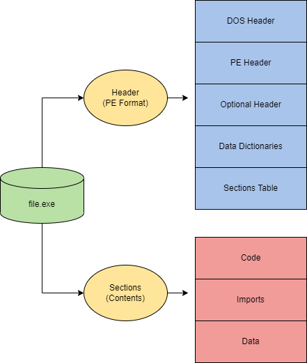
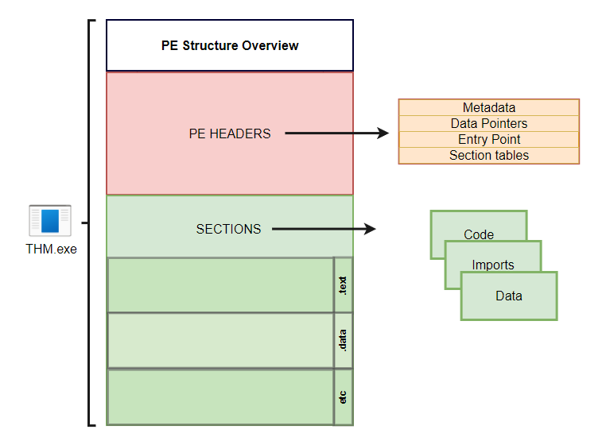

# Windows Internals

## &#x20;Windows Process

Service vs Procees

🔹 Key Points

1. Every **service is a process**, but **not every process is a service**.
2. Services are designed to run **continuously in the background**, often with elevated privileges.
3. Processes can be **temporary and user-driven**, like opening Notepad or a browser.

| **Process Name**                 | **Description**                                          | **Category** | **Common Attack Target?**                  |
| -------------------------------- | -------------------------------------------------------- | ------------ | ------------------------------------------ |
| `System`                         | Kernel process, always running                           | System Core  | ✅ Rarely injected (too risky)              |
| `smss.exe`                       | Session Manager Subsystem                                | System Init  | ❌                                          |
| `csrss.exe`                      | Client/Server Runtime Subsystem                          | System Init  | ⚠️ Sometimes targeted                      |
| `wininit.exe`                    | Windows initialization                                   | System Init  | ❌                                          |
| `services.exe`                   | Service Control Manager                                  | Service Host | ✅ Often targeted                           |
| `lsass.exe`                      | Local Security Authority Subsystem Service (auth, creds) | Security     | 🚨 High-value target (hash dump, mimikatz) |
| `svchost.exe`                    | Generic host for Windows services                        | Service Host | ✅ Common for injection/hollowing           |
| `winlogon.exe`                   | Logon process                                            | Security     | ⚠️ Sometimes attacked                      |
| `dwm.exe`                        | Desktop Window Manager                                   | UI           | ❌                                          |
| `explorer.exe`                   | Windows Explorer (desktop, taskbar, file browsing)       | UI           | ✅ Common injection target                  |
| `sihost.exe`                     | Shell Infrastructure Host                                | UI           | ❌                                          |
| `RuntimeBroker.exe`              | Manages app permissions                                  | UI           | ⚠️ Sometimes abused                        |
| `ShellExperienceHost.exe`        | Manages Start menu, taskbar                              | UI           | ❌                                          |
| `SearchUI.exe` / `SearchApp.exe` | Cortana / Search features                                | UI           | ❌                                          |
| `SearchIndexer.exe`              | Windows search indexing                                  | Background   | ❌                                          |
| `taskmgr.exe`                    | Task Manager                                             | Utility      | ❌                                          |
| `conhost.exe`                    | Console Window Host (supports cmd/PowerShell)            | Utility      | ✅ Used in injection                        |
| `cmd.exe`                        | Command Prompt                                           | Utility      | ⚠️ Used by attackers                       |
| `powershell.exe`                 | Windows PowerShell                                       | Utility      | 🚨 Often abused                            |
| `msmpeng.exe`                    | Windows Defender Antivirus Service                       | Security     | ✅ Sometimes killed/disabled                |
| `spoolsv.exe`                    | Print Spooler service                                    | Service      | ⚠️ Exploited in PrintNightmare             |
| `OneDrive.exe`                   | Microsoft OneDrive sync client                           | Cloud        | ❌                                          |
| `SkypeApp.exe` / `Teams.exe`     | Communication apps                                       | Cloud        | ❌                                          |
| `calc.exe`                       | Calculator                                               | Utility      | ❌                                          |
| `mspaint.exe`                    | Paint                                                    | Utility      | ❌                                          |
| `notepad.exe`                    | Notepad                                                  | Utility      | ❌                                          |

### &#x20;🏷️ Common Integrity Levels

| **Integrity Level**              | **Description**                                                                     | **Example**                                          |
| -------------------------------- | ----------------------------------------------------------------------------------- | ---------------------------------------------------- |
| **Low (Low IL)**                 | Very restricted. Can’t modify most files or settings.                               | Microsoft Edge/IE in Protected Mode, Sandboxed apps. |
| **Medium (Medium IL)**           | Normal user level. Most processes run here.                                         | `explorer.exe`, `notepad.exe`.                       |
| **High (High IL)**               | Elevated (Run as Administrator). Can change system settings.                        | Command Prompt / PowerShell “Run as Administrator”.  |
| **System (System IL)**           | Used by core Windows services. More powerful than Admin.                            | `lsass.exe`, `winlogon.exe`, `services.exe`.         |
| **Protected Process (PP / PPL)** | Special processes with extra protection. Can’t be injected or tampered with easily. | Antivirus, `lsass.exe` in Protected Mode.            |

### What is Process

In **Windows**, a **process** is an instance of a running program or service.

*   Each process has:

    * A **name** (usually the `.exe` file, like `explorer.exe`).
    * A **PID (Process ID)** → a unique number Windows assigns.
    * Its own **memory space** (RAM assigned to it).
    * One or more **threads** that do the actual work.

    <figure><figcaption></figcaption></figure>

### Process Injection Types

#### **1. Process Injection (T1055)**

* **Description:**\
  Adversaries inject malicious code into legitimate processes to evade detection and potentially escalate privileges. This allows execution under the context of a trusted process.
* **Common Methods:**
  * **DLL injection** (forcing a process to load a malicious DLL).
  * **Thread injection** (creating a remote thread in another process).
  * **APC (Asynchronous Procedure Call) injection**.
* **Purpose:**
  * Hide malicious activity.
  * Bypass security tools that monitor process creation.
  * Run code with higher privileges if injected into a system process.

***

#### **2. Process Hollowing (T1055.012)**

* **Description:**\
  A specific form of process injection where an attacker:
  1. Creates a new process in a suspended state.
  2. “Hollows out” (unmaps) the legitimate code from memory.
  3. Replaces it with malicious code.
  4. Resumes the process, which now runs malicious code under the guise of a legitimate executable.
* **Example:**
  * Launching `notepad.exe`, hollowing it out, and injecting a reverse shell.
* **Purpose:**
  * Masquerade malicious code as a trusted binary.
  * Evade AV/EDR solutions that rely on monitoring running executables.

***

#### **3. Process Masquerading (T1055.013)**

* **Description:**\
  Malicious code is injected into a process while making it look like another (often legitimate) process.
* **Difference from Hollowing:**\
  Instead of fully replacing a process’s memory (as in hollowing), masquerading often involves:
  * Renaming processes or binaries.
  * Modifying metadata so malicious processes appear legitimate.
  * Using legitimate process names like `svchost.exe` or `explorer.exe`.
* **Purpose:**
  * Blend malicious execution with normal system activity.
  * Trick defenders and analysts into overlooking suspicious processes.

## Dynamic Link Libraries (DLL FILE)

### DLL injections

#### **1. DLL Hijacking (T1574.001)**

* **What it is:**\
  When Windows loads a program, it often looks for required DLLs in specific directories (e.g., app folder, system32, PATH). If an attacker places a **malicious DLL with the same name** in a location searched first, Windows will load that instead of the real one.
* **Key Point:** Exploits **search order** of DLL loading.
* **Example:**
  * App expects `example.dll` in `C:\Windows\System32`.
  * Attacker drops `example.dll` in the same folder as the `.exe`.
  * The program loads the attacker’s DLL.
* **Purpose:** Persistence, privilege escalation, stealthy execution.

***

#### **2. DLL Side-Loading (T1574.002)**

* **What it is:**\
  Attackers abuse **legitimate, signed executables** that are known to insecurely load DLLs. They place a **malicious DLL** next to that trusted `.exe`. Since the executable is signed/trusted, security tools are less suspicious.
* **Key Point:** Uses a **trusted binary** as a “carrier” to load a malicious DLL.
* **Example:**
  * Microsoft-signed `App.exe` loads `helper.dll`.
  * Attacker replaces `helper.dll` with a malicious one.
  * Defender sees a Microsoft binary running → less suspicion.
* **Purpose:** Defense evasion, execution under the guise of a legitimate app.

***

#### **3. DLL Injection (T1055.001)**

* **What it is:**\
  Instead of tricking Windows into loading a fake DLL at startup, an attacker **forces a running process** to load a malicious DLL.
* **How:**
  * Attacker gets a handle to the target process.
  * Allocates memory inside it.
  * Writes the DLL path into that memory.
  * Calls `CreateRemoteThread()` to load it via `LoadLibrary`.
* **Key Point:** Code runs inside the memory space of a legitimate process.
* **Example:**
  * Attacker injects a malicious DLL into `explorer.exe`.
  * Code runs under Explorer’s context → hides better.
* **Purpose:** Code execution, persistence, evasion.

### ✅ Quick Comparison

| Technique            | Method                            | Requires Victim Action?            | Runs In          | Common Use                     |
| -------------------- | --------------------------------- | ---------------------------------- | ---------------- | ------------------------------ |
| **DLL Hijacking**    | Abuse search order                | Yes (user runs vulnerable program) | New process      | Persistence, escalation        |
| **DLL Side-Loading** | Abuse signed/trusted binary       | Yes (user runs signed app)         | New process      | Evasion (signed process trust) |
| **DLL Injection**    | Force running process to load DLL | No (attacker actively injects)     | Existing process | Stealthy execution, evasion    |

## &#x20;Portable Executable (PE) Format

Executables and applications are a large portion of how Windows internals operate at a higher level. The PE (**P**ortable **E**xecutable) format defines the information about the executable and stored data. The PE format also defines the structure of how data components are stored.

The PE (**P**ortable **E**xecutable) format is an overarching structure for executable and object files. The PE (**P**ortable **E**xecutable) and COFF (**C**ommon **O**bject **F**ile **F**ormat) files make up the PE format.

PE data is most commonly seen in the hex dump of an executable file. Below we will break down a hex dump of calc.exe into the sections of PE data.

The structure of PE data is broken up into seven components,

<figure><figcaption></figcaption></figure>

<figure><figcaption></figcaption></figure>

1. .text stores the actual code of the program
2. .data holds the initialized and defined variables
3. .bss holds the uninitialized data (declared variables with no assigned values)
4. .rdata contains the read-only data
5. .edata: contains exportable objects and related table information
6. .idata imported objects and related table information
7. .reloc image relocation information
8. .rsrc links external resources used by the program such as images, icons, embedded binaries, and manifest file, which has all information about program versions, authors, company, and copyright!


On malware the be more non default sections

