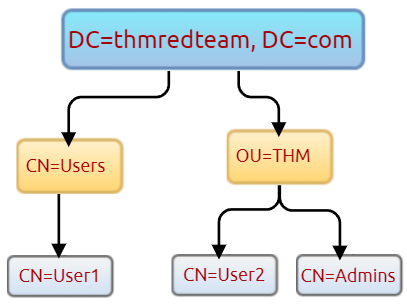

# Enumeration

The following are Active Directory Administrators accounts:

| Group Name                | Access / Permissions                                                           |
| ------------------------- | ------------------------------------------------------------------------------ |
| **BUILTIN\Administrator** | Local admin access on a domain controller                                      |
| **Domain Admins**         | Administrative access to all resources in the domain                           |
| **Enterprise Admins**     | Available only in the forest root; full control across the forest              |
| **Schema Admins**         | Can modify domain/forest schema; often targeted by red teamers for persistence |
| **Server Operators**      | Can manage domain servers                                                      |
| **Account Operators**     | Can manage users not in privileged groups                                      |

```
Get-ADUser  -Filter *
```

[LDAP hierarchical tree structure](http://www.ietf.org/rfc/rfc2253.txt)

<figure><figcaption></figcaption></figure>

```
Get-ADUser -Filter * -SearchBase "CN=Users,DC=THMREDTEAM,DC=COM"
```

## Enumeration through Command Prompt

**Users**

```bash
C:\>net user /domain
```

```
C:\>net user zoe.marshall /domain
```

**Groups**

```bash
C:\>net group /domain

The request will be processed at a domain controller for domain za.tryhackme.com

Group Accounts for \\THMDC

-------------------------------------------------------------------------------
*Cloneable Domain Controllers
*DnsUpdateProxy
*Domain Admins
*Domain Computers
*Domain Controllers
*Domain Guests
*Domain Users
[...]
*Schema Admins
*Server Admins
*Tier 0 Admins
*Tier 1 Admins
*Tier 2 Admins
The command completed successfully.
```

```bash
C:\>net group "Tier 1 Admins" /domain
```

**Password Policy**

```bash
C:\>net accounts /domain
```

This will provide us with helpful information such as:

* Length of password history kept. Meaning how many unique passwords must the user provide before they can reuse an old password.
* The lockout threshold for incorrect password attempts and for how long the account will be locked.
* The minimum length of the password.
* The maximum age that passwords are allowed to reach indicating if passwords have to be rotated at a regular interval.

## &#x20;Enumeration through PowerShell

**Users**

We can use the `Get-ADUser` cmdlet to enumerate AD users:

```bash
PS C:\> Get-ADUser -Identity gordon.stevens -Server za.tryhackme.com -Properties *
```

The parameters are used for the following:

* -Identity - The account name that we are enumerating
* -Properties - Which properties associated with the account will be shown, \* will show all properties
* -Server - Since we are not domain-joined, we have to use this parameter to point it to our domain controller

**Groups**

```bash
PS C:\> Get-ADGroup -Identity Administrators -Server za.tryhackme.com
```

**Domains**

```bash
PS C:\> Get-ADDomain -Server za.tryhackme.com
```

## Enumeration with Bloodhound

**BloodHound** is a tool that maps **Active Directory relationships** to identify privilege escalation paths. It helps attackers or defenders visualize **how users, groups, and computers are connected** to plan lateral movement.


We need to upload sharphound.ps1 to the target first.


```
powershell -ep bypass
```

or we can for spafic file

```
powershell -ep bypass -File script.ps1
```

What It Means

* `powershell` → Launches PowerShell.
* `-ep` → Stands for **ExecutionPolicy**.
* `bypass` → Temporarily **ignores the current execution policy** for this session

```bash
Invoke-Bloodhound -CollectionMethod All -Domain CONTROLLER.local -ZipFileName loot.zip
```

