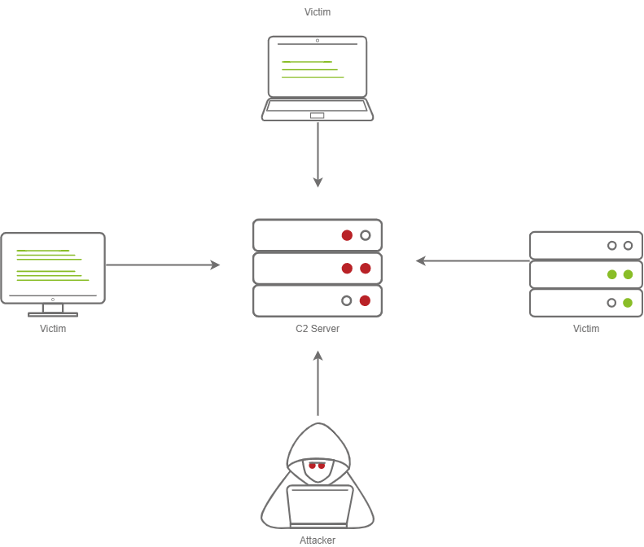

# (C2) Frameworks

## **C2 Server**

<figure><figcaption></figcaption></figure>

In order to understand a Command and Control framework, we must first start by understanding the various components of a C2 server. Let’s start with the most essential component - The C2 Server itself. The C2 Server serves as a hub for agents to call back to. Agents will periodically reach out to the C2 server and wait for the operator’s commands.

**Agents / Payloads**

An agent is a program generated by the C2 framework that calls back to a listener on a C2 server. Most of the time, this agent enables special functionality compared to a standard reverse shell. Most C2 Frameworks implement pseudo commands to make the C2 Operator’s life easier. Some examples of this may be a pseudo command to Download or Upload a file onto the system. It’s important to know that agents can be highly configurable, with adjustments on the timing of how often C2 Agents beacon out to a Listener on a C2 Server and much more.

**Listeners**

On the most basic level, a listener is an application running on the C2 server that waits for a callback over a specific port or protocol. Some examples of this are DNS, HTTP, and or HTTPS.

**Beacons**

A Beacon is the process of a C2 Agent calling back to the listener running on a C2 Server.

### Obfuscating Agent Callbacks

**Sleep Timers**

One key thing that some security analysts, anti-virus, and next-generation firewalls look for when attempting to identify Command and Control traffic is beaconing and the rate at which a device beacons out to a C2 server. Let’s say a firewall observed traffic that looks like so

* TCP/443 - Session Duration 3s, 55 packets sent, 10:00:05.000
* TCP/443 - Session Duration 2s, 33 packets sent, 10:00:10.000
* TCP/443 - Session Duration 3s, 55 packets sent, 10:00:15.000
* TCP/443 - Session Duration 1s, 33 packets sent, 10:00:20.000
* TCP/443 - Session Duration 3s, 55 packets sent, 10:00:25.000

A pattern is starting to form. The agent beacons out every 5 seconds; this means that it has a sleep timer of 5 seconds.

**Jitter**

Jitter takes the sleep timer and adds some variation to it; our C2 beaconing may now exhibit a strange pattern that may show activity that is closer to an average user:

* TCP/443 - Session Duration 3s, 55 packets sent, 10:00:03.580
* TCP/443 - Session Duration 2s, 33 packets sent, 10:00:13.213
* TCP/443 - Session Duration 3s, 55 packets sent, 10:00:14.912
* TCP/443 - Session Duration 1s, 33 packets sent, 10:00:23.444
* TCP/443 - Session Duration 3s, 55 packets sent, 10:00:27.182

The beaconing is now set at a semi-irregular pattern that makes it slightly more difficult to identify among regular user traffic. In more advanced C2 frameworks, it may be possible to alter various other parameters, like “File” jitter or adding junk data to the payload or files being transmitted to make it seem larger than it actually is.

Sample Python3 code for Jitter may look like so:

## Payload Types

Much like a regular Reverse Shell, there are two primary types of payloads that you may be able to use in your C2 Framework; **Staged** and **Stageless** payloads.

**Stageless Payloads**

Stageless Payloads are the simplest of the two; they contain the full C2 agent and will call back to the C2 server and begin beaconing immediately. You can refer to the diagram below to gain a better understanding of how Stageless payloads operate.

**Staged Payloads**

Staged payloads require a callback to the C2 server to download additional parts of the C2 agent. This is commonly referred to as a “Dropper” because it is “Dropped” onto the victim machine to download the second stage of our staged payload. This is a preferred method over stageless payloads because a small amount of code needs to be written to retrieve the additional parts of the C2 agent from the C2 server. It also makes it easier to obfuscate code to bypass Anti-Virus programs.

The steps for establishing C2 beaconing with a **staged** payload are as follows:

1. The Victim downloads and executes the Dropper
2. The Dropper calls back to the C2 Server for Stage 2
3. The C2 Server sends Stage 2 back to the Victim Workstation
4. Stage 2 is loaded into memory on the Victim Workstation&#x20;
5. C2 Beaconing Initializes, and the Red Teamer/Threat Actors can engage with the Victim on the C2 Server.

### Modules

Modules are a core component of any C2 Framework; they add the ability to make agents and the C2 server more flexible. Depending on the C2 Framework, scripts must be written in different languages. Cobalt Strike has “Aggressor Scripts”, which are written in the “Aggressor Scripting Language”. PowerShell Empire has support for multiple languages, Metasploit’s Modules are written in Ruby, and many others are written in many other languages.

### Post Exploitation Modules

Post Exploitation modules are simply modules that deal with anything after the initial point of compromise, this could be as simple as running SharpHound.ps1 to find paths of lateral movement, or it could be as complex as dumping LSASS and parsing credentials in memory. For more information on Post Exploitation, refer to the [Post Exploitation Basics](https://tryhackme.com/room/postexploit) room.

### Pivoting Modules

One of the last major components of a C2 Framework is its pivoting modules, making it easier to access restricted network segments within the C2 Framework. If you have Administrative Access on a system, you may be able to open up an “SMB Beacon”, which can enable a machine to act as a proxy via the SMB protocol. This may allow machines in a restricted network segment to communicate with your C2 server.

### ⚙️ Popular Free / Open‑Source C2 Frameworks

1. **Sliver**
   * Very modern, cross‑platform (Windows, Linux, macOS) C2. [Bishop Fox+2Medium+2](https://bishopfox.com/blog/2025-red-team-tools-c2-frameworks-active-directory-network-exploitation?utm_source=chatgpt.com)
   * Supports mTLS, HTTP(S), DNS channels. [Bishop Fox](https://bishopfox.com/blog/2025-red-team-tools-c2-frameworks-active-directory-network-exploitation?utm_source=chatgpt.com)
   * Good for OPSEC / stealthy comms.
2. **Mythic**
   * Modular architecture, Python + Go, Docker‑friendly. [LinkedIn](https://www.linkedin.com/posts/rakesh-joshi-119302215_mythic-c2-framework-is-a-modern-open-source-activity-7329007321597087744-Qq32?utm_source=chatgpt.com)
   * Web UI + REST API, supports multiple “agents” (payloads). [LinkedIn](https://www.linkedin.com/posts/rakesh-joshi-119302215_mythic-c2-framework-is-a-modern-open-source-activity-7329007321597087744-Qq32?utm_source=chatgpt.com)
   * Encrypted C2 channels. [LinkedIn](https://www.linkedin.com/posts/rakesh-joshi-119302215_mythic-c2-framework-is-a-modern-open-source-activity-7329007321597087744-Qq32?utm_source=chatgpt.com)
3. **PoshC2**
   * Built in PowerShell and Python. [Bishop Fox](https://bishopfox.com/blog/2025-red-team-tools-c2-frameworks-active-directory-network-exploitation?utm_source=chatgpt.com)
   * Very flexible, supports proxying, obfuscation, and lateral movement. [Medium](https://medium.com/%40nirvana.elahi/red-teaming-involves-simulating-real-world-cyberattacks-to-test-an-organizations-defenses-and-8b5d225fde97?utm_source=chatgpt.com)
4. **Empire**
   * Classic post‑exploitation framework, PowerShell / Python agents. [Medium](https://medium.com/%40nirvana.elahi/red-teaming-involves-simulating-real-world-cyberattacks-to-test-an-organizations-defenses-and-8b5d225fde97?utm_source=chatgpt.com)
   * Lots of modules, good for red teaming.
5. **Covenant**
   * .NET‑based C2 framework. [ciso2ciso.com+1](https://ciso2ciso.com/wp-content/uploads/2022/08/RedTeam-and-Penetration-Testing-Guide.pdf?utm_source=chatgpt.com)
   * Good .NET tradecraft, can run on Windows.
6. **Silent Trinity**
   * Python + .NET, asynchronous C2. [GitHub+1](https://github.com/tcostam/awesome-command-control?utm_source=chatgpt.com)
   * Designed for stealth and modular post‑exploitation.
7. **LazyOwn**
   * Open source (GPLv3). [Reddit](https://www.reddit.com/r/indiehackers/comments/1ikxk8t?utm_source=chatgpt.com)
   * Supports Telegram / Discord bots as C2 channels.
