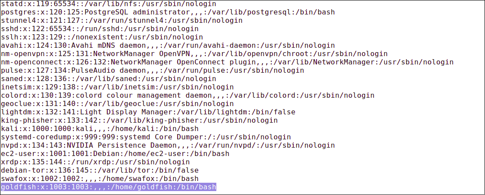

# Linux

<figure><figcaption></figcaption></figure>


All passwords are located: /etc/shadow or /etc/passwd and are encrypted&#x20;



/etc/shadow - /etc/passwd Can be accesed only by root


## &#x20;🔐 Common Hash Algorithms in Linux

| ID     | Hash Type             | Description                               |
| ------ | --------------------- | ----------------------------------------- |
| `$1$`  | **MD5**               | Obsolete and insecure                     |
| `$2y$` | **Blowfish (bcrypt)** | More secure; slower but better protection |
| `$5$`  | **SHA-256**           | Secure, configurable                      |
| `$6$`  | **SHA-512**           | Default in most modern Linux systems      |

<figure><figcaption></figcaption></figure>


✅ Most modern distributions (Ubuntu, Debian, CentOS, Arch, etc.) use **SHA-512** by default.


## Viewing etc/shadow /etc/passwd

> /etc/passwd This file stores the most essential information, required during the user login process. (It stores user account information). It's a plain-text file that contains a list of the system's accounts, giving for each account some useful information like user ID, group ID, home directory, shell, and more.
>
> /etc/shadow The /etc/shadow file stores actual password in an encrypted format (aka hashes) for user’s account with additional properties related to user password. Those encrypted passwords usually have a pretty similar structure, making it easy for us to identify the encoding format and crack the hash to get the password.

```bash
cat /etc/shadow
```

<figure><figcaption></figcaption></figure>

<figure><figcaption></figcaption></figure>

`goldfish:x:1003:1003:,,,:/home/goldfish:/bin/bash`

1. (goldfish) - Username
2. (x) - Password. (x character indicates that an encrypted account password is stored in /etc/shadow file and cannot be displayed in the plain text here)
3. (1003) - User ID (UID): Each non-root user has his own UID (1-99). UID 0 is reserved for root.
4. (1003) - Group ID (GID): Linux group ID
5. (,,,) - User ID Info: A field that contains additional info, such as phone number, name, and last name. (,,, in this case means that I did not input any additional info while creating the user)
6. (/home/goldfish) - Home directory: A path to user's home directory that contains all the files related to them.
7. (/bin/bash) - Shell or a command: Path of a command or shell that is used by the user. Simple users usually have /bin/bash as their shell, while services run on /usr/sbin/nologin.

## Metasploit post module

```
post/linux/gather/hashdump
```
