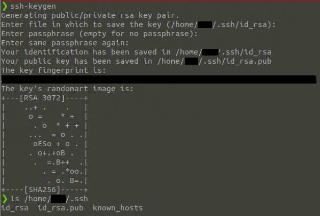
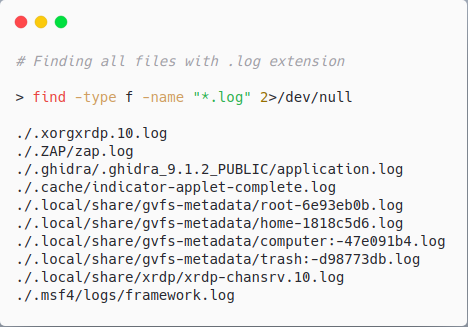
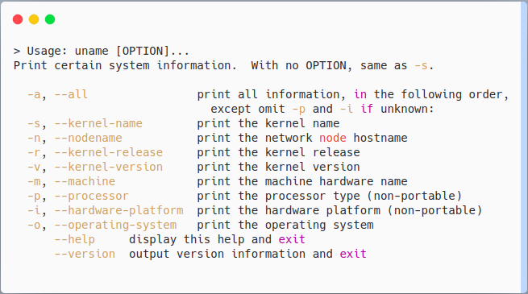

# Linux

<figure><figcaption></figcaption></figure>

## Metasploit Post Modules

### Enumerating System Information

<figure><figcaption></figcaption></figure>

* sysinfo

**Identify OS version**

```bash
cat /etc/issue or for all info cat /etc/*release
```

**Hardware**

```bash
ls cpu
```

Drives/disk

```bash
df -h
```

List installed packages

```
dpkg -l
```


There will be alot cause on linux every comand is package


### CheckVM

<pre><code><strong>post/linux/gather/checkvm
</strong></code></pre>

### Configs

```
post/linux/gather/enum_configs
```

### Network enum

```
post/linux/gather/enum_network
```

```
netstat
```

```
roote
```

This displays **network names and their corresponding IP addresses**, typically used for legacy tools and configuration.

```
cat /etc/networks
```

This displays the **static hostname-to-IP address mapping** used for local name resolution, **before DNS is consulted**.

```
cat /etc/hosts
```

### Protections

```
post/linux/gather/enum_protections
```

```
post/linux/gather/enum_system
```

### Users and groups

Zero uid on linux is always the Root user

```
metepreter getuid
```

See what group user is part of

```
groups <user>
```

Output system users

* Users accounts
* Services accounts

Services users have `/nologin`

```
cat /etc/passwd
```

**Last**

This command tell us what user logged in before `last`

## Automating Enum

```
post/linux/gather/enum_configs
```

🔎 It gathers potentially interesting **configuration files** that may contain:

* Credentials
* Service configurations
* Custom scripts
* Backup files
* API tokens
* Misconfigurations

```
post/linux/gather/enum_network
```

```
post/linux/gather/enum_system
```

&#x20;🔎 Collects detailed information about the **host system**, including:

* Operating system and version
* Kernel version
* CPU and memory details
* Network interfaces and routes
* Running processes
* Mounted filesystems
* Logged-in users
* Uptime and hostname
* Package management system and installed packages

### Lin enum script

We upload it and run it

```
chmod +x script.sh
```





## Other commands

|                        |                                                                                                |
| ---------------------- | ---------------------------------------------------------------------------------------------- |
| <h4>hostname</h4>      | will return the hostname of the target machine                                                 |
| <h4>uname -a</h4>      | Will print system information giving us additional detail about the kernel used by the system. |
| <h4>/etc/issue</h4>    | This file usually contains some information about the operating system                         |
| <h4>/proc/version</h4> | The proc filesystem (procfs) provides information about the target system processes            |
| <h4>env</h4>           | The `env` command will show environmental variables.                                           |

**uname**

```bash
uname [OPTIONS]
```

| Option | Description                               |
| ------ | ----------------------------------------- |
| `-a`   | Show **all** available system info        |
| `-s`   | Show kernel name (default output)         |
| `-n`   | Show network node hostname                |
| `-r`   | Show kernel release version               |
| `-v`   | Show kernel version                       |
| `-m`   | Show machine hardware name (architecture) |
| `-p`   | Show processor type (if available)        |
| `-i`   | Show hardware platform (if available)     |
| `-o`   | Show operating system                     |


[bash](../../../../../operating-systems/linux/bash/)


## ssh

Look for **id\_rsa** file that contains a private key that can be used to connect to a box via ssh. It is usually located in the `.ssh` folder in the user's home folder. (Full path: `/home/user/.ssh/id_rsa`)

Get that file on your system and give it read/write-only permissions for your user:\
(`chmod 600 id_rsa`) and connect by executing `ssh -i id_rsa user@ip`).

In case if the target box does not have a generated **id\_rsa** file (or you simply don't have reading permissions for it), you can still gain stable ssh access. All you need to do is generate your own **id\_rsa** key on your system and include an associated key into **authorized\_keys** file on the target machine.\
Execute `ssh-keygen` and you should see **id\_rsa** and `id_rsa.pub` files appear in your own **.ssh** folder. Copy the content of the **id\_rsa.pub** file and put it inside the **authorized\_keys** file on the target machine (located in .ssh folder). After that, connect to the machine using your id\_rsa file.

<figure><figcaption></figcaption></figure>

## Port Forwarding

According to Wikipedia, "Port forwarding is an application of network address translation (NAT) that redirects a communication request from one address and port number combination to another while the packets are traversing a network gateway, such as a router or firewall".&#x20;

Port forwarding not only allows you to bypass firewalls but also gives you an opportunity to enumerate some local services and processes running on the box.&#x20;

The Linux netstat command gives you a bunch of information about your network connections, the ports that are in use, and the processes using them. In order to see all TCP connections, execute `netstat -at | less`. This will give you a list of running processes that use TCP. From this point, you can easily enumerate running processes and gain some valuable information.

`netstat -tulpn` will provide you a much nicer output with the most interesting data.

## -type f

<figure><figcaption></figcaption></figure>

Basically, what you want to do is to look for interesting log (.log) and configuration files (.conf). In addition to that, the system owner might be keeping backup files (.bak).

The most important switches for us in our enumeration process are -type and -name.\
The first one allows us to limit the search towards files only `-type f` and the second one allows us to search for files by extensions using the wildcard (\*).&#x20;

## uname

<figure><figcaption></figcaption></figure>
