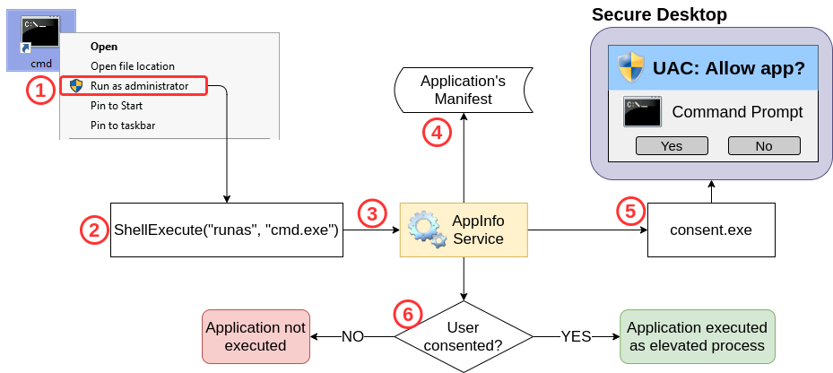

# Win

## Metasploit post modules

Scanning privli escalation vulnerabilities

Not Offline requires active session

<pre><code><strong>meterpreter> run post/multi/recon/local_exploit_suggester
</strong></code></pre>

| Command                                 | Description                                    |
| --------------------------------------- | ---------------------------------------------- |
| `getsystem`                             | Try to escalate to SYSTEM privileges. WIN ONLY |
| `getprivs  OR windows/gather/win_privs` | see what privileges we have                    |
| `whoami /priv`                          | see the privs we have : in Shell               |

## Windows exploit suggester

#### ✅ Standalone Python script

#### 🔧 **How it works:**

* Takes a `systeminfo` output from a Windows host.
* Compares it to a local database of **Microsoft security bulletins (patches)**.
* Identifies **missing patches** and maps them to **known privilege escalation exploits** (from ExploitDB, MS bulletins, etc.).
* OFFLINE





## Privscheck

This script aims to identify **Local Privilege Escalation** (LPE) vulnerabilities that are usually due to Windows configuration issues, or bad practices. It can also gather useful information for some exploitation and post-exploitation tasks.



### Basic checks only

Quickly identify important issues, such as local privilege escalation vulnerabilities.

```
powershell -ep bypass -c ". .\PrivescCheck.ps1; Invoke-PrivescCheck"
```

### &#x20;Extended checks + human-readable reports

Identify important issues, but also gather additional information, and save the results to report files that are easy to read.

```
powershell -ep bypass -c ". .\PrivescCheck.ps1; Invoke-PrivescCheck -Extended -Report PrivescCheck_$($env:COMPUTERNAME) -Format TXT,HTML"
```

### &#x20;All checks + all reports

Perform extended and audit checks, and save the results to human-readable reports, but also machine-readable files, which can later be parsed for automated report generation.

```
powershell -ep bypass -c ". .\PrivescCheck.ps1; Invoke-PrivescCheck -Extended -Audit -Report PrivescCheck_$($env:COMPUTERNAME) -Format TXT,HTML,CSV,XML"
```

### Check types

All the checks implemented in PrivescCheck have a **Type**. This value, and the flags specified on the command line, will determine if they are run, or not.

#### Bas

Checks of type `Base` will always be executed, unless the script is run as an administrator. They are mainly intended for identifying privilege escalation vulnerabilities, or other important issues.

#### Extended

Checks of type `Extended` can only be executed if the option `-Extended` is specified on the command line. They are mainly intended for providing additional information that could be useful for exploit development, or post-exploitation.

#### Audit

Checks of type `Audit` can only be executed if the option `-Audit` is specified on the command line. They are mainly intended for providing information that is relevant in the context of a configuration audit.

#### Experimental

Checks of type `Experimental` can only be executed if the option `-Experimental` is specified on the command line. These are unstable checks that need further work. Use them with caution.

## &#x20;Access Token Impersonation

* winlogon.exe procces

<figure><figcaption></figcaption></figure>

<p align="center"><strong>!!! IMPORTANT !!!</strong></p>

<figure><figcaption></figcaption></figure>

***

### 🪪 What Is an Access Token (Windows Security)?

An **Access Token** in Windows is a **data structure** that contains **security information** about a **logged-in user** or **process**.

It tells the system:

* **Who** you are
* **What** you can do (privileges)
* **Where** you belong (groups)

Think of it like your **"security passport"** for Windows. When you log in, Windows creates a token and attaches it to every process you run.


Only metepreter gets elvated privalages not the actual shell


***

### 🔍 What’s Inside an Access Token?

| Component           | Description                                                                |
| ------------------- | -------------------------------------------------------------------------- |
| **User SID**        | The unique ID of the user                                                  |
| **Group SIDs**      | The user’s group memberships (e.g., Administrators, Users)                 |
| **Privileges**      | Rights like `SeDebugPrivilege`, `SeImpersonatePrivilege`, etc.             |
| **Integrity Level** | Tells Windows how trusted the process is (e.g., low, medium, high, system) |
| **Linked Token**    | For UAC (Standard + Elevated token on admin accounts)                      |

***

### 🧠 What is Access Token Impersonation (for Privilege Escalation)?

**Access token impersonation** allows an attacker to **run code with the privileges of a more powerful user (like SYSTEM or Admin)** by stealing or impersonating that user's **access token** — without knowing their credentials.

🔒 **An access token = a "proof of identity" + permissions** for a user session. Windows uses it to control what you can do.

***

### 🛠️ How It Enables Privilege Escalation

After gaining **initial access** (e.g., as a low-privilege user), the attacker looks for a way to **steal or impersonate a token** that belongs to a **higher-privileged** process or session (e.g., Administrator or SYSTEM). Once impersonated, the attacker can:

* **Spawn processes** as that higher-privileged user
* **Access files**, **install services**, or **execute commands** they normally can’t

***

### Metasploit Module

📦 Module used: Incognito

🔐 Requirments: SeImpersonatePrivilege

> `getprivs` see our privileges

Using Incognito

```
meterpreter> load incognito
```

Commands:

* `list_tokens -u`#   Show available user tokens
* `list_tokens -g` # Show available groups
* `impersonate_token` "DOMAIN\Administrator" # Impersonate a token
* `getuid` # Confirm elevated identity

## &#x20;UAC

First we need to check if our current user its inside the adminstrator group otherwise we cant bypass UAC

To check we run

```
net localgroup administrators
```

### Integrity Levels

UAC is a **Mandatory Integrity Control (MIC)**, which is a mechanism that allows differentiating users, processes and resources by assigning an **Integrity Level (IL)** to each of them. In general terms, users or processes with a higher IL access token will be able to access resources with lower or equal ILs.

| Integrity Level | Use                                                                                                                                           |
| --------------- | --------------------------------------------------------------------------------------------------------------------------------------------- |
| Low             | <p>Generally used for interaction with the Internet (i.e. Internet Explorer). Has very limited permissions.<br></p>                           |
| Medium          | <p>Assigned to standard users and Administrators' filtered tokens.<br></p>                                                                    |
| High            | <p>Used by Administrators' elevated tokens if UAC is enabled. If UAC is disabled, all administrators will always use a high IL token.<br></p> |
| System          | Reserved for system use                                                                                                                       |

### Filtered Tokens

To accomplish this separation of roles, UAC treats regular users and administrators in a slightly different way during logon:

* **Non-administrators** will receive a single access token when logged in, which will be used for all tasks performed by the user. This token has Medium IL.
* **Administrators** will receive two access tokens:
  * **Filtered Token:** A token with Administrator privileges stripped, used for regular operations. This token has Medium IL.
  * **Elevated Token:** A token with full Administrator privileges, used when something needs to be run with administrative privileges. This token has High IL.

<figure><figcaption></figcaption></figure>

#### UAC Internals

At the heart of UAC, we have the **Application Information Service** or **Appinfo**. Whenever a user requires elevation, the following occurs:

1. The user requests to run an application as administrator.
2. A **ShellExecute** API call is made using the **runas** verb.
3. The request gets forwarded to Appinfo to handle elevation.
4. The application manifest is checked to see if AutoElevation is allowed (more on this later).
5. Appinfo executes **consent.exe**, which shows the UAC prompt on a **secure desktop**. A secure desktop is simply a separate desktop that isolates processes from whatever is running in the actual user's desktop to avoid other processes from tampering with the UAC prompt in any way.
6. If the user gives consent to run the application as administrator, the Appinfo service will execute the request using a user's Elevated Token. Appinfo will then set the parent process ID of the new process to point to the shell from which elevation was requested.

<figure><figcaption></figcaption></figure>

### UACme



## **Windows configuration files**


[credential-dumping](../credential-dumping/)


## Powershell History

Whenever a user runs a command using Powershell, it gets stored into a file that keeps a memory of past commands. This is useful for repeating commands you have used before quickly. If a user runs a command that includes a password directly as part of the Powershell command line, it can later be retrieved by using the following command from a `cmd.exe` prompt:

```
type %userprofile%\AppData\Roaming\Microsoft\Windows\PowerShell\PSReadline\ConsoleHost_history.txt
```

**Note:** The command above will only work from cmd.exe, as Powershell won't recognize `%userprofile%` as an environment variable. To read the file from Powershell, you'd have to replace `%userprofile%` with `$Env:userprofile`.&#x20;

## Saved Windows Credentials

Windows allows us to use other users' credentials. This function also gives the option to save these credentials on the system. The command below will list saved credentials:

```shell-session
cmdkey /list
```

While you can't see the actual passwords, if you notice any credentials worth trying, you can use them with the `runas` command and the `/savecred` option, as seen below.

```shell-session
runas /savecred /user:admin cmd.exe
```

## IIS Configuration

Internet Information Services (IIS) is the default web server on Windows installations. The configuration of websites on IIS is stored in a file called `web.config` and can store passwords for databases or configured authentication mechanisms. Depending on the installed version of IIS, we can find web.config in one of the following locations:

* C:\inetpub\wwwroot\web.config
* C:\Windows\Microsoft.NET\Framework64\v4.0.30319\Config\web.config

Here is a quick way to find database connection strings on the file:

```shell-session
type C:\Windows\Microsoft.NET\Framework64\v4.0.30319\Config\web.config | findstr connectionString
```

## Retrieve Credentials from Software: PuTT

```
reg query HKEY_CURRENT_USER\Software\SimonTatham\PuTTY\Sessions\ /f "Proxy" /s
```

