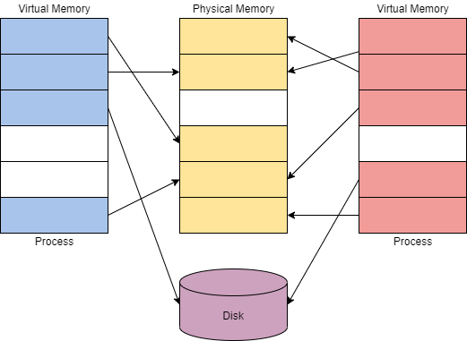

# Windows Internals

Attackers can target processes to evade detections and hide malware as legitimate processes. Below is a small list of potential attack vectors attackers could employ against processes,

* Process Injection ([T1055](https://attack.mitre.org/techniques/T1055/))
* Process Hollowing ([T1055.012](https://attack.mitre.org/techniques/T1055/012/))
* Process Masquerading ([T1055.013](https://attack.mitre.org/techniques/T1055/013/))

Processes have many components; they can be split into key characteristics that we can use to describe processes at a high level. The table below describes each critical component of processes and their purpose.

## **Process**&#x20;

| <p>Process Component<br></p>             | <p>Purpose<br></p>                                                                                         |
| ---------------------------------------- | ---------------------------------------------------------------------------------------------------------- |
| <p>Private Virtual Address Space<br></p> | <p>Virtual memory addresses that the process is allocated.<br></p>                                         |
| <p>Executable Program<br></p>            | <p>Defines code and data stored in the virtual address space.<br></p>                                      |
| <p>Open Handles<br></p>                  | <p>Defines handles to system resources accessible to the process.<br></p>                                  |
| <p>Security Context<br></p>              | <p>The access token defines the user, security groups, privileges, and other security information.<br></p> |
| <p>Process ID <br></p>                   | <p>Unique numerical identifier of the process.<br></p>                                                     |
| <p>Threads<br></p>                       | Section of a process scheduled for execution.                                                              |

We can also explain a process at a **lower level** as it resides in the virtual address space. The table and diagram below depict what a process looks like in memory.

| <p>Component<br></p>         | <p>Purpose<br></p>                                   |
| ---------------------------- | ---------------------------------------------------- |
| <p>Code<br></p>              | <p>Code to be executed by the process.<br></p>       |
| <p>Global Variables<br></p>  | <p>Stored variables.<br></p>                         |
| <p>Process Heap<br></p>      | <p>Defines the heap where data is stored.<br></p>    |
| <p>Process Resources<br></p> | <p>Defines further resources of the process.<br></p> |
| <p>Environment Block<br></p> | Data structure to define process information.        |

<figure><figcaption></figcaption></figure>

Below is a table with a brief list of essential process details.

| <p>Value/Component<br></p> | <p>Purpose<br></p>                                                                  | <p>Example<br></p>     |
| -------------------------- | ----------------------------------------------------------------------------------- | ---------------------- |
| <p>Name<br></p>            | <p>Define the name of the process, typically inherited from the application<br></p> | <p>conhost.exe<br></p> |
| <p>PID<br></p>             | <p>Unique numerical value to identify the process<br></p>                           | <p>7408<br></p>        |
| <p>Status<br></p>          | <p>Determines how the process is running (running, suspended, etc.)<br></p>         | <p>Running<br></p>     |
| <p>User name<br></p>       | <p>User that initiated the process. Can denote privilege of the process<br></p>     | SYSTEM                 |

There are multiple utilities available that make observing processes easier; including [Process Hacker 2](https://github.com/processhacker/processhacker), [Process Explorer](https://docs.microsoft.com/en-us/sysinternals/downloads/process-explorer), and [Procmon](https://docs.microsoft.com/en-us/sysinternals/downloads/procmon).

## Threads

A thread is an executable unit employed by a process and scheduled based on device factors.

Device factors can vary based on CPU and memory specifications, priority and logical factors, and others.

We can simplify the definition of a thread: "controlling the execution of a process."

Since threads control execution, this is a commonly targeted component. Thread abuse can be used on its own to aid in code execution, or it is more widely used to chain with other API calls as part of other techniques.&#x20;

Threads share the same details and resources as their parent process, such as code, global variables, etc. Threads also have their unique values and data, outlined in the table below.

| Component                       | Purpose                                                                                     |
| ------------------------------- | ------------------------------------------------------------------------------------------- |
| <p>Stack <br></p>               | <p>All data relevant and specific to the thread (exceptions, procedure calls, etc.)<br></p> |
| <p>Thread Local Storage<br></p> | <p>Pointers for allocating storage to a unique data environment<br></p>                     |
| <p>Stack Argument<br></p>       | <p>Unique value assigned to each thread<br></p>                                             |
| <p>Context Structure<br></p>    | Holds machine register values maintained by the kernel                                      |

## Virtual memory

<figure><figcaption></figcaption></figure>

Virtual memory is a critical component of how Windows internals work and interact with each other. Virtual memory allows other internal components to interact with memory as if it was physical memory without the risk of collisions between applications. The concept of modes and collisions is explained further in task 8.

Virtual memory provides each process with a [private virtual address space](https://docs.microsoft.com/en-us/windows/win32/memory/virtual-address-space). A memory manager is used to translate virtual addresses to physical addresses. By having a private virtual address space and not directly writing to physical memory, processes have less risk of causing damage.

The memory manager will also use _pages_ or _transfers_ to handle memory. Applications may use more virtual memory than physical memory allocated; the memory manager will transfer or page virtual memory to the disk to solve this problem. You can visualize this concept in the diagram below.

<figure><figcaption></figcaption></figure>

The theoretical maximum virtual address space is 4 GB on a 32-bit x86 system.

The theoretical maximum virtual address space is 256 TB on a 64-bit modern system.

.png>)<br>

## Dynamic Link Libraries

he [Microsoft docs](https://docs.microsoft.com/en-us/troubleshoot/windows-client/deployment/dynamic-link-library) describe a DLL as "a library that contains code and data that can be used by more than one program at the same time."

DLLs are used as one of the core functionalities behind application execution in Windows. From the [Windows documentation](https://docs.microsoft.com/en-us/troubleshoot/windows-client/deployment/dynamic-link-library), "The use of DLLs helps promote modularization of code, code reuse, efficient memory usage, and reduced disk space. So, the operating system and the programs load faster, run faster, and take less disk space on the computer."

When a DLL is loaded as a function in a program, the DLL is assigned as a dependency. Since a program is dependent on a DLL, attackers can target the DLLs rather than the applications to control some aspect of execution or functionality.

* DLL Hijacking ([T1574.001](https://attack.mitre.org/techniques/T1574/001/))
* DLL Side-Loading ([T1574.002](https://attack.mitre.org/techniques/T1574/002/))
* DLL Injection ([T1055.001](https://attack.mitre.org/techniques/T1055/001/))

DLLs are created no different than any other project/application; they only require slight syntax modification to work. Below is an example of a DLL from the _Visual C++ Win32 Dynamic-Link Library project_.

```cpp
#include "stdafx.h"
#define EXPORTING_DLL
#include "sampleDLL.h"
BOOL APIENTRY DllMain( HANDLE hModule, DWORD ul_reason_for_call, LPVOID lpReserved
)
{
    return TRUE;
}

void HelloWorld()
{
    MessageBox( NULL, TEXT("Hello World"), TEXT("In a DLL"), MB_OK);
}
```

Below is the header file for the DLL;

```cpp
#ifndef INDLL_H
    #define INDLL_H
    #ifdef EXPORTING_DLL
        extern __declspec(dllexport) void HelloWorld();
    #else
        extern __declspec(dllimport) void HelloWorld();
    #endif

#endif
```

DLLs can be loaded in a program using _load-time dynamic linking_ or _run-time dynamic linking_.

When loaded using _load-time dynamic linking_, explicit calls to the DLL functions are made from the application. You can only achieve this type of linking by providing a header (_.h_) and import library (_.lib_) file. Below is an example of calling an exported DLL function from an application.

```cpp
#include "stdafx.h"
#include "sampleDLL.h"
int APIENTRY WinMain(HINSTANCE hInstance, HINSTANCE hPrevInstance, LPSTR lpCmdLine, int nCmdShow)
{
    HelloWorld();
    return 0;
}
```

When loaded using _run-time dynamic linking_, a separate function (`LoadLibrary` or `LoadLibraryEx`) is used to load the DLL at run time. Once loaded, you need to use `GetProcAddress` to identify the exported DLL function to call. Below is an example of loading and importing a DLL function in an application.

```cpp
...
typedef VOID (*DLLPROC) (LPTSTR);
...
HINSTANCE hinstDLL;
DLLPROC HelloWorld;
BOOL fFreeDLL;

hinstDLL = LoadLibrary("sampleDLL.dll");
if (hinstDLL != NULL)
{
    HelloWorld = (DLLPROC) GetProcAddress(hinstDLL, "HelloWorld");
    if (HelloWorld != NULL)
        (HelloWorld);
    fFreeDLL = FreeLibrary(hinstDLL);
}
...
```

## **P**ortable **E**xecutable format

Executables and applications are a large portion of how Windows internals operate at a higher level. The PE (**P**ortable **E**xecutable) format defines the information about the executable and stored data. The PE format also defines the structure of how data components are stored.

The PE (**P**ortable **E**xecutable) format is an overarching structure for executable and object files. The PE (**P**ortable **E**xecutable) and COFF (**C**ommon **O**bject **F**ile **F**ormat) files make up the PE format.

PE data is most commonly seen in the hex dump of an executable file. Below we will break down a hex dump of calc.exe into the sections of PE data.

The structure of PE data is broken up into seven components,

The **DOS Header** defines the type of file

The `MZ` DOS header defines the file format as `.exe`. The DOS header can be seen in the hex dump section below.

```
Offset(h) 00 01 02 03 04 05 06 07 08 09 0A 0B 0C 0D 0E 0F
00000000  4D 5A 90 00 03 00 00 00 04 00 00 00 FF FF 00 00  MZ..........ÿÿ..
00000010  B8 00 00 00 00 00 00 00 40 00 00 00 00 00 00 00  ¸.......@.......
00000020  00 00 00 00 00 00 00 00 00 00 00 00 00 00 00 00  ................
00000030  00 00 00 00 00 00 00 00 00 00 00 00 E8 00 00 00  ............è...
00000040  0E 1F BA 0E 00 B4 09 CD 21 B8 01 4C CD 21 54 68  ..º..´.Í!¸.LÍ!Th
```

The **DOS Stub** is a program run by default at the beginning of a file that prints a compatibility message. This does not affect any functionality of the file for most users.

The DOS stub prints the message `This program cannot be run in DOS mode`. The DOS stub can be seen in the hex dump section below.

```
00000040  0E 1F BA 0E 00 B4 09 CD 21 B8 01 4C CD 21 54 68  ..º..´.Í!¸.LÍ!Th
00000050  69 73 20 70 72 6F 67 72 61 6D 20 63 61 6E 6E 6F  is program canno
00000060  74 20 62 65 20 72 75 6E 20 69 6E 20 44 4F 53 20  t be run in DOS 
00000070  6D 6F 64 65 2E 0D 0D 0A 24 00 00 00 00 00 00 00  mode....$.......
```

The **PE File Header** provides PE header information of the binary. Defines the format of the file, contains the signature and image file header, and other information headers.

The PE file header is the section with the least human-readable output. You can identify the start of the PE file header from the `PE` stub in the hex dump section below.

```
000000E0  00 00 00 00 00 00 00 00 50 45 00 00 64 86 06 00  ........PE..d†..
000000F0  10 C4 40 03 00 00 00 00 00 00 00 00 F0 00 22 00  .Ä@.........ð.".
00000100  0B 02 0E 14 00 0C 00 00 00 62 00 00 00 00 00 00  .........b......
00000110  70 18 00 00 00 10 00 00 00 00 00 40 01 00 00 00  p..........@....
00000120  00 10 00 00 00 02 00 00 0A 00 00 00 0A 00 00 00  ................
00000130  0A 00 00 00 00 00 00 00 00 B0 00 00 00 04 00 00  .........°......
00000140  63 41 01 00 02 00 60 C1 00 00 08 00 00 00 00 00  cA....`Á........
00000150  00 20 00 00 00 00 00 00 00 00 10 00 00 00 00 00  . ..............
00000160  00 10 00 00 00 00 00 00 00 00 00 00 10 00 00 00  ................
00000170  00 00 00 00 00 00 00 00 94 27 00 00 A0 00 00 00  ........”'.. ...
00000180  00 50 00 00 10 47 00 00 00 40 00 00 F0 00 00 00  .P...G...@..ð...
00000190  00 00 00 00 00 00 00 00 00 A0 00 00 2C 00 00 00  ......... ..,...
000001A0  20 23 00 00 54 00 00 00 00 00 00 00 00 00 00 00   #..T...........
000001B0  00 00 00 00 00 00 00 00 00 00 00 00 00 00 00 00  ................
000001C0  10 20 00 00 18 01 00 00 00 00 00 00 00 00 00 00  . ..............
000001D0  28 21 00 00 40 01 00 00 00 00 00 00 00 00 00 00  (!..@...........
000001E0  00 00 00 00 00 00 00 00 00 00 00 00 00 00 00 00  ................
```

The **Image Optional Header** has a deceiving name and is an important part of the **PE File Header**

The **Data Dictionaries** are part of the image optional header. They point to the image data directory structure.

The **Section Table** will define the available sections and information in the image. As previously discussed, sections store the contents of the file, such as code, imports, and data. You can identify each section definition from the table in the hex dump section below.

```
000001F0  2E 74 65 78 74 00 00 00 D0 0B 00 00 00 10 00 00  .text...Ð.......
00000200  00 0C 00 00 00 04 00 00 00 00 00 00 00 00 00 00  ................
00000210  00 00 00 00 20 00 00 60 2E 72 64 61 74 61 00 00  .... ..`.rdata..
00000220  76 0C 00 00 00 20 00 00 00 0E 00 00 00 10 00 00  v.... ..........
00000230  00 00 00 00 00 00 00 00 00 00 00 00 40 00 00 40  ............@..@
00000240  2E 64 61 74 61 00 00 00 B8 06 00 00 00 30 00 00  .data...¸....0..
00000250  00 02 00 00 00 1E 00 00 00 00 00 00 00 00 00 00  ................
00000260  00 00 00 00 40 00 00 C0 2E 70 64 61 74 61 00 00  ....@..À.pdata..
00000270  F0 00 00 00 00 40 00 00 00 02 00 00 00 20 00 00  ð....@....... ..
00000280  00 00 00 00 00 00 00 00 00 00 00 00 40 00 00 40  ............@..@
00000290  2E 72 73 72 63 00 00 00 10 47 00 00 00 50 00 00  .rsrc....G...P..
000002A0  00 48 00 00 00 22 00 00 00 00 00 00 00 00 00 00  .H..."..........
000002B0  00 00 00 00 40 00 00 40 2E 72 65 6C 6F 63 00 00  ....@..@.reloc..
000002C0  2C 00 00 00 00 A0 00 00 00 02 00 00 00 6A 00 00  ,.... .......j..
000002D0  00 00 00 00 00 00 00 00 00 00 00 00 40 00 00 42  ............@..B
```

Now that the headers have defined the format and function of the file, the sections can define the contents and data of the file.

| <p>Section<br></p>          | <p>Purpose<br></p>                                              |
| --------------------------- | --------------------------------------------------------------- |
| <p>.text<br></p>            | <p>Contains executable code and entry point<br></p>             |
| <p>.data <br></p>           | <p>Contains initialized data (strings, variables, etc.)<br></p> |
| <p>.rdata or .idata<br></p> | <p>Contains imports (Windows API) and DLLs.<br></p>             |
| <p>.reloc<br></p>           | <p>Contains relocation information<br></p>                      |
| <p>.rsrc<br></p>            | <p>Contains application resources (images, etc.)<br></p>        |
| <p>.debug<br></p>           | Contains debug information                                      |

<figure><figcaption></figcaption></figure>

## Interacting with Windows Internals

Interacting with Windows internals may seem daunting, but it has been dramatically simplified. The most accessible and researched option to interact with Windows Internals is to interface through Windows API calls. The Windows API provides native functionality to interact with the Windows operating system. The API contains the Win32 API and, less commonly, the Win64 API.<br>

<br>

<figure><figcaption></figcaption></figure>

The Windows kernel will control all programs and processes and bridge all software and hardware interactions. This is especially important since many Windows internals require interaction with memory in some form.

An application by default normally cannot interact with the kernel or modify physical hardware and requires an interface. This problem is solved through the use of processor modes and access levels.

A Windows processor has a _user_ and _kernel_ mode. The processor will switch between these modes depending on access and requested mode.

The switch between user mode and kernel mode is often facilitated by system and API calls. In documentation, this point is sometimes referred to as the "_Switching Point_."

| User mode                                                       | Kernel Mode                                             |
| --------------------------------------------------------------- | ------------------------------------------------------- |
| <p>No direct hardware access<br></p>                            | <p>Direct hardware access<br></p>                       |
| <p>Creates a process in a private virtual address space<br></p> | <p>Ran in a single shared virtual address space<br></p> |
| <p>Access to "owned memory locations"<br></p>                   | Access to entire physical memory                        |

Applications started in user mode or "_userland"_ will stay in that mode until a system call is made or interfaced through an API. When a system call is made, the application will switch modes. Pictured right is a flow chart describing this process.

When looking at how languages interact with the Win32 API, this process can become further warped; the application will go through the language runtime before going through the API. The most common example is C# executing through the CLR before interacting with the Win32 API and making system calls.

> Common Language Runtime (CLR) is a run-time system that serves as a virtual machine for executing programs.

