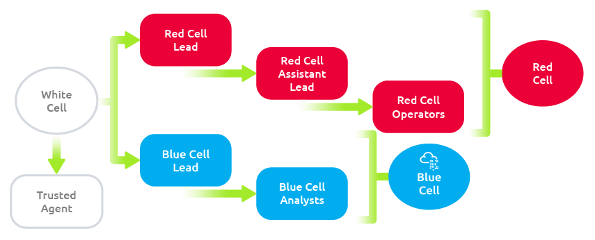
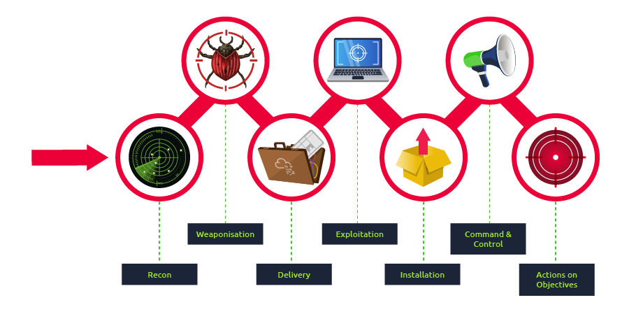
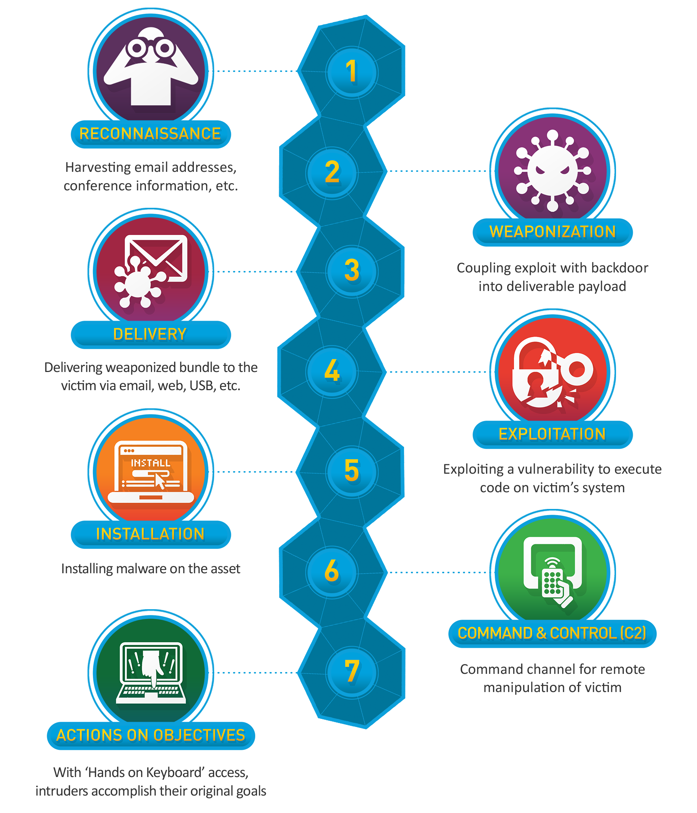

# Red Teaming

## **APTs and why Regular Pentesting is not Enough**

<figure><figcaption></figcaption></figure>

As a consequence, some aspects of penetration tests might significantly differ from a real attack, like:

* **Penetration tests are LOUD:** Usually, pentesters won't put much effort into trying to go undetected. Unlike real attackers, they don't mind being easy to detect, as they have been contracted to find as many vulnerabilities as they can in as many hosts as possible.
* **Non-technical attack vectors might be overlooked:** Attacks based on social engineering or physical intrusions are usually not included in what is tested.
* **Relaxation of security mechanisms:** While doing a regular penetration test, some security mechanisms might be temporarily disabled or relaxed for the pentesting team in favor of efficiency. Although this might sound counterintuitive, it is essential to remember that pentesters have limited time to check the network. Therefore, it is usually desired not to waste their time searching for exotic ways to bypass IDS/IPS, WAF, intrusion deception or other security measures, but rather focus on reviewing critical technological infrastructure for vulnerabilities.

On the other hand, real attackers won't follow an ethical code and are mostly unrestricted in their actions. Nowadays, the most prominent threat actors are known as **Advanced Persistent Threats (APT)**, which are highly skilled groups of attackers, usually sponsored by nations or organised criminal groups. They primarily target critical infrastructure, financial organisations, and government institutions. They are called persistent because the operations of these groups can remain undetected on compromised networks for long periods.

If a company is affected by an APT, would it be prepared to respond effectively? Could they detect the methods used to gain and maintain access on their networks if the attacker has been there for several months? What if the initial access was obtained because John at accounting opened a suspicious email attachment? What if a zero-day exploit was involved? Do previous penetration tests prepare us for this?&#x20;

## Red Team Engagements

Red teaming is a term borrowed from the military. In military exercises, a group would take the role of a red team to simulate attack techniques to test the reaction capabilities of a defending team, generally known as **blue team**, against known adversary strategies. Translated into the world of cybersecurity, red team engagements consist of emulating a real threat actor's **Tactics, Techniques and Procedures (TTPs)** so that we can measure how well our blue team responds to them and ultimately improve any security controls in place.

Every red team engagement will start by defining clear goals, often referenced as **crown jewels** or **flags**, ranging from compromising a given critical host to stealing some sensitive information from the target. Usually, the blue team won't be informed of such exercises to avoid introducing any biases in their analysis. The red team will do everything they can to achieve the goals while remaining undetected and evading any existing security mechanisms like firewalls, antivirus, EDR, IPS and others. Notice how on a red team engagement, not all of the hosts on a network will be checked for vulnerabilities. A real attacker would only need to find a single path to its goal and is not interested in performing noisy scans that the blue team could detect.

Taking the same network as before, on a red team engagement where the goal is to compromise the intranet server, we would plan for a way to reach our objective while interacting as little as possible with other hosts. Meanwhile, the blue team's capacity to detect and respond accordingly to the attack can be evaluated.

* **Technical Infrastructure:** Like in a regular penetration test, a red team will try to uncover technical vulnerabilities, with a much higher emphasis on stealth and evasion.
* **Social Engineering:** Targeting people through phishing campaigns, phone calls or social media to trick them into revealing information that should be private.
* **Physical Intrusion:** Using techniques like lockpicking, RFID cloning, exploiting weaknesses in electronic access control devices to access restricted areas of facilities.

Depending on the resources available, the red team exercise can be run in several ways:

* **Full Engagement:** Simulate an attacker's full workflow, from initial compromise until final goals have been achieved.
* **Assumed Breach:** Start by assuming the attacker has already gained control over some assets, and try to achieve the goals from there. As an example, the red team could receive access to some user's credentials or even a workstation in the internal network.
* **Table-top Exercise:** An over the table simulation where scenarios are discussed between the red and blue teams to evaluate how they would theoretically respond to certain threats. Ideal for situations where doing live simulations might be complicated.

## Teams and Functions of an Engagement

There are several factors and people involved within a red team engagement. Everyone will have their mindset and methodology to approach the engagement personnel; however, each engagement can be broken into three teams or cells. Below is a brief table illustrating each of the teams and a brief explanation of their responsibilities.

<figure><figcaption></figcaption></figure>

| **Team**                  | **Definition**                                                                                                                                                                                           |
| ------------------------- | -------------------------------------------------------------------------------------------------------------------------------------------------------------------------------------------------------- |
| **Red Cell /Attacker**    | A red cell is the component that makes up the **offensive portion** of a red team engagement. It simulates a given target's **strategic and tactical responses**, mimicking adversary behavior.          |
| **Blue Cell / Defender**  | The blue cell is the **defensive team** in the engagement. It includes all components defending a target network: **blue team members, defenders, internal staff, and organization management**.         |
| **White Cell / Referee**  | Acts as the **referee** during the engagement. It **controls the environment**, monitors **rules of engagement (ROE)**, **coordinates** activities, and **ensures fairness** between red and blue cells. |

Since this is a red team-oriented room, we will focus on the responsibilities of the red cell. Below is a table outlining the roles and responsibilities of members of the red team.

| **Role**                    | **Definition**                                                                                                                                                     |
| --------------------------- | ------------------------------------------------------------------------------------------------------------------------------------------------------------------ |
| **Red Team Lead**           | Plans and organizes engagements at a high level. **Delegates** tasks to assistant lead and operators. Oversees the **entire engagement strategy and assignments**. |
| **Red Team Assistant Lead** | Assists the team lead in **overseeing operations and operators**. May also help write **engagement plans and documentation** as needed.                            |
| **Red Team Operator**       | **Executes tasks** assigned by team leads. Interprets and analyzes **engagement plans** to carry out offensive actions during the engagement.                      |

As with most red team functions, each team and company will have its own structure and roles for each team member. The above table only acts as an example of the typical responsibilities of each role.

## Engagement Structure

A core function of the red team is adversary emulation. While not mandatory, it is commonly used to assess what a real adversary would do in an environment using their tools and methodologies. The red team can use various cyber kill chains to summarize and assess the steps and procedures of an engagement.

The blue team commonly uses cyber kill chains to map behaviors and break down an adversaries movement. The red team can adapt this idea to map adversary TTPs (**T**actics, **T**echniques, and **P**rocedures) to components of an engagement.

Many regulation and standardization bodies have released their cyber kill chain. Each kill chain follows roughly the same structure, with some going more in-depth or defining objectives differently. Below is a small list of standard cyber kill chains.

<figure><figcaption></figcaption></figure>

<figure><figcaption></figcaption></figure>

Components of the kill chain are broken down in the table below.

| **Technique**             | **Purpose**                                                    | **Examples**                                |
| ------------------------- | -------------------------------------------------------------- | ------------------------------------------- |
| **Reconnaissance**        | Obtain information on the target                               | Harvesting emails, OSINT                    |
| **Weaponization**         | Combine the objective with an exploit to create a payload      | Exploit with backdoor, malicious Office doc |
| **Delivery**              | Deliver the weaponized payload to the target                   | Email, web, USB                             |
| **Exploitation**          | Exploit the target's system to execute code                    | MS17-010, ZeroLogon                         |
| **Installation**          | Install malware or additional tooling on the target system     | Mimikatz, Rubeus                            |
| **Command & Control**     | Control the compromised asset remotely                         | Empire, Cobalt Strike                       |
| **Actions on Objectives** | Perform final goals such as data theft, destruction, or ransom | Conti, LockBit 2.0                          |

## &#x20;Rules of Engagement

Rules of Engagement (RoE) are a legally binding outline of the client objectives and scope with further details of engagement expectations between both parties. This is the first "official" document in the engagement planning process and requires proper authorization between the client and the red team. This document often acts as the general contract between the two parties; an external contract or other NDAs (**N**on-**D**isclosure **A**greement) can also be used.

The format and wording of the RoE are critical since it is a legally binding contract and sets clear expectations.

Each RoE structure will be determined by the client and red team and can vary in content length and overall sections. Below is a brief table of standard sections you may see contained in the RoE.

| **Section Name**                              | **Section Details**                                                                          |
| --------------------------------------------- | -------------------------------------------------------------------------------------------- |
| **Executive Summary**                         | Overarching summary of all contents and authorization within RoE document                    |
| **Purpose**                                   | Defines why the RoE document is used                                                         |
| **References**                                | Any references used throughout the RoE document (e.g., HIPAA, ISO)                           |
| **Scope**                                     | Statement of the agreement to restrictions and guidelines                                    |
| **Definitions**                               | Definitions of technical terms used throughout the RoE document                              |
| **Rules of Engagement and Support Agreement** | Defines obligations of both parties and general technical expectations of engagement conduct |
| **Provisions**                                | Define exceptions and additional information from the Rules of Engagement                    |
| **Requirements, Restrictions, and Authority** | Define specific expectations of the red team cell                                            |
| **Ground Rules**                              | Define limitations of the red team cell's interactions                                       |
| **Resolution of Issues/Points of Contact**    | Contains all essential personnel involved in an engagement                                   |
| **Authorization**                             | Statement of authorization for the engagement                                                |
| **Approval**                                  | Signatures from both parties approving all subsections of the preceding document             |
| **Appendix**                                  | Any further information from preceding subsections                                           |

## Campaign Planning

Prior to this task, we have primarily focused on engagement planning and documentation from the business perspective. Campaign planning uses the information acquired and planned from the client objectives and RoE and applies it to various plans and documents to identify how and what the red team will do.

Each internal red team will have its methodology and documentation for campaign planning. We will be showing one in-depth set of plans that allows for precise communication and detailed documentation. The campaign summary we will be using consists of four different plans varying in-depth and coverage adapted from military operations documents. Each plan can be found in the table below with a brief explanation.

| **Type of Plan**     | **Explanation of Plan**                                                          | **Plan Contents**                                            |
| -------------------- | -------------------------------------------------------------------------------- | ------------------------------------------------------------ |
| **Engagement Plan**  | An overarching description of technical requirements of the red team.            | CONOPS, Resource and Personnel Requirements, Timelines       |
| **Operations Plan**  | An expansion of the Engagement Plan. Goes further into specifics of each detail. | Operators, Known Information, Responsibilities, etc.         |
| **Mission Plan**     | The exact commands to run and execution time of the engagement.                  | Commands to run, Time Objectives, Responsible Operator, etc. |
| **Remediation Plan** | Defines how the engagement will proceed after the campaign is finished.          | Report, Remediation consultation, etc.                       |

## &#x20;Engagement Documentation

| **Type of Plan**                  | **Component**                          | **Purpose**                                                                                    | **Notes**               |
| --------------------------------- | -------------------------------------- | ---------------------------------------------------------------------------------------------- | ----------------------- |
| **Engagement Plan**               | CONOPS (Concept of Operations)         | Non-technical overview of how the red team meets client objectives and targets the client.     | -                       |
|                                   | Resource Plan                          | Includes timelines and required information for red team success (personnel, hardware, cloud). | -                       |
| **Operations Plan**               | Personnel                              | Information on employee requirements.                                                          | -                       |
|                                   | Stopping Conditions                    | Defines how and why the red team should stop during the engagement.                            | -                       |
|                                   | RoE (Rules of Engagement) _(optional)_ | Not always required. Typically defines what is allowed or off-limits during the test.          | Optional                |
|                                   | Technical Requirements                 | What knowledge or tools the red team needs to be successful.                                   | -                       |
| **Mission Plan**                  | Command Playbooks _(optional)_         | Exact commands/tools to run, with context (why, when, how). Useful for larger teams.           | Optional                |
|                                   | Execution Times                        | Defines when stages of the engagement begin (tools, commands, timing).                         | Can include exact times |
|                                   | Responsibilities / Roles               | Specifies who performs which tasks, and when.                                                  | -                       |
| **Remediation Plan** _(optional)_ | Report                                 | A summary of the engagement and findings.                                                      | Optional                |
|                                   | Remediation / Consultation             | How findings will be addressed; may be included in report or discussed in a client meeting.    | Optional                |

## &#x20;Threat Intel

These cyber frameworks will collect known TTPs and categorize them based on varying characteristics such as,

1. Threat Group
2. Kill Chain Phase
3. Tactic
4. Objective/Goal

Once a targeted adversary is selected, the goal is to identify all TTPs categorized with that chosen adversary and map them to a known cyber kill chain. This concept is covered further in the next task.

Leveraging TTPs is used as a planning technique rather than something a team will focus on during engagement execution. Depending on the size of the team, a CTI team or threat intelligence operator may be employed to gather TTPs for the red team. During the execution of an engagement, the red team will use threat intelligence to craft tooling, modify traffic and behavior, and emulate the targeted adversary. This concept is covered further in task 5.

Overall the red team consumes threat intelligence to analyze and emulate the behaviors of adversaries through collected TTPs and IOCs.

### &#x20;**T**hreat **I**ntelligence-**b**ased **E**thical **R**ed Teaming (**TIBER-EU)**

<figure><figcaption></figcaption></figure>

The main difference between this framework and others is the _"Testing"_ phase that requires threat intelligence to feed the red team's testing.

This framework encompasses a best practice rather than anything actionable from a red team perspective.

There are several public white papers and documents if you are interested in reading about this framework further,

### MITRE ATTACK



Simple Explaination



### Understand Threat Actors

Mitre&#x20;



### Map out attack

[Cyber Analytics Repository](https://car.mitre.org/)(CAR)



### Take Action Defend

[MITRE ENGAGE](https://engage.mitre.org/)



### Understad Defense Actors

[D3FEND](https://d3fend.mitre.org/)



[Cyber Analytics Repository](https://car.mitre.org/)(CAR)

The official definition of  CAR  is " _The MITRE Cyber Analytics Repository (CAR) is a knowledge base of analytics developed by MITRE based on the MITRE ATT\&CK_ ® _adversary model. CAR defines a data model that is leveraged in its pseudocode representations but also includes implementations directly targeted at specific tools (e.g., Splunk, EQL) in its analytics. With respect to coverage, CAR is focused on providing a set of validated and well-explained analytics, in particular with regards to their operating theory and rationale._ "

<figure><figcaption></figcaption></figure>

[MITRE ENGAGE](https://engage.mitre.org/)

#### Key Points about MITRE Engage:

* **Purpose**: Helps defenders plan and execute **adversary engagement strategies** such as deception, denial, and adversary interaction.
* **Goal**: Instead of just detecting and blocking, Engage encourages shaping adversary behavior, slowing them down, and collecting intelligence.
* **Tactics**: Provides structured guidance on actions like creating decoys, misdirecting attackers, introducing friction, and gathering threat intelligence during intrusions.
* **Use Cases**:
  * Setting up honeypots and honeytokens.
  * Feeding attackers false data.
  * Delaying or diverting attacks while defenders respond.
  * Learning attacker behavior in controlled environments.

<figure><figcaption></figcaption></figure>

[D3FEND](https://d3fend.mitre.org/)

**MITRE D3FEND** is another MITRE framework — but instead of focusing on _adversary behavior_ (like **ATT\&CK**) or _engagement/deception_ (like **Engage**), it focuses on **cyber defense techniques**.

#### 🔹 What is MITRE D3FEND?

* A **knowledge base of defensive techniques**, much like ATT\&CK is for offensive/adversary techniques.
* Provides a **taxonomy of defensive countermeasures** mapped to specific ATT\&CK techniques.
* Designed to help security professionals understand _which defensive methods_ can mitigate or detect specific attacker behaviors.

<figure><figcaption></figcaption></figure>

**CTID** stands for **MITRE Center for Threat-Informed Defense**.

#### 🔹 What CTID Does

* Works with **private companies, governments, and nonprofits** worldwide.
* Its mission is to **advance the state of the art and practice in threat-informed defense**.
* It creates **free, publicly available resources** that help defenders understand and counter adversaries.

## &#x20;TTP Mapping

**TTP Mapping** is employed by the red cell to map adversaries' collected TTPs to a standard cyber kill chain. Mapping TTPs to a kill chain aids the red team in planning an engagement to emulate an adversary.

To begin the process of mapping TTPs, an adversary must be selected as the target. An adversary can be chosen based on,

1. Target Industry
2. Employed Attack Vectors
3. Country of Origin
4. Other Factors

The first cyber framework we will be collecting TTPs from is [**MITRE ATT\&CK**](https://attack.mitre.org/). If you are not familiar with MITRE ATT\&CK, it provides IDs and descriptions of categorized TTPs. For more information about MITRE and how to use ATT\&CK, check out the [MITRE room](https://tryhackme.com/room/mitre).
