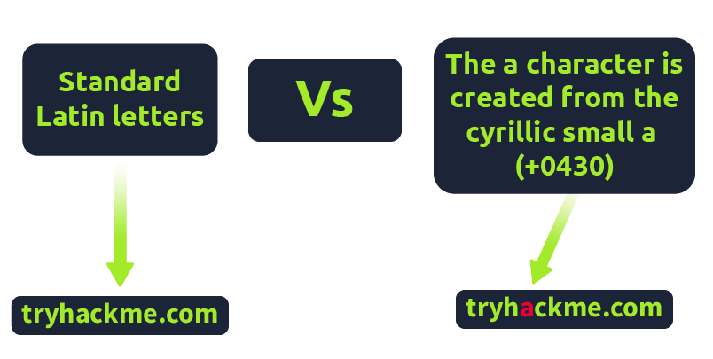
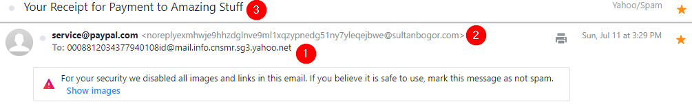
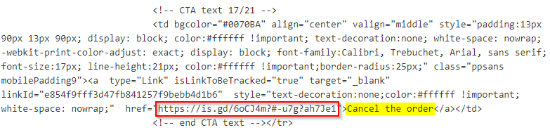
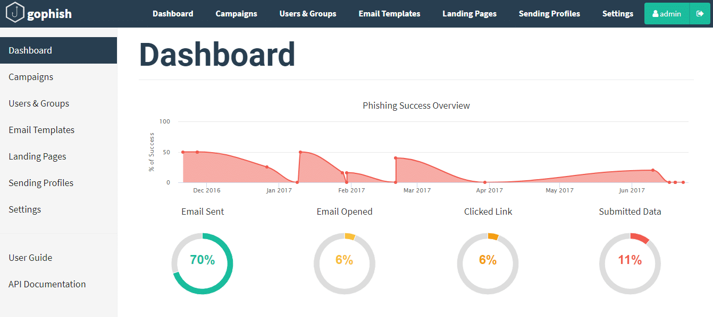
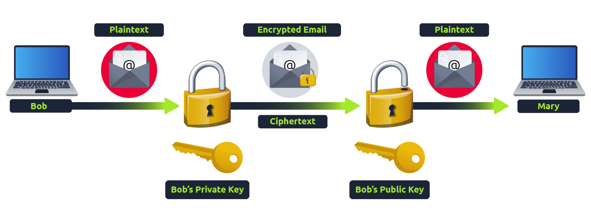

# Phising

<figure><figcaption></figcaption></figure>

Different types of malicious emails can be classified as one of the following:

* [**Spam**](https://www.proofpoint.com/us/threat-reference/spam) - unsolicited junk emails sent out in bulk to a large number of recipients. The more malicious variant of Spam is known as **MalSpam**.
* [**Phishing**](https://www.proofpoint.com/us/threat-reference/phishing) -  emails sent to a target(s) purporting to be from a trusted entity to lure individuals into providing sensitive information.&#x20;
* [**Spear phishing**](https://www.proofpoint.com/us/threat-reference/spear-phishing) **-** takes phishing a step further by targeting a specific individual(s) or organization seeking sensitive information. &#x20;
* [**Whaling**](https://www.rapid7.com/fundamentals/whaling-phishing-attacks/) - is similar to spear phishing, but it's targeted specifically to C-Level high-position individuals (CEO, CFO, etc.), and the objective is the same.&#x20;
* [**Smishing**](https://www.proofpoint.com/us/threat-reference/smishing) - takes phishing to mobile devices by targeting mobile users with specially crafted text messages.&#x20;
* [**Vishing**](https://www.proofpoint.com/us/threat-reference/vishing) - is similar to smishing, but instead of using text messages for the social engineering attack, the attacks are based on voice calls.&#x20;

## Email Delivery

POP3

* Emails are downloaded and stored on a single device.
* Sent messages are stored on the single device from which the email was sent.
* Emails can only be accessed from the single device the emails were downloaded to.
* If you want to keep messages on the server, make sure the setting "Keep email on server" is enabled, or all messages are deleted from the server once downloaded to the single device's app or software.

IMAP

* Emails are stored on the server and can be downloaded to multiple devices.
* Sent messages are stored on the server.
* Messages can be synced and accessed across multiple devices.

## Writing Convincing Phishing Emails

To find what brands or people a victim interacts with, you can employ OSINT (Open Source Intelligence) tactics. For example:

* Observe their social media account for any brands or friends they talk to.
* Searching Google for the victim's name and rough location for any reviews the victim may have left about local businesses or brands.
* Looking at the victim's business website to find suppliers.
* Looking at LinkedIn to find coworkers of the victim.

**The Subject:**

You should set the subject to something quite urgent, worrying, or piques the victim's curiosity, so they do not ignore it and act on it quickly.

Examples of this could be:

1. Your account has been compromised.
2. Your package has been dispatched/shipped.
3. Staff payroll information (do not forward!)
4. Your photos have been published.

**The Content:**

If impersonating a brand or supplier, it would be pertinent to research their standard email templates and branding (style, logo's images, signoffs etc.) and make your content look the same as theirs, so the victim doesn't expect anything. If impersonating a contact or coworker, it could be beneficial to contact them; first, they may have some branding in their template, have a particular email signature or even something small such as how they refer to themselves, for example, someone might have the name Dorothy and their email is dorothy@company.thm. Still, in their signature, it might say "Best Regards, Dot". Learning these somewhat small things can sometimes have quite dramatic psychological effects on the victim and convince them more to open and act on the email.

If you've set up a spoof website to harvest data or distribute malware, the links to this should be disguised using the [anchor text](https://en.wikipedia.org/wiki/Anchor_text) and changing it either to some text which says "Click Here" or changing it to a correct looking link that reflects the business you are spoofing, for example

`<a href="http://spoofsite.thm">Click Here</a>`

`<a href="http://spoofsite.thm">https://onlinebank.thm</a>`

## Phishing Infrastructure

A certain amount of infrastructure will need to be put in place to launch a successful phishing campaign.

**Domain Name:**

You'll need to register either an authentic-looking domain name or one that mimics the identity of another domain. See task 5 for details on how to create the perfect domain name.

**SSL/TLS Certificates:**

Creating SSL/TLS certificates for your chosen domain name will add an extra layer of authenticity to the attack.

**Email Server/Account:**

You'll need to either set up an email server or register with an SMTP email provider.&#x20;

**DNS Records:**

Setting up DNS Records such as SPF, DKIM, DMARC will improve the deliverability of your emails and make sure they're getting into the inbox rather than the spam folder.

**Web Server:**

You'll need to set up webservers or purchase web hosting from a company to host your phishing websites. Adding SSL/TLS to the websites will give them an extra layer of authenticity.&#x20;

**Analytics:**

When a phishing campaign is part of a red team engagement, keeping analytics information is more important. You'll need something to keep track of the emails that have been sent, opened or clicked. You'll also need to combine it with information from your phishing websites for which users have supplied personal information or downloaded software.&#x20;

**Automation And Useful Software:**

Some of the above infrastructures can be quickly automated by using the below tools.

**GoPhish - (Open-Source Phishing Framework) -** [**getgophish.com**](https://getgophish.com/)

**SET - (Social Engineering Toolkit) -** [**trustedsec.com**](https://www.trustedsec.com/tools/the-social-engineer-toolkit-set/)

| Mechanism                                                                | Purpose                                                                | How It Works                                                                                    | Example DNS Record                                         | Red Team Impact                                                                                                           |
| ------------------------------------------------------------------------ | ---------------------------------------------------------------------- | ----------------------------------------------------------------------------------------------- | ---------------------------------------------------------- | ------------------------------------------------------------------------------------------------------------------------- |
| **SPF** (Sender Policy Framework)                                        | Verifies _which servers/IPs_ are authorized to send email for a domain | Receiving server checks the sender’s domain DNS TXT record for allowed mail servers             | `v=spf1 include:_spf.google.com ~all`                      | Makes direct domain spoofing harder. Red teams use look-alike domains or compromised accounts instead.                    |
| **DKIM** (DomainKeys Identified Mail)                                    | Ensures email is _authentic and unmodified_                            | Outgoing mail is signed with a private key, recipient verifies signature with public key in DNS | `v=DKIM1; k=rsa; p=MIIBIjANBgkqh...`                       | Prevents forged messages. Red teams can’t spoof unless they control signing keys → often switch to look-alike domains.    |
| **DMARC** (Domain-based Message Authentication, Reporting & Conformance) | Tells recipient what to do if SPF/DKIM checks fail                     | Uses policies: `none`, `quarantine`, or `reject`. Also sends reports.                           | `v=DMARC1; p=reject; rua=mailto:dmarc-reports@example.com` | If strict (`reject`), spoofing domain is nearly impossible. Red teams may pivot to typosquatting or compromised accounts. |

## Droppers

Droppers are software that phishing victims tend to be tricked into downloading and running on their system. The dropper may advertise itself as something useful or legitimate such as a codec to view a certain video or software to open a specific file.

The droppers are not usually malicious themselves, so they tend to pass antivirus checks. Once installed, the intended malware is either unpacked or downloaded from a server and installed onto the victim's computer. The malicious software usually connects back to the attacker's infrastructure. The attacker can take control of the victim's computer, which can further explore and exploit the local network.

## Choosing A Phishing Domain

Choosing the right Phishing domain to launch your attack from is essential to ensure you have the psychological edge over your target. A red team engagement can use some of the below methods for choosing the perfect domain name.

### **Expired Domains:**

Although not essential, buying a domain name with some history may lead to better scoring of your domain when it comes to spam filters. Spam filters have a tendency to not trust brand new domain names compared to ones with some history.

### **Typosquatting:**

Typosquatting is when a registered domain looks very similar to the target domain you're trying to impersonate. Here are some of the common methods:

Misspelling: goggle.com Vs google.com

Additional Period: go.ogle.com Vs google.com

Switching numbers for letters: g00gle.com Vs google.com

Phrasing: googles.com Vs google.com

Additional Word: googleresults.com Vs google.com

These changes might look unrealistic, but at a glance, the human brain tends to fill in the blanks and see what it wants to see, i.e. the correct domain name.

### **TLD Alternatives:**

A TLD (Top Level Domain) is the .com .net .co.uk .org .gov e.t.c part of a domain name, there are 100's of variants of TLD's now. A common trick for choosing a domain would be to use the same name but with a different TLD. For example, register tryhackme.co.uk to impersonate tryhackme.com.

### **IDN Homograph Attack/Script Spoofing:**

Originally domain names were made up of Latin characters a-z and 0-9, but in 1998, IDN (internationalized domain name) was implemented to support language-specific script or alphabet from other languages such as Arabic, Chinese, Cyrillic, Hebrew and more. An issue that arises from the IDN implementation is that different letters from different languages can actually appear identical. For example, Unicode character U+0430 (Cyrillic small letter a) looks identical to Unicode character U+0061 (Latin small letter a) used in English, enabling attackers to register a domain name that looks almost identical to another.

<figure><figcaption></figcaption></figure>

## &#x20;Using MS Office In Phishing

Often during phishing campaigns, a Microsoft Office document (typically Word, Excel or PowerPoint) will be included as an attachment. Office documents can contain macros; macros do have a legitimate use but can also be used to run computer commands that can cause malware to be installed onto the victim's computer or connect back to an attacker's network and allow the attacker to take control of the victim's computer.

**Take, for example, the following scenario:**

A staff member working for Acme IT Support receives an email from human resources with an excel spreadsheet called "Staff\_Salaries.xlsx" intended to go to the boss but somehow ended up in the staff members inbox instead.&#x20;

What really happened was that an attacker spoofed the human resources email address and crafted a psychologically tempting email perfectly aimed to tempt the staff member into opening the attachment.

## Using Browser Exploits

Another method of gaining control over a victim's computer could be through browser exploits; this is when there is a vulnerability against a browser itself (Internet Explorer/Edge, Firefox, Chrome, Safari, etc.), which allows the attacker to run remote commands on the victim's computer.\
\
Browser exploits aren't usually a common path to follow in a red team engagement unless you have prior knowledge of old technology being used on-site. Many browsers are kept up to date, hard to exploit due to how browsers are developed, and the exploits are often worth a lot of money if reported back to the developers.\
\
That being said, it can happen, and as previously mentioned, it could be used to target old technologies on-site because possibly the browser software cannot be updated due to incompatibility with commercial software/hardware, which can happen quite often in big institutions such as education, government and especially health care.\
\
Usually, the victim would receive an email, convincing them to visit a particular website set up by the attacker. Once the victim is on the site, the exploit works against the browser, and now the attacker can perform any commands they wish on the victim's computer.

An example of this is [CVE-2021-40444](https://msrc.microsoft.com/update-guide/vulnerability/CVE-2021-40444) from September 2021, which is a vulnerability found in Microsoft systems that allowed the execution of code just from visiting a website.

## Examples

1. This is an unusual email recipient address. This is not the email address associated with the Yahoo account.&#x20;
2. This mismatch should immediately stand out. The sender's details (service@paypal.com) don't match the sender's email address (gibberish@sultanbogor.com).&#x20;
3. The subject line hints that you made a purchase or a transaction of some sort. If you don't recall this account, then it will grab your attention. This social engineering tactic is to prompt you to interact with the email with haste.&#x20;

<figure><figcaption></figcaption></figure>

<figure><figcaption></figcaption></figure>

This email sample will highlight the following techniques:\

1. Spoofed email address
2. Pixel tracking
3. Link manipulation

Here are some quick observations about this email sample:

1. The email is tailored to appear that it's sent from a mail distribution center of some sort.&#x20;
2. The subject line adds to the pretense with a 'tracking number.'&#x20;
3. The link in the email body matches the subject line.&#x20;

## &#x20;Tracking Pixels



## Tools

Gophish

<figure><figcaption></figcaption></figure>

## Email Defang

The square brackets **\[ ]** in `devret[.]xyz` are **intentional**.

They’re used as a **safety measure** in security writing:

* `devret.xyz` is the _real_ domain.
* `devret[.]xyz` is a **defanged** version — meaning it prevents the text from being automatically recognized as a clickable link.

👉 This way, readers can learn about or analyze suspicious domains without accidentally visiting them and risking exposure to malware or phishing.

You’ll often see this in security reports, blogs, and threat intel write-ups (sometimes also with `hxxp://` instead of `http://`).

## Phishing Prevention

### SPF (Sender Policy Framework)

Sender Policy Framework (SPF) is an email authentication protocol that helps prevent email spoofing and phishing by allowing domain owners to publish a list of authorized mail servers in their Domain Name System (DNS) records

<figure><figcaption></figcaption></figure>

How does a basic SPF record look like?

`v=spf1 ip4:127.0.0.1 include:_spf.google.com -all`

An explanation for the above record:

* `v=spf1` -> This is the start of the SPF record
* `ip4:127.0.0.1` -> This specifies which IP (in this case version IP4 & not IP6) can send mail
* `include:_spf.google.com` -> This specifies which domain can send mail
* `-all` -> non-authorized emails will be rejected

### DKIM (DomainKeys Identified Mail)

is an email authentication method that uses public-key cryptography to digitally sign outgoing emails, allowing receiving mail servers to verify the sender's domain and ensure the message hasn't been altered in transit

`v=DKIM1; k=rsa; p=MIIBIjANBgkqhkiG9w0BAQEFAAOCAQ8AMIIBCgKCAQEAxTQIC7vZAHHZ7WVv/5x/qH1RAgMQI+y6Xtsn73rWOgeBQjHKbmIEIlgrebyWWFCXjmzIP0NYJrGehenmPWK5bF/TRDstbM8uVQCUWpoRAHzuhIxPSYW6k/w2+HdCECF2gnGmmw1cT6nHjfCyKGsM0On0HDvxP8I5YQIIlzNigP32n1hVnQP+UuInj0wLIdOBIWkHdnFewzGK2+qjF2wmEjx+vqHDnxdUTay5DfTGaqgA9AKjgXNjLEbKlEWvy0tj7UzQRHd24a5+2x/R4Pc7PF/y6OxAwYBZnEPO0sJwio4uqL9CYZcvaHGCLOIMwQmNTPMKGC9nt3PSjujfHUBX3wIDAQAB`&#x20;

An explanation of the above record:

* `v=DKIM1` -> This is the version of the DKIM record. This is optional.&#x20;
* `k=rsa` -> This is the key type. The default value is RSA. RSA is an encryption algorithm (cryptosystem).
* `p=` -> This is the public key that will be matched to the private key, which was created during the DKIM setup process.&#x20;

### DMARC (Domain-Based Message Authentication, Reporting, and Conformance)

An email security protocol that helps prevent email spoofing and protects domain owners from phishing and Business Email Compromise (BEC) attacks by validating the authenticity of email senders

How does a basic DMARC record look like?

`v=DMARC1; p=quarantine; rua=mailto:postmaster@website.com`&#x20;

An explanation of the above record:

* `v=DMARC1` -> Must be in all caps, and it's not optional
* `p=quarantine` -> If a check fails, then an email will be sent to the spam folder (DMARC Policy)
* `rua=mailto:postmaster@website.com` -> Aggregate reports will be sent to this email address

### &#x20;S/MIME (Secure/Multipurpose Internet Mail Extensions)

is an internet standard for securing email using public-key cryptography to provide digital signatures for authentication and message integrity, and encryption for message confidentiality

<figure><figcaption></figcaption></figure>
